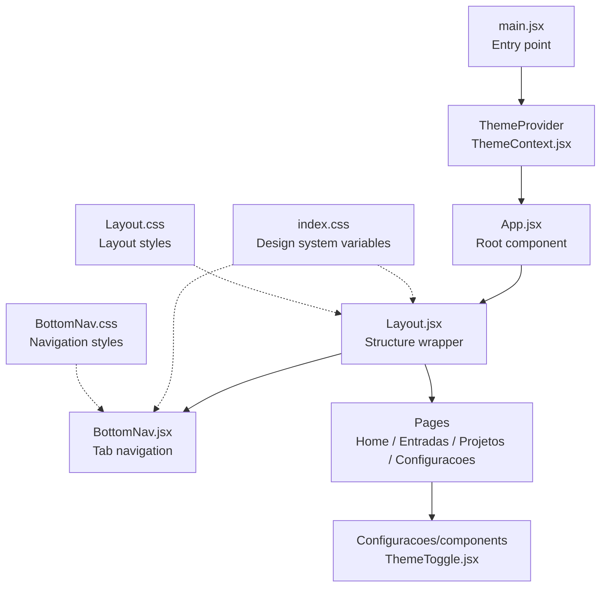
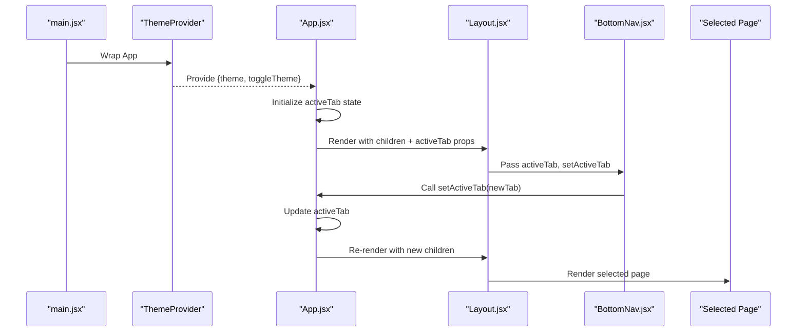
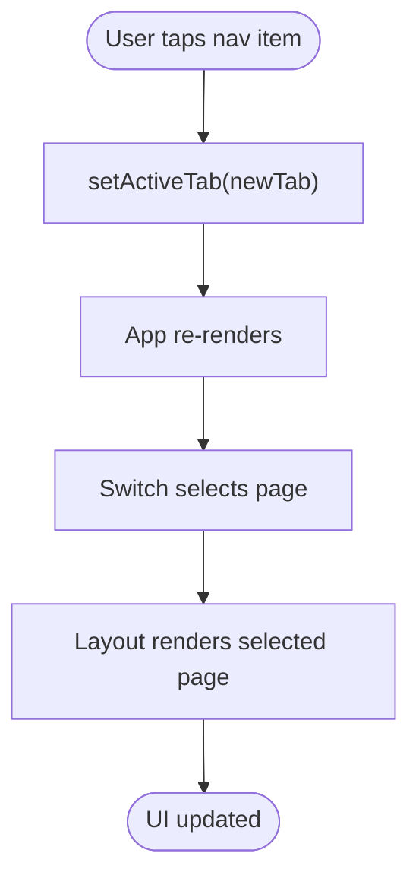
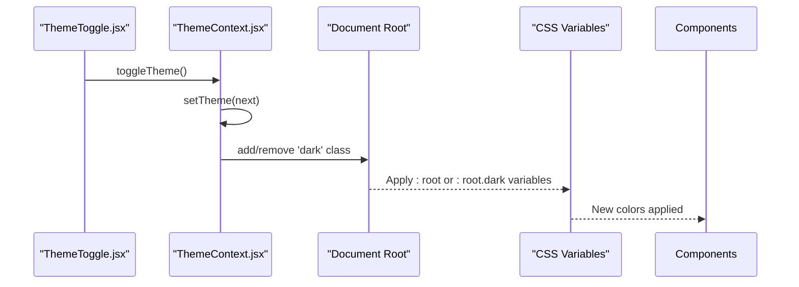
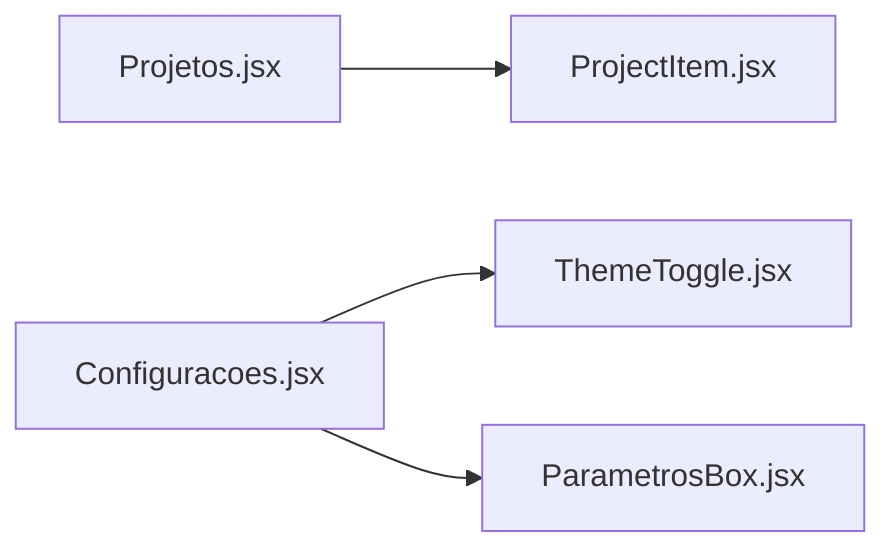
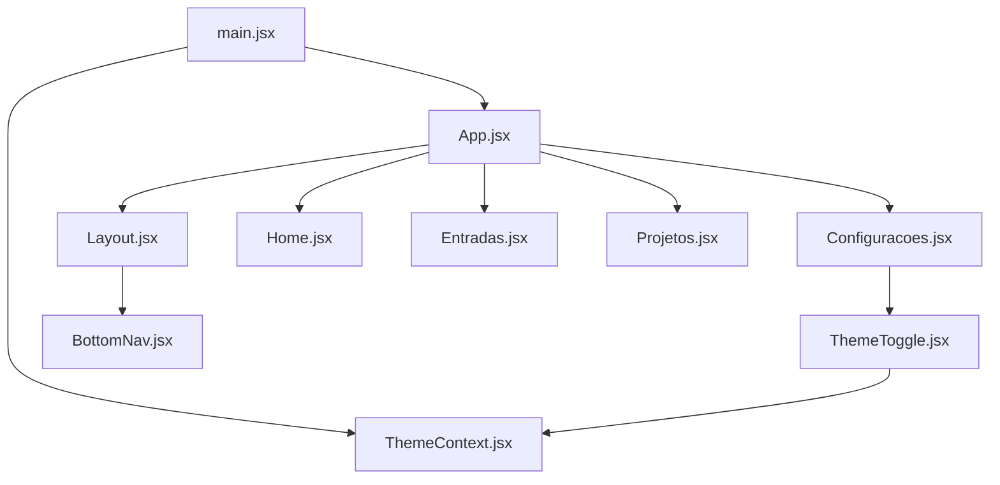

# Architecture Overview

<cite>
**Referenced Files in This Document**
- [main.jsx](file://src/main.jsx)
- [App.jsx](file://src/App.jsx)
- [ThemeContext.jsx](file://src/context/ThemeContext.jsx)
- [Layout.jsx](file://src/components/Layout/Layout.jsx)
- [BottomNav.jsx](file://src/components/BottomNav/BottomNav.jsx)
- [Home.jsx](file://src/pages/Home/Home.jsx)
- [Entradas.jsx](file://src/pages/Entradas/Entradas.jsx)
- [Projetos.jsx](file://src/pages/Projetos/Projetos.jsx)
- [Configuracoes.jsx](file://src/pages/Configuracoes/Configuracoes.jsx)
- [ThemeToggle.jsx](file://src/pages/Configuracoes/components/ThemeToggle.jsx)
- [index.css](file://src/index.css)
- [Layout.css](file://src/components/Layout/Layout.css)
- [BottomNav.css](file://src/components/BottomNav/BottomNav.css)
</cite>

## Table of Contents
1. [Introduction](#introduction)
2. [Project Structure](#project-structure)
3. [Core Components](#core-components)
4. [Architecture Overview](#architecture-overview)
5. [Detailed Component Analysis](#detailed-component-analysis)
6. [Dependency Analysis](#dependency-analysis)
7. [Performance Considerations](#performance-considerations)
8. [Troubleshooting Guide](#troubleshooting-guide)
9. [Conclusion](#conclusion)

## Introduction
This document describes the Nordic Worklog application architecture with a focus on its component-based design using React and Context API for global state. The app is structured around a root component, a layout wrapper that provides consistent structure, and a theme context provider for global theming. Navigation follows a tab-based pattern driven by local state in the root component and rendered conditionally. The UI uses a mobile-first responsive approach powered by CSS custom properties to support light and dark themes consistently across components.

## Project Structure
The project organizes code by feature and responsibility:
- Application entrypoint and providers at the top level
- Pages encapsulate screen-level logic and content
- Shared structural components (Layout, BottomNav) provide consistent chrome
- Context modules centralize cross-cutting concerns like theming
- Global styles define the design system via CSS custom properties



**Diagram sources**
- [main.jsx:1-15](file://src/main.jsx#L1-L15)
- [ThemeContext.jsx:1-49](file://src/context/ThemeContext.jsx#L1-L49)
- [App.jsx:1-39](file://src/App.jsx#L1-L39)
- [Layout.jsx:1-49](file://src/components/Layout/Layout.jsx#L1-L49)
- [BottomNav.jsx:1-37](file://src/components/BottomNav/BottomNav.jsx#L1-L37)
- [Home.jsx:1-19](file://src/pages/Home/Home.jsx#L1-L19)
- [Entradas.jsx:1-19](file://src/pages/Entradas/Entradas.jsx#L1-L19)
- [Projetos.jsx:1-31](file://src/pages/Projetos/Projetos.jsx#L1-L31)
- [Configuracoes.jsx:1-70](file://src/pages/Configuracoes/Configuracoes.jsx#L1-L70)
- [ThemeToggle.jsx:1-55](file://src/pages/Configuracoes/components/ThemeToggle.jsx#L1-L55)
- [index.css:1-86](file://src/index.css#L1-L86)
- [Layout.css:1-74](file://src/components/Layout/Layout.css#L1-L74)
- [BottomNav.css:1-59](file://src/components/BottomNav/BottomNav.css#L1-L59)

**Section sources**
- [main.jsx:1-15](file://src/main.jsx#L1-L15)
- [App.jsx:1-39](file://src/App.jsx#L1-L39)
- [ThemeContext.jsx:1-49](file://src/context/ThemeContext.jsx#L1-L49)
- [Layout.jsx:1-49](file://src/components/Layout/Layout.jsx#L1-L49)
- [BottomNav.jsx:1-37](file://src/components/BottomNav/BottomNav.jsx#L1-L37)
- [index.css:1-86](file://src/index.css#L1-L86)
- [Layout.css:1-74](file://src/components/Layout/Layout.css#L1-L74)
- [BottomNav.css:1-59](file://src/components/BottomNav/BottomNav.css#L1-L59)

## Core Components
- App (root): Holds active tab state and renders the selected page inside Layout. It drives tab-based navigation through conditional rendering.
- ThemeProvider: Provides global theme state and toggle function; persists preference and applies a class to the document root.
- Layout: Wraps pages with fixed header and content area; passes navigation props to BottomNav.
- BottomNav: Renders tab buttons and updates active tab via callback from parent.
- Pages: Home, Entradas, Projetos, Configuracoes are leaf screens composed under Layout.
- ThemeToggle: Uses the theme context to switch between light and dark modes.

Key responsibilities and separation of concerns:
- State ownership: Tab state lives in App; theme state lives in ThemeProvider.
- Presentation: Layout and BottomNav handle chrome and navigation UI.
- Feature boundaries: Each page owns its own subcomponents and data display.

**Section sources**
- [App.jsx:1-39](file://src/App.jsx#L1-L39)
- [ThemeContext.jsx:1-49](file://src/context/ThemeContext.jsx#L1-L49)
- [Layout.jsx:1-49](file://src/components/Layout/Layout.jsx#L1-L49)
- [BottomNav.jsx:1-37](file://src/components/BottomNav/BottomNav.jsx#L1-L37)
- [Home.jsx:1-19](file://src/pages/Home/Home.jsx#L1-L19)
- [Entradas.jsx:1-19](file://src/pages/Entradas/Entradas.jsx#L1-L19)
- [Projetos.jsx:1-31](file://src/pages/Projetos/Projetos.jsx#L1-L31)
- [Configuracoes.jsx:1-70](file://src/pages/Configuracoes/Configuracoes.jsx#L1-L70)
- [ThemeToggle.jsx:1-55](file://src/pages/Configuracoes/components/ThemeToggle.jsx#L1-L55)

## Architecture Overview
High-level flow:
- Entry point mounts React tree with StrictMode and wraps App in ThemeProvider.
- App manages active tab and renders the corresponding page within Layout.
- Layout composes Header, main content area, and BottomNav.
- BottomNav triggers tab changes via callbacks passed down from App.
- ThemeProvider injects theme and toggle into any descendant via useTheme.



**Diagram sources**
- [main.jsx:1-15](file://src/main.jsx#L1-L15)
- [ThemeContext.jsx:1-49](file://src/context/ThemeContext.jsx#L1-L49)
- [App.jsx:1-39](file://src/App.jsx#L1-L39)
- [Layout.jsx:1-49](file://src/components/Layout/Layout.jsx#L1-L49)
- [BottomNav.jsx:1-37](file://src/components/BottomNav/BottomNav.jsx#L1-L37)

## Detailed Component Analysis

### Root and Providers
- main.jsx initializes the React tree and ensures all components have access to ThemeProvider.
- ThemeContext.jsx exposes ThemeProvider and useTheme hook, persisting theme to localStorage and applying a .dark class to the document root.

```mermaid
classDiagram
class ThemeProvider {
+state : theme
+toggleTheme()
+children
}
class useTheme {
+returns : { theme, toggleTheme }
}
ThemeProvider <.. useTheme : "consumes context"
```

**Diagram sources**
- [ThemeContext.jsx:1-49](file://src/context/ThemeContext.jsx#L1-L49)

**Section sources**
- [main.jsx:1-15](file://src/main.jsx#L1-L15)
- [ThemeContext.jsx:1-49](file://src/context/ThemeContext.jsx#L1-L49)

### Navigation and Layout
- App holds activeTab and selects the page to render.
- Layout provides fixed header and content container, delegating navigation to BottomNav.
- BottomNav defines tabs and emits setActiveTab events.



**Diagram sources**
- [App.jsx:1-39](file://src/App.jsx#L1-L39)
- [Layout.jsx:1-49](file://src/components/Layout/Layout.jsx#L1-L49)
- [BottomNav.jsx:1-37](file://src/components/BottomNav/BottomNav.jsx#L1-L37)

**Section sources**
- [App.jsx:1-39](file://src/App.jsx#L1-L39)
- [Layout.jsx:1-49](file://src/components/Layout/Layout.jsx#L1-L49)
- [BottomNav.jsx:1-37](file://src/components/BottomNav/BottomNav.jsx#L1-L37)

### Theming Flow
- ThemeToggle reads current theme and calls toggleTheme.
- ThemeProvider updates state, persists to storage, and toggles .dark on document root.
- CSS custom properties respond to the presence of .dark to swap colors.



**Diagram sources**
- [ThemeToggle.jsx:1-55](file://src/pages/Configuracoes/components/ThemeToggle.jsx#L1-L55)
- [ThemeContext.jsx:1-49](file://src/context/ThemeContext.jsx#L1-L49)
- [index.css:1-86](file://src/index.css#L1-L86)

**Section sources**
- [ThemeToggle.jsx:1-55](file://src/pages/Configuracoes/components/ThemeToggle.jsx#L1-L55)
- [ThemeContext.jsx:1-49](file://src/context/ThemeContext.jsx#L1-L49)
- [index.css:1-86](file://src/index.css#L1-L86)

### Pages and Subcomponents
- Home and Entradas are placeholder screens demonstrating card-based minimal layouts.
- Projetos lists sample projects and composes ProjectItem.
- Configuracoes integrates ThemeToggle and parameter settings.



**Diagram sources**
- [Projetos.jsx:1-31](file://src/pages/Projetos/Projetos.jsx#L1-L31)
- [Configuracoes.jsx:1-70](file://src/pages/Configuracoes/Configuracoes.jsx#L1-L70)
- [ThemeToggle.jsx:1-55](file://src/pages/Configuracoes/components/ThemeToggle.jsx#L1-L55)

**Section sources**
- [Home.jsx:1-19](file://src/pages/Home/Home.jsx#L1-L19)
- [Entradas.jsx:1-19](file://src/pages/Entradas/Entradas.jsx#L1-L19)
- [Projetos.jsx:1-31](file://src/pages/Projetos/Projetos.jsx#L1-L31)
- [Configuracoes.jsx:1-70](file://src/pages/Configuracoes/Configuracoes.jsx#L1-L70)

## Dependency Analysis
Component relationships and imports:
- main.jsx depends on ThemeProvider and App.
- App depends on Layout and four pages.
- Layout depends on BottomNav.
- Configuracoes depends on ThemeToggle and ParametrosBox.
- ThemeToggle depends on ThemeContext.



**Diagram sources**
- [main.jsx:1-15](file://src/main.jsx#L1-L15)
- [App.jsx:1-39](file://src/App.jsx#L1-L39)
- [Layout.jsx:1-49](file://src/components/Layout/Layout.jsx#L1-L49)
- [BottomNav.jsx:1-37](file://src/components/BottomNav/BottomNav.jsx#L1-L37)
- [ThemeContext.jsx:1-49](file://src/context/ThemeContext.jsx#L1-L49)
- [Configuracoes.jsx:1-70](file://src/pages/Configuracoes/Configuracoes.jsx#L1-L70)
- [ThemeToggle.jsx:1-55](file://src/pages/Configuracoes/components/ThemeToggle.jsx#L1-L55)

**Section sources**
- [main.jsx:1-15](file://src/main.jsx#L1-L15)
- [App.jsx:1-39](file://src/App.jsx#L1-L39)
- [Layout.jsx:1-49](file://src/components/Layout/Layout.jsx#L1-L49)
- [BottomNav.jsx:1-37](file://src/components/BottomNav/BottomNav.jsx#L1-L37)
- [ThemeContext.jsx:1-49](file://src/context/ThemeContext.jsx#L1-L49)
- [Configuracoes.jsx:1-70](file://src/pages/Configuracoes/Configuracoes.jsx#L1-L70)
- [ThemeToggle.jsx:1-55](file://src/pages/Configuracoes/components/ThemeToggle.jsx#L1-L55)

## Performance Considerations
- Conditional rendering: App switches pages via a simple switch statement. For larger apps, consider lazy loading pages to reduce initial bundle size.
- Context usage: ThemeProvider is lightweight and only re-renders when theme changes. Avoid placing heavy computations inside context values.
- Styling performance: CSS custom properties and transitions are GPU-friendly and avoid layout thrashing. Keep animations minimal and prefer transform/opacity.
- Mobile viewport: Fixed header and bottom nav require correct padding compensation to avoid content overlap. Ensure safe-area insets are respected on devices with notches.

[No sources needed since this section provides general guidance]

## Troubleshooting Guide
- Theme not applying:
  - Verify that ThemeProvider wraps the app in the entry file.
  - Confirm that the document root receives the .dark class when toggling.
  - Check that CSS variables are defined for both :root and :root.dark.
- Navigation not switching:
  - Ensure setActiveTab is passed from App to Layout and then to BottomNav.
  - Validate that BottomNav invokes setActiveTab with the correct tab id.
- Content hidden behind fixed bars:
  - Confirm Layout applies top/bottom padding to account for fixed header and bottom nav heights.
  - Ensure safe-area-inset-bottom is considered for devices with home indicators.

**Section sources**
- [main.jsx:1-15](file://src/main.jsx#L1-L15)
- [ThemeContext.jsx:1-49](file://src/context/ThemeContext.jsx#L1-L49)
- [index.css:1-86](file://src/index.css#L1-L86)
- [Layout.jsx:1-49](file://src/components/Layout/Layout.jsx#L1-L49)
- [BottomNav.jsx:1-37](file://src/components/BottomNav/BottomNav.jsx#L1-L37)

## Conclusion
Nordic Worklog follows a clear, maintainable architecture:
- Root-driven tab navigation with conditional rendering keeps routing simple and predictable.
- Layout centralizes chrome and spacing, while BottomNav encapsulates navigation behavior.
- ThemeProvider provides global theme state with persistence and CSS variable-driven styling.
- Pages remain focused on feature-specific content and composition.
This structure supports a mobile-first experience and a cohesive design system built on CSS custom properties.