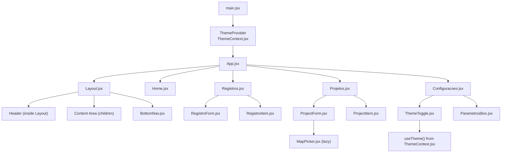
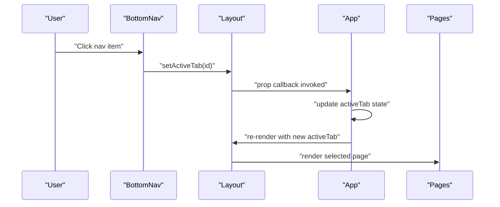
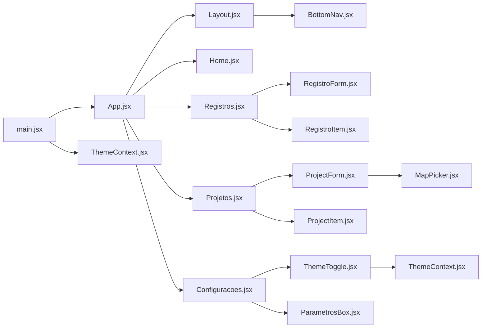

# Component Hierarchy

<cite>
**Referenced Files in This Document**
- [main.jsx](file://src/main.jsx)
- [App.jsx](file://src/App.jsx)
- [Layout.jsx](file://src/components/Layout/Layout.jsx)
- [BottomNav.jsx](file://src/components/BottomNav/BottomNav.jsx)
- [Home.jsx](file://src/pages/Home/Home.jsx)
- [Registros.jsx](file://src/pages/Registros/Registros.jsx)
- [RegistroForm.jsx](file://src/pages/Registros/components/RegistroForm.jsx)
- [RegistroItem.jsx](file://src/pages/Registros/components/RegistroItem.jsx)
- [Projetos.jsx](file://src/pages/Projetos/Projetos.jsx)
- [ProjectForm.jsx](file://src/pages/Projetos/components/ProjectForm.jsx)
- [ProjectItem.jsx](file://src/pages/Projetos/components/ProjectItem.jsx)
- [ThemeToggle.jsx](file://src/pages/Configuracoes/components/ThemeToggle.jsx)
- [ParametrosBox.jsx](file://src/pages/Configuracoes/components/ParametrosBox.jsx)
- [ThemeContext.jsx](file://src/context/ThemeContext.jsx)
</cite>

## Table of Contents
1. [Introduction](#introduction)
2. [Project Structure](#project-structure)
3. [Core Components](#core-components)
4. [Architecture Overview](#architecture-overview)
5. [Detailed Component Analysis](#detailed-component-analysis)
6. [Dependency Analysis](#dependency-analysis)
7. [Performance Considerations](#performance-considerations)
8. [Troubleshooting Guide](#troubleshooting-guide)
9. [Conclusion](#conclusion)

## Introduction
This document explains the React component hierarchy of the Nordic Worklog application with a focus on how the root App component manages active tab state and conditionally renders page components, how the Layout wrapper provides consistent structure with header and content areas, and how the BottomNav component drives navigation. It also covers props passing down the tree, state management at different levels, and composition patterns used across pages and subcomponents.

## Project Structure
The application is bootstrapped by main.jsx, which mounts the app inside a ThemeProvider and StrictMode. The root App component holds the active tab state and delegates rendering to Layout, which composes the header, main content area, and BottomNav. Each page (Home, Entradas, Projetos, Configuracoes) is rendered conditionally based on the active tab. Page-level subcomponents are composed within their respective pages.

**Diagram sources**
- [main.jsx:8-14](file://src/main.jsx#L8-L14)
- [App.jsx:12-36](file://src/App.jsx#L12-L36)
- [Layout.jsx:11-48](file://src/components/Layout/Layout.jsx#L11-L48)
- [BottomNav.jsx:10-36](file://src/components/BottomNav/BottomNav.jsx#L10-L36)
- [Home.jsx:7-18](file://src/pages/Home/Home.jsx#L7-L18)
- [Entradas.jsx:7-18](file://src/pages/Entradas/Entradas.jsx#L7-L18)
- [Projetos.jsx:8-30](file://src/pages/Projetos/Projetos.jsx#L8-L30)
- [Configuracoes.jsx:10-69](file://src/pages/Configuracoes/Configuracoes.jsx#L10-L69)
- [ProjectItem.jsx:12-48](file://src/pages/Projetos/components/ProjectItem.jsx#L12-L48)
- [ThemeToggle.jsx:9-54](file://src/pages/Configuracoes/components/ThemeToggle.jsx#L9-L54)
- [ParametrosBox.jsx:8-84](file://src/pages/Configuracoes/components/ParametrosBox.jsx#L8-L84)
- [ThemeContext.jsx:7-48](file://src/context/ThemeContext.jsx#L7-L48)

**Section sources**
- [main.jsx:8-14](file://src/main.jsx#L8-L14)
- [App.jsx:12-36](file://src/App.jsx#L12-L36)
- [Layout.jsx:11-48](file://src/components/Layout/Layout.jsx#L11-L48)
- [BottomNav.jsx:10-36](file://src/components/BottomNav/BottomNav.jsx#L10-L36)

## Core Components
- Root App: Holds activeTab state and selects the current page. Passes activeTab and setActiveTab to Layout.
- Layout: Provides fixed header and scrollable content area; renders children (the selected page) and passes navigation props to BottomNav.
- BottomNav: Renders navigation items and calls setActiveTab when clicked.
- Pages: Home, Registros, Projetos, Configuracoes render page-specific features.
- Subcomponents: RegistroForm, RegistroItem, ProjectForm, ProjectItem, ThemeToggle, ParametrosBox, MapPicker compose within pages.

Key responsibilities:
- State ownership: activeTab lives in App.
- Presentation: Layout and BottomNav present navigation and layout.
- Composition: Pages compose reusable subcomponents.

**Section sources**
- [App.jsx:12-36](file://src/App.jsx#L12-L36)
- [Layout.jsx:11-48](file://src/components/Layout/Layout.jsx#L11-L48)
- [BottomNav.jsx:10-36](file://src/components/BottomNav/BottomNav.jsx#L10-L36)
- [Home.jsx:7-18](file://src/pages/Home/Home.jsx#L7-L18)
- [Entradas.jsx:7-18](file://src/pages/Entradas/Entradas.jsx#L7-L18)
- [Projetos.jsx:8-30](file://src/pages/Projetos/Projetos.jsx#L8-L30)
- [Configuracoes.jsx:10-69](file://src/pages/Configuracoes/Configuracoes.jsx#L10-L69)

## Architecture Overview
The application follows a unidirectional data flow for navigation:
- App owns activeTab and setState function.
- Layout receives these props and forwards them to BottomNav.
- BottomNav triggers setActiveTab(item.id), updating App’s state.
- App re-renders and chooses the corresponding page via conditional rendering.

**Diagram sources**
- [BottomNav.jsx:22-32](file://src/components/BottomNav/BottomNav.jsx#L22-L32)
- [Layout.jsx:45](file://src/components/Layout/Layout.jsx#L45)
- [App.jsx:16-29](file://src/App.jsx#L16-L29)

## Detailed Component Analysis

### Root App Component
- Purpose: Entry point for routing logic; maintains activeTab and returns the selected page.
- State: activeTab initialized to 'home'.
- Rendering: Uses a switch-based helper to return the correct page component.
- Composition: Wraps the selected page inside Layout, passing activeTab and setActiveTab.

Props passed down:
- To Layout: activeTab, setActiveTab
- To pages: none directly (pages receive no props from App)

State management:
- Local state in App controls navigation.

Composition pattern:
- Conditional rendering based on state value.

**Section sources**
- [App.jsx:12-36](file://src/App.jsx#L12-L36)

### Layout Wrapper Component
- Purpose: Provides consistent shell with header and content area; integrates BottomNav.
- Props:
  - children: the currently selected page component.
  - activeTab: current tab id.
  - setActiveTab: callback to change the active tab.
- Behavior:
  - Computes header title based on activeTab.
  - Renders header, main content area, and BottomNav.
  - Forwards activeTab and setActiveTab to BottomNav.

Data flow:
- Receives navigation state and updater from App.
- Displays dynamic header title.
- Delegates navigation actions to BottomNav.

Composition pattern:
- Shell composition with children injection.

**Section sources**
- [Layout.jsx:11-48](file://src/components/Layout/Layout.jsx#L11-L48)

### BottomNav Component
- Purpose: Navigation bar with icons and labels for each tab.
- Props:
  - activeTab: current tab id.
  - setActiveTab: callback to update active tab.
- Behavior:
  - Defines nav items with id, label, and icon.
  - Maps items to buttons; applies active styling when item.id equals activeTab.
  - Calls setActiveTab(item.id) on click.

Navigation flow:
- Click -> setActiveTab -> App updates state -> Layout re-renders -> selected page changes.

Accessibility:
- aria-label provided per button.

**Section sources**
- [BottomNav.jsx:10-36](file://src/components/BottomNav/BottomNav.jsx#L10-L36)

### Page Components
- Home: Dashboard with summary cards showing weekly hours, project count, and quick action buttons.
- Registros: Daily worklog entries grouped by month/week in accordion layout. Uses RegistroForm for CRUD and RegistroItem for list display.
- Projetos: Project management with full CRUD via ProjectForm. Includes technician team management and map-based location picker.
- Configuracoes: Composes ThemeToggle and ParametrosBox; includes mock export and account options.

Composition patterns:
- List rendering with key prop (Projetos).
- Feature grouping into cards (Configuracoes).

**Section sources**
- [Home.jsx:7-18](file://src/pages/Home/Home.jsx#L7-L18)
- [Entradas.jsx:7-18](file://src/pages/Entradas/Entradas.jsx#L7-L18)
- [Projetos.jsx:8-30](file://src/pages/Projetos/Projetos.jsx#L8-L30)
- [Configuracoes.jsx:10-69](file://src/pages/Configuracoes/Configuracoes.jsx#L10-L69)

### Subcomponents
- RegistroForm: Full worklog entry form with auto-fill, validation, dynamic standby calculation, and photo attachments.
- RegistroItem: Compact list item showing date, project, and hour badges (work/standby/travel).
- ProjectForm: Project CRUD form with technician management, map picker, and file attachments.
- ProjectItem: Displays project name, client, and status badge.
- MapPicker: Reusable react-leaflet map component for location picking with reverse geocoding (lazy-loaded).
- WeatherCard: Weather forecast card with 5-day forecast, GPS location, and map-based city selector.
- ThemeToggle: Reads theme and toggle function from ThemeContext; toggles dark/light mode.
- ParametrosBox: Manages local state for hourly rate, stand-by rate, standard workday, and per diem.

Composition patterns:
- Presentational subcomponent receiving data via props (ProjectItem).
- Context-driven interactive control (ThemeToggle).
- Self-contained form-like inputs with local state (ParametrosBox).

**Section sources**
- [ProjectItem.jsx:12-48](file://src/pages/Projetos/components/ProjectItem.jsx#L12-L48)
- [ThemeToggle.jsx:9-54](file://src/pages/Configuracoes/components/ThemeToggle.jsx#L9-L54)
- [ParametrosBox.jsx:8-84](file://src/pages/Configuracoes/components/ParametrosBox.jsx#L8-L84)

### Theme Context Integration
- ThemeProvider wraps the entire app in main.jsx.
- useTheme hook exposes theme and toggleTheme to descendants.
- ThemeToggle consumes context to reflect and change theme.

Data flow:
- ThemeProvider sets initial theme from localStorage or system preference.
- toggleTheme updates theme state and persists it.
- ThemeToggle reads current theme and invokes toggleTheme.

**Section sources**
- [main.jsx:8-14](file://src/main.jsx#L8-L14)
- [ThemeContext.jsx:7-48](file://src/context/ThemeContext.jsx#L7-L48)
- [ThemeToggle.jsx:9-54](file://src/pages/Configuracoes/components/ThemeToggle.jsx#L9-L54)

## Dependency Analysis
The following diagram shows direct import relationships among core components and contexts.

**Diagram sources**
- [main.jsx:4-6](file://src/main.jsx#L4-L6)
- [App.jsx:2-6](file://src/App.jsx#L2-L6)
- [Layout.jsx:2](file://src/components/Layout/Layout.jsx#L2)
- [Projetos.jsx:2](file://src/pages/Projetos/Projetos.jsx#L2)
- [Configuracoes.jsx:2-3](file://src/pages/Configuracoes/Configuracoes.jsx#L2-L3)
- [ThemeToggle.jsx:2](file://src/pages/Configuracoes/components/ThemeToggle.jsx#L2)

**Section sources**
- [main.jsx:4-6](file://src/main.jsx#L4-L6)
- [App.jsx:2-6](file://src/App.jsx#L2-L6)
- [Layout.jsx:2](file://src/components/Layout/Layout.jsx#L2)
- [Projetos.jsx:2](file://src/pages/Projetos/Projetos.jsx#L2)
- [Configuracoes.jsx:2-3](file://src/pages/Configuracoes/Configuracoes.jsx#L2-L3)
- [ThemeToggle.jsx:2](file://src/pages/Configuracoes/components/ThemeToggle.jsx#L2)

## Performance Considerations
- Conditional rendering in App uses a simple switch; acceptable for a small number of tabs. If the number of pages grows significantly, consider lazy loading or route-based code splitting.
- BottomNav maps over a static array; this is efficient. Avoid recreating arrays or objects on every render if you extend functionality.
- ThemeContext updates document class and localStorage on theme change; keep toggleTheme memoized if additional logic is added.
- Keep page components lightweight; move heavy computations or data fetching out of render paths.

[No sources needed since this section provides general guidance]

## Troubleshooting Guide
- Active tab not changing:
  - Ensure BottomNav calls setActiveTab with the correct id.
  - Verify Layout forwards setActiveTab to BottomNav.
  - Confirm App’s renderPage handles all expected ids.
- Header title mismatch:
  - Check Layout’s getHeaderTitle mapping matches activeTab values.
- Theme not applying:
  - Confirm ThemeProvider wraps App in main.jsx.
  - Ensure ThemeToggle uses useTheme and calls toggleTheme.
  - Validate that document.documentElement class toggles correctly.

**Section sources**
- [BottomNav.jsx:22-32](file://src/components/BottomNav/BottomNav.jsx#L22-L32)
- [Layout.jsx:13-26](file://src/components/Layout/Layout.jsx#L13-L26)
- [App.jsx:16-29](file://src/App.jsx#L16-L29)
- [ThemeContext.jsx:19-32](file://src/context/ThemeContext.jsx#L19-L32)
- [ThemeToggle.jsx:9-54](file://src/pages/Configuracoes/components/ThemeToggle.jsx#L9-L54)

## Conclusion
The Nordic Worklog application employs a clear, layered component hierarchy:
- App owns navigation state and selects pages.
- Layout provides a consistent shell and composes BottomNav.
- BottomNav drives navigation through callbacks.
- Pages compose focused subcomponents for specific features.
- ThemeContext supplies global theme state consumed by ThemeToggle.

This design keeps concerns separated, supports easy extension of pages and features, and maintains a straightforward data flow suitable for a small-to-medium React application.