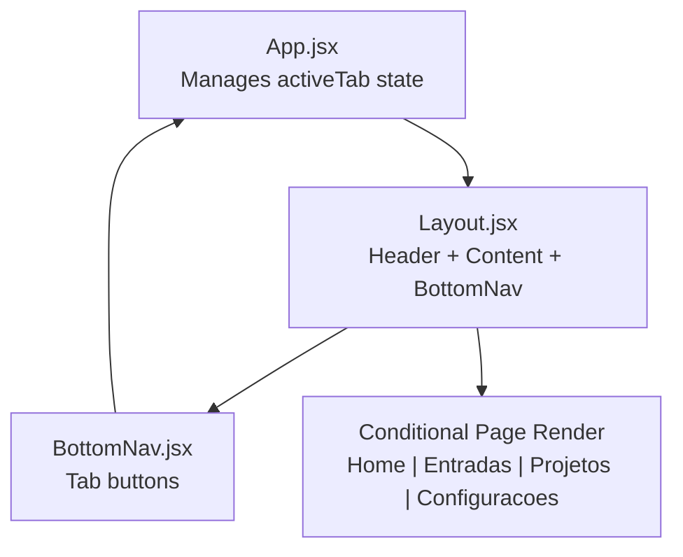
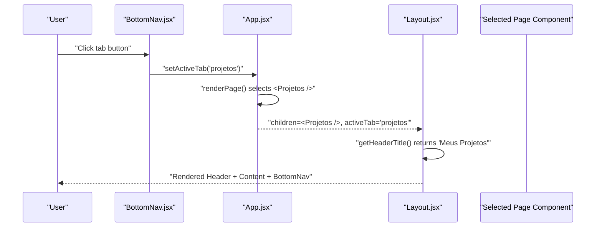
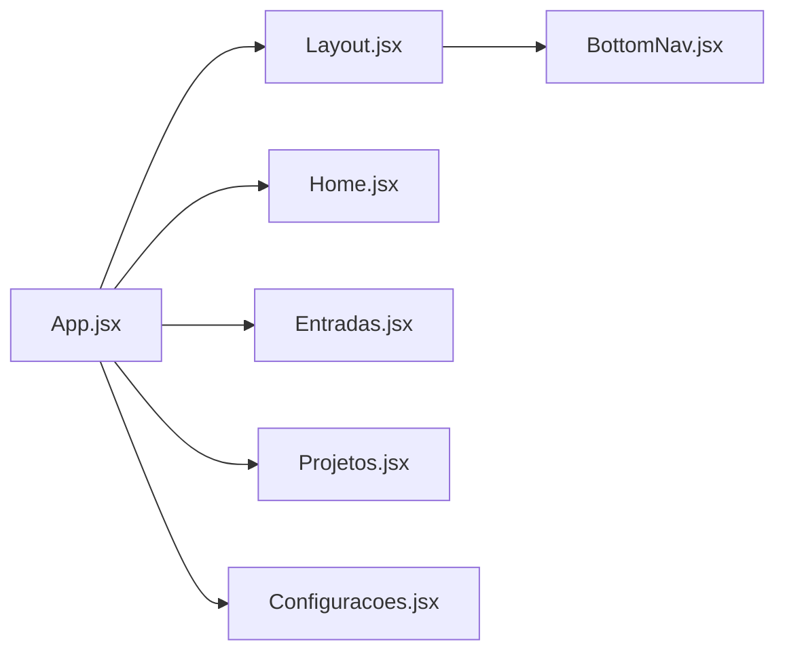

# Navigation System

<cite>
**Referenced Files in This Document**
- [App.jsx](file://src/App.jsx)
- [Layout.jsx](file://src/components/Layout/Layout.jsx)
- [BottomNav.jsx](file://src/components/BottomNav/BottomNav.jsx)
- [Home.jsx](file://src/pages/Home/Home.jsx)
- [Entradas.jsx](file://src/pages/Entradas/Entradas.jsx)
- [Projetos.jsx](file://src/pages/Projetos/Projetos.jsx)
- [Configuracoes.jsx](file://src/pages/Configuracoes/Configuracoes.jsx)
- [BottomNav.css](file://src/components/BottomNav/BottomNav.css)
- [Layout.css](file://src/components/Layout/Layout.css)
</cite>

## Table of Contents
1. [Introduction](#introduction)
2. [Project Structure](#project-structure)
3. [Core Components](#core-components)
4. [Architecture Overview](#architecture-overview)
5. [Detailed Component Analysis](#detailed-component-analysis)
6. [Dependency Analysis](#dependency-analysis)
7. [Performance Considerations](#performance-considerations)
8. [Troubleshooting Guide](#troubleshooting-guide)
9. [Conclusion](#conclusion)
10. [Appendices](#appendices)

## Introduction
This section documents the tab-based navigation system used by the Nordic Worklog application. The app uses a simple, state-driven approach:
- A single source of truth for the active tab lives in the root App component.
- Conditional rendering displays the corresponding page based on the active tab identifier.
- The BottomNav component provides user controls to switch tabs and reflects the current selection visually.
- The Layout component composes the header title dynamically from the active tab and wraps all pages with consistent chrome (header, content area, bottom nav).

The navigation is string-based: each tab is identified by a lowercase string key that maps directly to a page component. This design keeps routing lightweight and easy to extend without introducing a full client-side router.

## Project Structure
The navigation-related files are organized as follows:
- Root orchestrator: App.jsx manages activeTab state and renders the selected page inside Layout.
- Layout shell: Layout.jsx renders the fixed header, main content area, and BottomNav. It also computes the dynamic header title.
- Bottom navigation: BottomNav.jsx renders the tab buttons and triggers setActiveTab when clicked.
- Pages: Home, Entradas, Projetos, Configuracoes are rendered conditionally based on activeTab.

**Diagram sources**
- [App.jsx:12-35](file://src/App.jsx#L12-L35)
- [Layout.jsx:11-47](file://src/components/Layout/Layout.jsx#L11-L47)
- [BottomNav.jsx:10-36](file://src/components/BottomNav/BottomNav.jsx#L10-L36)

**Section sources**
- [App.jsx:1-39](file://src/App.jsx#L1-L39)
- [Layout.jsx:1-49](file://src/components/Layout/Layout.jsx#L1-L49)
- [BottomNav.jsx:1-37](file://src/components/BottomNav/BottomNav.jsx#L1-L37)

## Core Components
- App
  - Owns activeTab state initialized to 'home'.
  - Uses a renderPage function to map the active tab string to a page component via conditional logic.
  - Passes activeTab and setActiveTab down to Layout.
- Layout
  - Receives children (the currently rendered page), activeTab, and setActiveTab.
  - Computes a human-readable header title based on activeTab.
  - Renders a fixed header, scrollable content area, and BottomNav at the bottom.
- BottomNav
  - Declares an array of tab items with id, label, and icon.
  - Maps over items to render buttons; sets active styling when item.id equals activeTab.
  - Calls setActiveTab(item.id) on click to switch tabs.

Key behaviors:
- String-based identifiers: 'home', 'entradas', 'projetos', 'configuracoes'.
- One-way data flow: BottomNav updates state in App; App re-renders Layout and the selected page.
- Dynamic header titles: Layout translates the active tab into localized titles.

**Section sources**
- [App.jsx:12-35](file://src/App.jsx#L12-L35)
- [Layout.jsx:11-26](file://src/components/Layout/Layout.jsx#L11-L26)
- [BottomNav.jsx:10-36](file://src/components/BottomNav/BottomNav.jsx#L10-L36)

## Architecture Overview
The navigation architecture centers around a single stateful parent (App) and two presentational/layout children (Layout and BottomNav). There is no URL-based routing; navigation is purely state-driven within the React tree.

**Diagram sources**
- [BottomNav.jsx:22-32](file://src/components/BottomNav/BottomNav.jsx#L22-L32)
- [App.jsx:16-29](file://src/App.jsx#L16-L29)
- [Layout.jsx:13-26](file://src/components/Layout/Layout.jsx#L13-L26)

## Detailed Component Analysis

### App Component
Responsibilities:
- State ownership: activeTab string.
- Page resolution: renderPage maps activeTab to a specific page component.
- Composition: passes activeTab and setActiveTab to Layout and renders the selected page as children.

State and mapping:
- Active tab values: 'home', 'entradas', 'projetos', 'configuracoes'.
- Default fallback: if activeTab is unknown, render Home.

Rendering strategy:
- Conditional rendering using a switch-like pattern inside renderPage.
- Children passed to Layout represent the currently active page.

Extensibility:
- To add a new tab, define a new string id, update renderPage to return the new page component, and ensure Layout and BottomNav include the new id.

**Section sources**
- [App.jsx:12-35](file://src/App.jsx#L12-L35)

### Layout Component
Responsibilities:
- Compose the app shell: fixed header, scrollable content area, and fixed bottom navigation.
- Compute header title based on activeTab.
- Forward activeTab and setActiveTab to BottomNav.

Header title mapping:
- Translates activeTab strings into localized titles for the header.

Styling considerations:
- Fixed header and bottom nav require padding adjustments in the content area to avoid overlap.

**Section sources**
- [Layout.jsx:11-47](file://src/components/Layout/Layout.jsx#L11-L47)
- [Layout.css:1-74](file://src/components/Layout/Layout.css#L1-L74)

### BottomNav Component
Responsibilities:
- Present tab buttons with icons and labels.
- Reflect active state visually.
- Emit setActiveTab(item.id) on click.

Data model:
- navItems array defines id, label, and icon for each tab.
- Active class applied when item.id matches activeTab.

Accessibility:
- aria-label attributes provide screen reader context for each tab.

Styling:
- CSS classes control layout, typography, transitions, and active state color.

**Section sources**
- [BottomNav.jsx:10-36](file://src/components/BottomNav/BottomNav.jsx#L10-L36)
- [BottomNav.css:1-59](file://src/components/BottomNav/BottomNav.css#L1-L59)

### Page Components Integration
Each page is a simple functional component returned by renderPage:
- Home: placeholder workspace area.
- Entradas: placeholder list area for work entries.
- Projetos: sample project list with subcomponents.
- Configuracoes: settings options including theme toggle and parameters.

These components receive no navigation props; they rely on the parent to render them when their tab is active.

**Section sources**
- [Home.jsx:1-19](file://src/pages/Home/Home.jsx#L1-L19)
- [Entradas.jsx:1-19](file://src/pages/Entradas/Entradas.jsx#L1-L19)
- [Projetos.jsx:1-31](file://src/pages/Projetos/Projetos.jsx#L1-L31)
- [Configuracoes.jsx:1-70](file://src/pages/Configuracoes/Configuracoes.jsx#L1-L70)

## Dependency Analysis
High-level relationships:
- App depends on Layout and all page components.
- Layout depends on BottomNav and renders children (pages).
- BottomNav depends only on its own styles and icon library.

**Diagram sources**
- [App.jsx:2-6](file://src/App.jsx#L2-L6)
- [Layout.jsx:2](file://src/components/Layout/Layout.jsx#L2)

**Section sources**
- [App.jsx:1-39](file://src/App.jsx#L1-L39)
- [Layout.jsx:1-49](file://src/components/Layout/Layout.jsx#L1-L49)
- [BottomNav.jsx:1-37](file://src/components/BottomNav/BottomNav.jsx#L1-L37)

## Performance Considerations
- Rendering cost: Each tab switch re-renders Layout and the selected page. For small apps this is negligible. If pages become heavy, consider memoization or lazy loading per tab.
- State co-location: Keeping activeTab in App avoids prop drilling beyond one level and simplifies reasoning about navigation state.
- Styling performance: CSS transitions are minimal and hardware-accelerated where possible (transform on active icon). Avoid excessive inline styles in hot paths.

[No sources needed since this section provides general guidance]

## Troubleshooting Guide
Common issues and resolutions:
- Tab does not change:
  - Ensure setActiveTab is passed to BottomNav and invoked with the correct id.
  - Verify activeTab value matches the id defined in BottomNav’s navItems.
- Header title mismatch:
  - Confirm getHeaderTitle includes a case for the new tab id and returns the expected title.
- New tab not visible:
  - Add the new id to BottomNav’s navItems.
  - Add a case in App’s renderPage to return the new page component.
  - Add a case in Layout’s getHeaderTitle to set the header title.
- Visual overlap with fixed header/bottom nav:
  - Check Layout.css content area padding-top and padding-bottom to account for fixed elements.

**Section sources**
- [BottomNav.jsx:22-32](file://src/components/BottomNav/BottomNav.jsx#L22-L32)
- [Layout.jsx:13-26](file://src/components/Layout/Layout.jsx#L13-L26)
- [Layout.css:41-48](file://src/components/Layout/Layout.css#L41-L48)

## Conclusion
The navigation system is intentionally simple and effective for a small application:
- Single source of truth for navigation state.
- Clear separation between layout, navigation controls, and page content.
- Easy to extend by adding new string-based tab ids and corresponding page components.

This approach scales well until more advanced features (deep linking, history, nested routes) are required, at which point a dedicated router may be considered.

[No sources needed since this section summarizes without analyzing specific files]

## Appendices

### String-Based Tab Identifier System
- Identifiers: 'home', 'entradas', 'projetos', 'configuracoes'
- Mapping locations:
  - App: renderPage maps ids to page components.
  - Layout: getHeaderTitle maps ids to header titles.
  - BottomNav: navItems arrays define ids, labels, and icons.

Best practices:
- Keep ids lowercase and stable.
- Centralize definitions in BottomNav and mirror mappings in App and Layout.

**Section sources**
- [App.jsx:16-29](file://src/App.jsx#L16-L29)
- [Layout.jsx:13-26](file://src/components/Layout/Layout.jsx#L13-L26)
- [BottomNav.jsx:12-17](file://src/components/BottomNav/BottomNav.jsx#L12-L17)

### Adding a New Navigation Tab
Steps:
1. Create a new page component under src/pages/<NewTab>/<NewTab>.jsx.
2. In BottomNav, add a new entry to navItems with id, label, and icon.
3. In App, add a case in renderPage to return the new page component for the new id.
4. In Layout, add a case in getHeaderTitle to return the desired header title.
5. Test clicking the new tab and verify header title and page content.

Example references:
- BottomNav tab definition: [BottomNav.jsx:12-17](file://src/components/BottomNav/BottomNav.jsx#L12-L17)
- App page mapping: [App.jsx:16-29](file://src/App.jsx#L16-L29)
- Layout header mapping: [Layout.jsx:13-26](file://src/components/Layout/Layout.jsx#L13-L26)

### Implementing Custom Navigation Behaviors
Options:
- Persist last active tab across reloads by syncing activeTab to localStorage.
- Guard access to certain tabs based on authentication state held in a context.
- Introduce a transition effect by wrapping page changes with a fade animation in Layout.

Implementation pointers:
- Persist state: initialize activeTab from storage and write to storage on setActiveTab calls.
- Context integration: lift activeTab into a shared context if multiple screens need to read/write it.
- Animations: apply a CSS class to children during transitions and manage it alongside activeTab.

[No sources needed since this section provides general guidance]