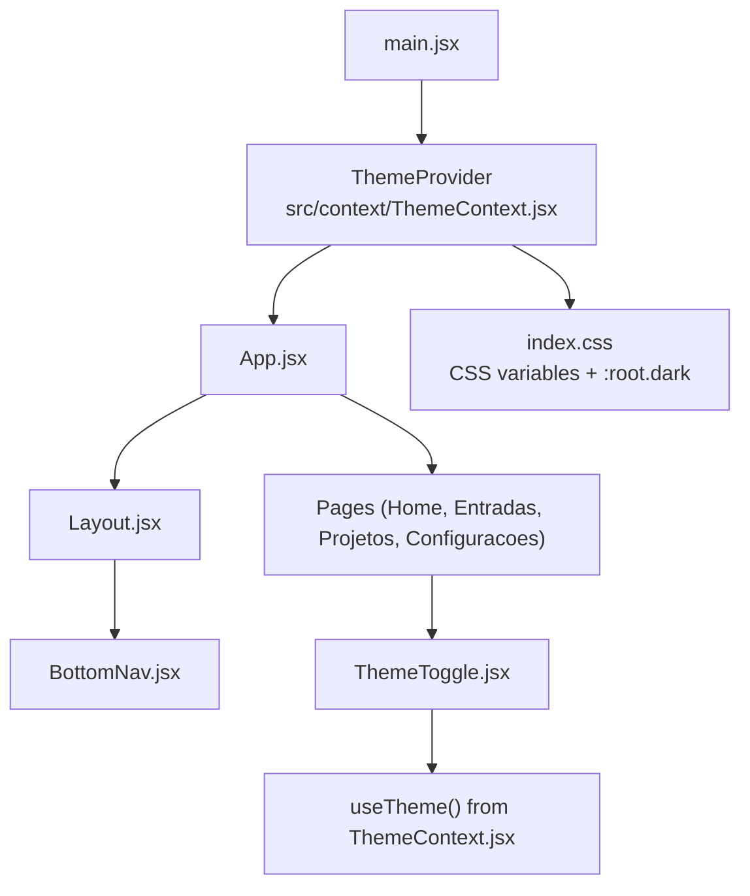
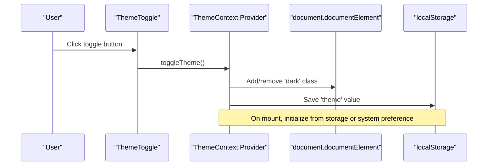
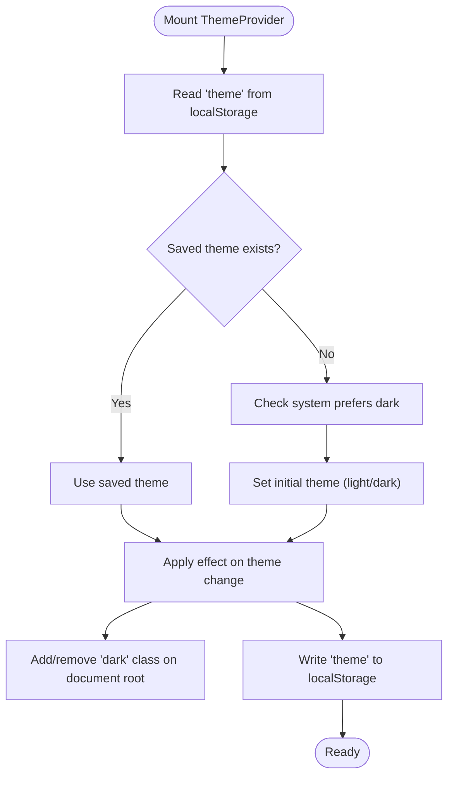
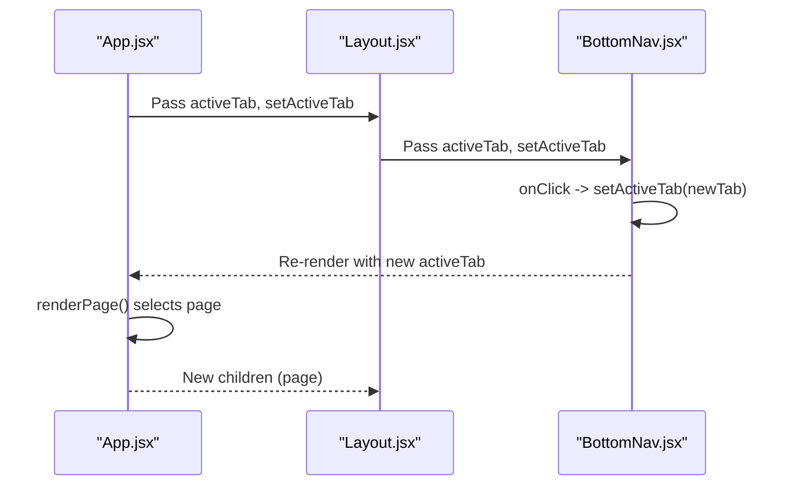
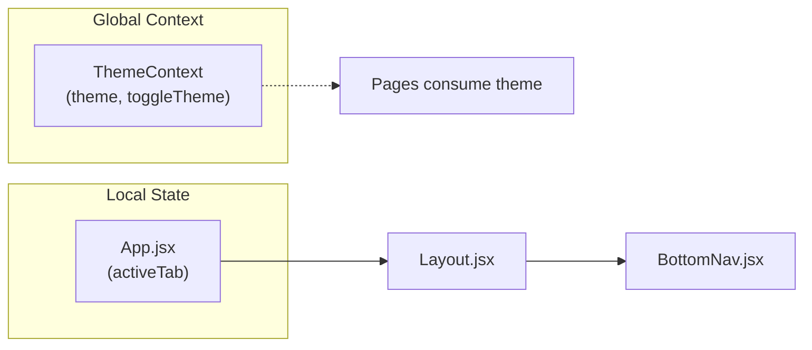
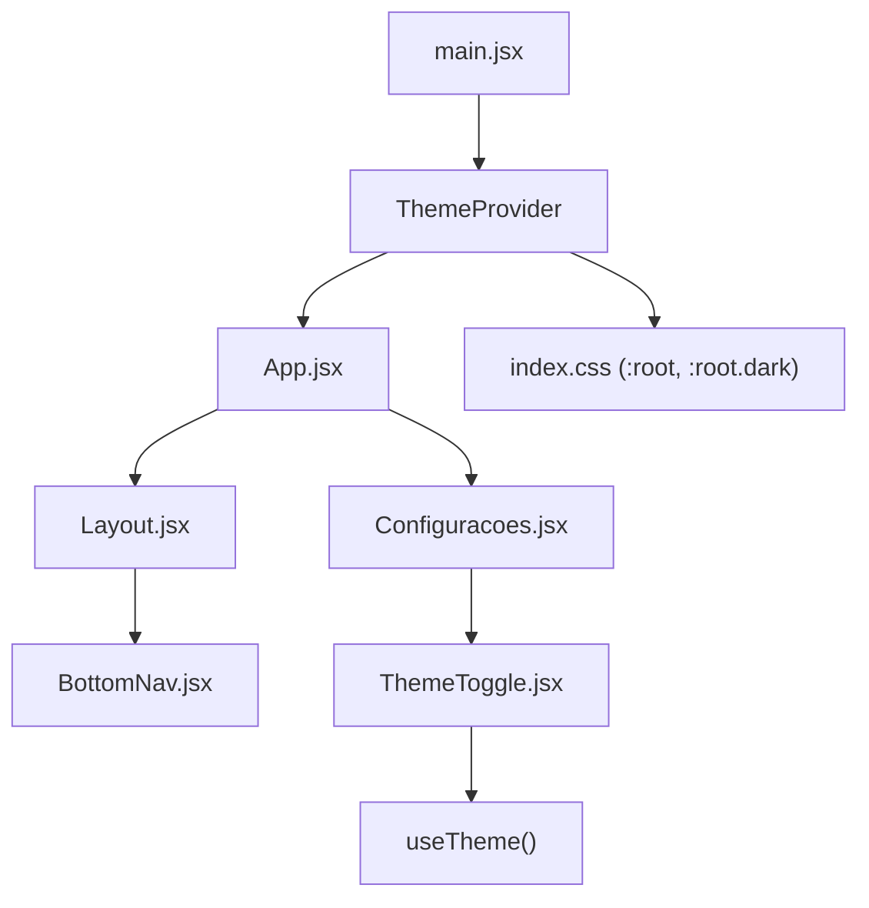

# State Management

<cite>
**Referenced Files in This Document**
- [ThemeContext.jsx](file://src/context/ThemeContext.jsx)
- [main.jsx](file://src/main.jsx)
- [App.jsx](file://src/App.jsx)
- [Layout.jsx](file://src/components/Layout/Layout.jsx)
- [BottomNav.jsx](file://src/components/BottomNav/BottomNav.jsx)
- [Configuracoes.jsx](file://src/pages/Configuracoes/Configuracoes.jsx)
- [ThemeToggle.jsx](file://src/pages/Configuracoes/components/ThemeToggle.jsx)
- [index.css](file://src/index.css)
</cite>

## Table of Contents
1. [Introduction](#introduction)
2. [Project Structure](#project-structure)
3. [Core Components](#core-components)
4. [Architecture Overview](#architecture-overview)
5. [Detailed Component Analysis](#detailed-component-analysis)
6. [Dependency Analysis](#dependency-analysis)
7. [Performance Considerations](#performance-considerations)
8. [Troubleshooting Guide](#troubleshooting-guide)
9. [Conclusion](#conclusion)

## Introduction
This document explains the state management architecture of the Nordic Worklog application with a focus on:
- Global theme state via React Context API (ThemeContext)
- Local navigation state in App.jsx using activeTab
- Theme persistence to localStorage and automatic detection of system preferences
- How state changes propagate through the component tree
- The separation between global context state and local component state
- Examples of consuming context values and updating state patterns used across the app

## Project Structure
The state-related parts of the application are organized into clear layers:
- Global theme state is provided at the root via ThemeProvider and consumed by components that need theme access
- Navigation state is owned by App.jsx and passed down to Layout and BottomNav for UI updates
- CSS variables switch based on a .dark class applied to the document root, driven by theme state



**Diagram sources**
- [main.jsx:8-14](file://src/main.jsx#L8-L14)
- [ThemeContext.jsx:7-38](file://src/context/ThemeContext.jsx#L7-L38)
- [App.jsx:12-36](file://src/App.jsx#L12-L36)
- [Layout.jsx:11-48](file://src/components/Layout/Layout.jsx#L11-L48)
- [BottomNav.jsx:10-36](file://src/components/BottomNav/BottomNav.jsx#L10-L36)
- [ThemeToggle.jsx:9-54](file://src/pages/Configuracoes/components/ThemeToggle.jsx#L9-L54)
- [index.css:7-28](file://src/index.css#L7-L28)

**Section sources**
- [main.jsx:1-15](file://src/main.jsx#L1-L15)
- [ThemeContext.jsx:1-49](file://src/context/ThemeContext.jsx#L1-L49)
- [App.jsx:1-39](file://src/App.jsx#L1-L39)
- [Layout.jsx:1-49](file://src/components/Layout/Layout.jsx#L1-L49)
- [BottomNav.jsx:1-37](file://src/components/BottomNav/BottomNav.jsx#L1-L37)
- [ThemeToggle.jsx:1-55](file://src/pages/Configuracoes/components/ThemeToggle.jsx#L1-L55)
- [index.css:1-86](file://src/index.css#L1-L86)

## Core Components
- ThemeContext provides global theme state and a toggle function. It initializes theme from localStorage or system preference, applies a .dark class to the document root, and persists changes to localStorage.
- App.jsx owns local navigation state (activeTab) and renders the corresponding page. It passes activeTab and setActiveTab to Layout and BottomNav.
- Layout receives activeTab and setActiveTab and forwards them to BottomNav while rendering the current page content.
- BottomNav displays navigation items and calls setActiveTab when a tab is clicked.
- ThemeToggle consumes useTheme to read current theme and call toggleTheme.

Key responsibilities:
- Global state: ThemeContext (theme, toggleTheme)
- Local state: App.jsx (activeTab)
- Consumption: ThemeToggle (global), Layout and BottomNav (local)

**Section sources**
- [ThemeContext.jsx:7-48](file://src/context/ThemeContext.jsx#L7-L48)
- [App.jsx:12-36](file://src/App.jsx#L12-L36)
- [Layout.jsx:11-48](file://src/components/Layout/Layout.jsx#L11-L48)
- [BottomNav.jsx:10-36](file://src/components/BottomNav/BottomNav.jsx#L10-L36)
- [ThemeToggle.jsx:9-54](file://src/pages/Configuracoes/components/ThemeToggle.jsx#L9-L54)

## Architecture Overview
The application uses two complementary state strategies:
- Global theme state via Context API for cross-cutting concerns (UI theme)
- Local state for top-level navigation control within App.jsx



**Diagram sources**
- [ThemeToggle.jsx:9-54](file://src/pages/Configuracoes/components/ThemeToggle.jsx#L9-L54)
- [ThemeContext.jsx:7-38](file://src/context/ThemeContext.jsx#L7-L38)
- [index.css:7-28](file://src/index.css#L7-L28)

## Detailed Component Analysis

### Global Theme State (ThemeContext)
- Initialization: Reads localStorage first; if absent, checks system preference via matchMedia and defaults accordingly.
- Persistence: A side effect adds/removes the .dark class on the document root and writes the selected theme to localStorage whenever it changes.
- API surface: Exposes theme value and toggleTheme function via Provider; provides a custom hook useTheme for safe consumption.



**Diagram sources**
- [ThemeContext.jsx:9-27](file://src/context/ThemeContext.jsx#L9-L27)
- [index.css:7-28](file://src/index.css#L7-L28)

**Section sources**
- [ThemeContext.jsx:1-49](file://src/context/ThemeContext.jsx#L1-L49)

### Local Navigation State (App.jsx)
- Ownership: App.jsx holds activeTab and setActiveTab.
- Rendering: A simple renderPage function switches between Home, Entradas, Projetos, and Configuracoes based on activeTab.
- Propagation: Active tab and setter are passed to Layout, which forwards them to BottomNav.



**Diagram sources**
- [App.jsx:12-36](file://src/App.jsx#L12-L36)
- [Layout.jsx:11-48](file://src/components/Layout/Layout.jsx#L11-L48)
- [BottomNav.jsx:10-36](file://src/components/BottomNav/BottomNav.jsx#L10-L36)

**Section sources**
- [App.jsx:1-39](file://src/App.jsx#L1-L39)
- [Layout.jsx:1-49](file://src/components/Layout/Layout.jsx#L1-L49)
- [BottomNav.jsx:1-37](file://src/components/BottomNav/BottomNav.jsx#L1-L37)

### Consuming Context Values (ThemeToggle)
- Pattern: Import and call useTheme to get { theme, toggleTheme }.
- Usage: Render icon and label based on current theme; bind toggleTheme to button click.
- Effect: Toggling triggers ThemeContext’s effect to update DOM and persist to localStorage.

```mermaid
classDiagram
class ThemeContext {
+value : { theme, toggleTheme }
}
class ThemeToggle {
+render()
-useTheme()
}
ThemeToggle --> ThemeContext : "consumes via useTheme()"
```

**Diagram sources**
- [ThemeContext.jsx:34-48](file://src/context/ThemeContext.jsx#L34-L48)
- [ThemeToggle.jsx:9-54](file://src/pages/Configuracoes/components/ThemeToggle.jsx#L9-L54)

**Section sources**
- [ThemeToggle.jsx:1-55](file://src/pages/Configuracoes/components/ThemeToggle.jsx#L1-L55)
- [ThemeContext.jsx:41-48](file://src/context/ThemeContext.jsx#L41-L48)

### Separation Between Global Context State and Local Component State
- Global context state (ThemeContext):
  - Scope: Entire application
  - Purpose: Cross-cutting UI theme
  - Lifecycle: Initialized once at root; persisted to localStorage; reacts to system preference
- Local component state (App.jsx):
  - Scope: App and its descendants via props
  - Purpose: Top-level navigation selection
  - Lifecycle: Controlled by user interactions in BottomNav; re-renders only affected branches



[No sources needed since this diagram shows conceptual separation]

## Dependency Analysis
- main.jsx wraps App with ThemeProvider so all descendants can consume theme.
- ThemeContext depends on browser APIs (localStorage, document.documentElement.classList, window.matchMedia).
- ThemeToggle depends on useTheme and icons library for visual feedback.
- App.jsx depends on Layout and BottomNav for navigation flow.



**Diagram sources**
- [main.jsx:8-14](file://src/main.jsx#L8-L14)
- [ThemeContext.jsx:7-38](file://src/context/ThemeContext.jsx#L7-L38)
- [App.jsx:12-36](file://src/App.jsx#L12-L36)
- [Layout.jsx:11-48](file://src/components/Layout/Layout.jsx#L11-L48)
- [BottomNav.jsx:10-36](file://src/components/BottomNav/BottomNav.jsx#L10-L36)
- [Configuracoes.jsx:10-69](file://src/pages/Configuracoes/Configuracoes.jsx#L10-L69)
- [ThemeToggle.jsx:9-54](file://src/pages/Configuracoes/components/ThemeToggle.jsx#L9-L54)
- [index.css:7-28](file://src/index.css#L7-L28)

**Section sources**
- [main.jsx:1-15](file://src/main.jsx#L1-L15)
- [ThemeContext.jsx:1-49](file://src/context/ThemeContext.jsx#L1-L49)
- [App.jsx:1-39](file://src/App.jsx#L1-L39)
- [Layout.jsx:1-49](file://src/components/Layout/Layout.jsx#L1-L49)
- [BottomNav.jsx:1-37](file://src/components/BottomNav/BottomNav.jsx#L1-L37)
- [Configuracoes.jsx:1-70](file://src/pages/Configuracoes/Configuracoes.jsx#L1-L70)
- [ThemeToggle.jsx:1-55](file://src/pages/Configuracoes/components/ThemeToggle.jsx#L1-L55)
- [index.css:1-86](file://src/index.css#L1-L86)

## Performance Considerations
- Context re-renders: Any consumer of ThemeContext will re-render when theme changes. Keep consumers focused (e.g., ThemeToggle) to minimize unnecessary updates.
- Side effects: ThemeContext applies DOM class and writes to localStorage on every theme change. This is lightweight but consider batching if more frequent updates are added later.
- System preference listener: If you add a listener for system preference changes, ensure cleanup to avoid memory leaks.

[No sources needed since this section provides general guidance]

## Troubleshooting Guide
- Theme not applying:
  - Ensure document.documentElement has the correct class (.dark or none).
  - Verify CSS variables under :root and :root.dark are defined.
- Theme not persisting:
  - Confirm localStorage is available and not blocked.
  - Check that the effect runs after theme initialization.
- useTheme error:
  - Using useTheme outside ThemeProvider throws an error. Wrap your app with ThemeProvider at the root.

**Section sources**
- [ThemeContext.jsx:19-27](file://src/context/ThemeContext.jsx#L19-L27)
- [ThemeContext.jsx:42-48](file://src/context/ThemeContext.jsx#L42-L48)
- [index.css:7-28](file://src/index.css#L7-L28)

## Conclusion
The Nordic Worklog app cleanly separates concerns:
- Global theme state via ThemeContext ensures consistent theming across the entire application with persistence and system preference support.
- Local navigation state in App.jsx keeps routing logic simple and contained, passing minimal props to child components.
Together, these patterns provide a scalable and maintainable foundation for future feature growth.