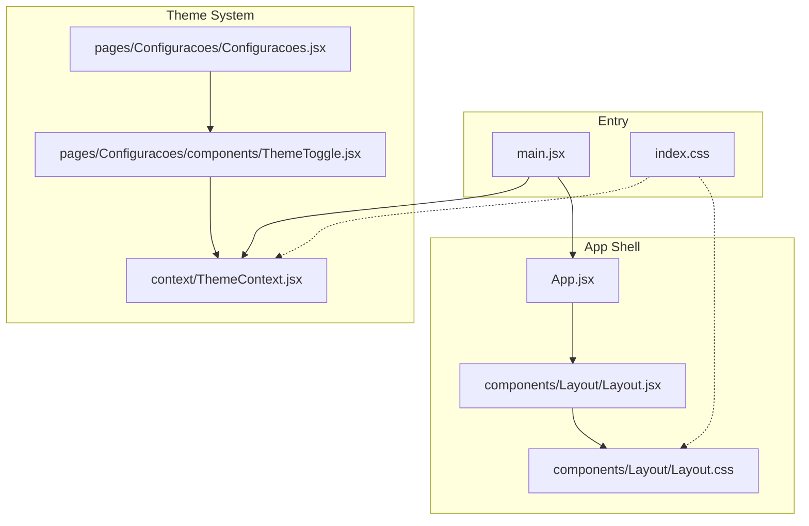
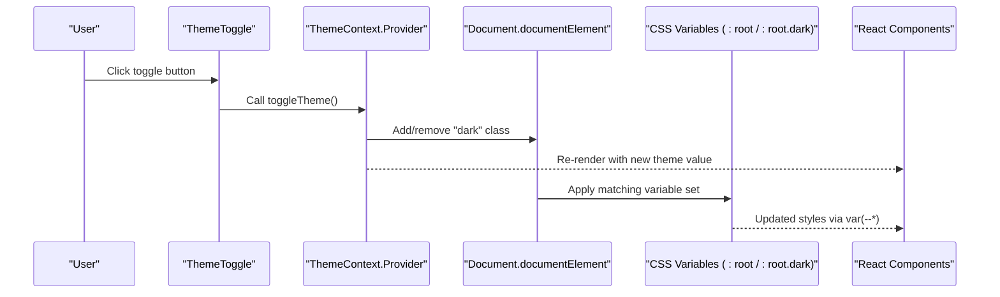
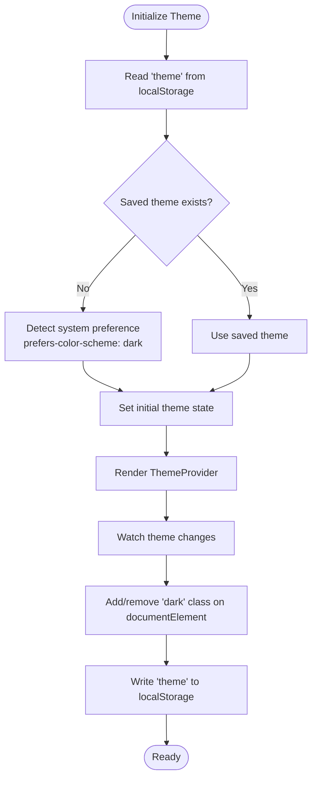
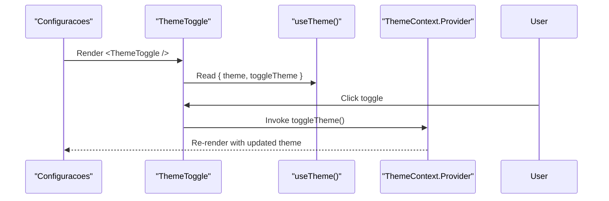
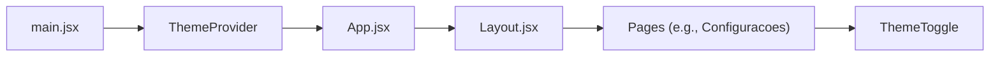
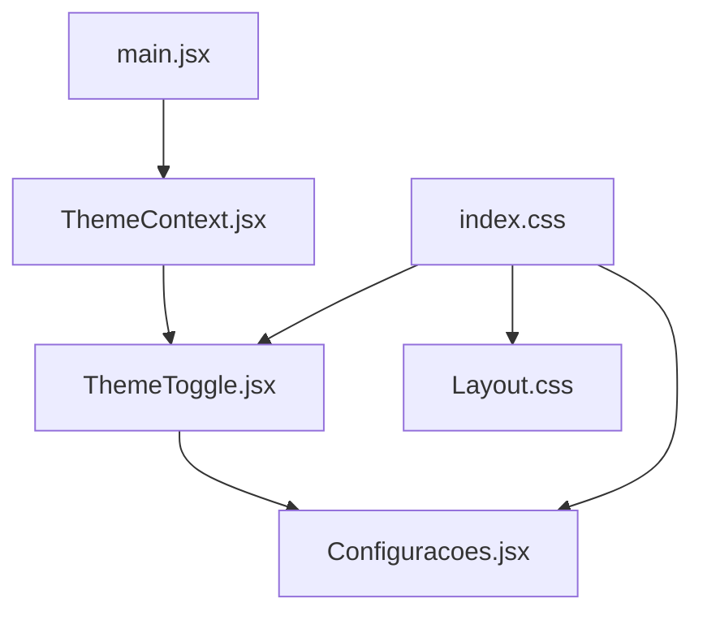

# Theming Architecture

<cite>
**Referenced Files in This Document**
- [ThemeContext.jsx](file://src/context/ThemeContext.jsx)
- [ThemeToggle.jsx](file://src/pages/Configuracoes/components/ThemeToggle.jsx)
- [index.css](file://src/index.css)
- [Layout.css](file://src/components/Layout/Layout.css)
- [main.jsx](file://src/main.jsx)
- [App.jsx](file://src/App.jsx)
- [Configuracoes.jsx](file://src/pages/Configuracoes/Configuracoes.jsx)
</cite>

## Table of Contents
1. [Introduction](#introduction)
2. [Project Structure](#project-structure)
3. [Core Components](#core-components)
4. [Architecture Overview](#architecture-overview)
5. [Detailed Component Analysis](#detailed-component-analysis)
6. [Dependency Analysis](#dependency-analysis)
7. [Performance Considerations](#performance-considerations)
8. [Troubleshooting Guide](#troubleshooting-guide)
9. [Conclusion](#conclusion)
10. [Appendices](#appendices)

## Introduction
This section documents the theming architecture of the Nordic Worklog application, focusing on:
- The ThemeContext provider that manages global light/dark theme state
- CSS custom properties (variables) that enable dynamic styling based on theme context
- Persistence of user preference using localStorage and automatic detection of system color scheme preferences
- The theme switching flow across the application
- The ThemeToggle component implementation and its integration with the global theme context
- Guidance for extending the theme system with additional color schemes or design tokens

## Project Structure
The theming system is implemented through a small set of focused files:
- A React Context provider for theme state management
- Global CSS variables defining light and dark palettes
- A toggle UI component that consumes the theme context
- Application entrypoint wrapping the app with the ThemeProvider



**Diagram sources**
- [main.jsx:1-15](file://src/main.jsx#L1-L15)
- [index.css:1-86](file://src/index.css#L1-L86)
- [App.jsx:1-39](file://src/App.jsx#L1-L39)
- [Layout.jsx:1-49](file://src/components/Layout/Layout.jsx#L1-L49)
- [Layout.css:1-74](file://src/components/Layout/Layout.css#L1-L74)
- [ThemeContext.jsx:1-49](file://src/context/ThemeContext.jsx#L1-L49)
- [ThemeToggle.jsx:1-55](file://src/pages/Configuracoes/components/ThemeToggle.jsx#L1-L55)
- [Configuracoes.jsx:1-70](file://src/pages/Configuracoes/Configuracoes.jsx#L1-L70)

**Section sources**
- [main.jsx:1-15](file://src/main.jsx#L1-L15)
- [index.css:1-86](file://src/index.css#L1-L86)
- [App.jsx:1-39](file://src/App.jsx#L1-L39)
- [Layout.jsx:1-49](file://src/components/Layout/Layout.jsx#L1-L49)
- [Layout.css:1-74](file://src/components/Layout/Layout.css#L1-L74)
- [ThemeContext.jsx:1-49](file://src/context/ThemeContext.jsx#L1-L49)
- [ThemeToggle.jsx:1-55](file://src/pages/Configuracoes/components/ThemeToggle.jsx#L1-L55)
- [Configuracoes.jsx:1-70](file://src/pages/Configuracoes/Configuracoes.jsx#L1-L70)

## Core Components
- ThemeContext Provider: Creates a React context to hold the current theme value and a function to toggle it. It initializes the theme from localStorage or system preference, applies a class to the document root, and persists changes.
- useTheme Hook: A convenience hook to access the theme context safely within components.
- ThemeToggle Component: A minimal toggle UI that reads the current theme and calls the toggle function when clicked.
- CSS Custom Properties: Global variables defined for both light and dark themes under :root and :root.dark, consumed by components via var(--name).

Key responsibilities:
- State initialization and persistence
- DOM class toggling for CSS variable scoping
- Providing a simple API for consumers

**Section sources**
- [ThemeContext.jsx:1-49](file://src/context/ThemeContext.jsx#L1-L49)
- [ThemeToggle.jsx:1-55](file://src/pages/Configuracoes/components/ThemeToggle.jsx#L1-L55)
- [index.css:1-86](file://src/index.css#L1-L86)

## Architecture Overview
The theming architecture follows a unidirectional data flow:
- The ThemeProvider initializes theme state and updates the document root class accordingly.
- CSS variables scoped under :root and :root.dark define the visual tokens for each theme.
- Components consume the theme via the useTheme hook and apply styles using CSS variables.
- User interactions trigger theme changes, which propagate through React re-renders and CSS variable updates.



**Diagram sources**
- [ThemeToggle.jsx:1-55](file://src/pages/Configuracoes/components/ThemeToggle.jsx#L1-L55)
- [ThemeContext.jsx:1-49](file://src/context/ThemeContext.jsx#L1-L49)
- [index.css:1-86](file://src/index.css#L1-L86)

## Detailed Component Analysis

### ThemeContext Provider
Responsibilities:
- Initialize theme from localStorage; if absent, detect system preference using media query
- Maintain theme state and expose a toggle function
- Update the document root class and persist the selection
- Provide a safe hook for consuming the context

Implementation highlights:
- Uses useState with an initializer function to avoid unnecessary work during SSR-like scenarios
- Uses useEffect to synchronize the DOM class and localStorage with the current theme
- Throws a descriptive error if used outside ThemeProvider



**Diagram sources**
- [ThemeContext.jsx:1-49](file://src/context/ThemeContext.jsx#L1-L49)

**Section sources**
- [ThemeContext.jsx:1-49](file://src/context/ThemeContext.jsx#L1-L49)

### CSS Custom Properties Architecture
Design tokens are defined as CSS variables under two scopes:
- Default scope (:root) for light theme
- Dark scope (:root.dark) for dark theme

Tokens include background colors, text colors, accent color, border color, font family, transition speed, and safe area insets. Components reference these tokens via var(--name), enabling instant theme switching without JavaScript-driven style recalculation beyond the class change.

Usage patterns:
- Body and layout elements bind to background and text tokens
- Cards and headers bind to secondary backgrounds and borders
- Transitions animate color changes smoothly

```mermaid
classDiagram
class CSSVariables {
"+Light tokens ( : root)"
"+Dark tokens ( : root.dark)"
"+Backgrounds"
"+Text colors"
"+Accent color"
"+Borders"
"+Fonts"
"+Transitions"
}
class Components {
"+Header"
"+Cards"
"+Body"
"+Buttons"
}
Components --> CSSVariables : "consumes var(--...)"
```

**Diagram sources**
- [index.css:1-86](file://src/index.css#L1-L86)
- [Layout.css:1-74](file://src/components/Layout/Layout.css#L1-L74)

**Section sources**
- [index.css:1-86](file://src/index.css#L1-L86)
- [Layout.css:1-74](file://src/components/Layout/Layout.css#L1-L74)

### ThemeToggle Component
Purpose:
- Provides a minimal toggle control to switch between light and dark themes
- Reflects the current theme visually and exposes accessibility label

Integration:
- Consumes the theme context via useTheme
- Calls the provided toggle function on click
- Applies inline styles referencing CSS variables for consistent theming



**Diagram sources**
- [ThemeToggle.jsx:1-55](file://src/pages/Configuracoes/components/ThemeToggle.jsx#L1-L55)
- [ThemeContext.jsx:1-49](file://src/context/ThemeContext.jsx#L1-L49)
- [Configuracoes.jsx:1-70](file://src/pages/Configuracoes/Configuracoes.jsx#L1-L70)

**Section sources**
- [ThemeToggle.jsx:1-55](file://src/pages/Configuracoes/components/ThemeToggle.jsx#L1-L55)
- [Configuracoes.jsx:1-70](file://src/pages/Configuracoes/Configuracoes.jsx#L1-L70)

### Provider Integration
The application wraps the entire tree with ThemeProvider at the entry point so all descendant components can access the theme context.



**Diagram sources**
- [main.jsx:1-15](file://src/main.jsx#L1-L15)
- [App.jsx:1-39](file://src/App.jsx#L1-L39)
- [Layout.jsx:1-49](file://src/components/Layout/Layout.jsx#L1-L49)
- [Configuracoes.jsx:1-70](file://src/pages/Configuracoes/Configuracoes.jsx#L1-L70)
- [ThemeToggle.jsx:1-55](file://src/pages/Configuracoes/components/ThemeToggle.jsx#L1-L55)

**Section sources**
- [main.jsx:1-15](file://src/main.jsx#L1-L15)
- [App.jsx:1-39](file://src/App.jsx#L1-L39)

## Dependency Analysis
- main.jsx imports and renders ThemeProvider around App, establishing the global theme scope.
- ThemeContext.jsx exports ThemeProvider and useTheme; no other modules depend directly on it except components that need theme access.
- ThemeToggle.jsx depends on useTheme and react-icons for visuals.
- index.css defines the token sets; Layout.css and page components consume them via var(--...).



**Diagram sources**
- [main.jsx:1-15](file://src/main.jsx#L1-L15)
- [ThemeContext.jsx:1-49](file://src/context/ThemeContext.jsx#L1-L49)
- [ThemeToggle.jsx:1-55](file://src/pages/Configuracoes/components/ThemeToggle.jsx#L1-L55)
- [Configuracoes.jsx:1-70](file://src/pages/Configuracoes/Configuracoes.jsx#L1-L70)
- [index.css:1-86](file://src/index.css#L1-L86)
- [Layout.css:1-74](file://src/components/Layout/Layout.css#L1-L74)

**Section sources**
- [main.jsx:1-15](file://src/main.jsx#L1-L15)
- [ThemeContext.jsx:1-49](file://src/context/ThemeContext.jsx#L1-L49)
- [ThemeToggle.jsx:1-55](file://src/pages/Configuracoes/components/ThemeToggle.jsx#L1-L55)
- [index.css:1-86](file://src/index.css#L1-L86)
- [Layout.css:1-74](file://src/components/Layout/Layout.css#L1-L74)

## Performance Considerations
- Class-based theme switching via documentElement.classList ensures minimal JS overhead; CSS variables update instantly.
- Initial theme resolution avoids extra network requests and uses synchronous APIs (localStorage, matchMedia).
- Smooth transitions are enabled via CSS variables for transition duration, reducing jank during theme changes.

[No sources needed since this section provides general guidance]

## Troubleshooting Guide
Common issues and resolutions:
- Theme not applied on first load: Ensure the document root receives the correct class and that CSS variables are defined for both scopes. Verify that the provider is mounted before any component consumes the theme.
- Theme resets after refresh: Confirm that localStorage writes succeed and that the initializer reads the stored value correctly.
- Components not updating: Ensure they call useTheme inside a subtree wrapped by ThemeProvider and that they re-render on state change.

Operational checks:
- Verify the presence of the "dark" class on the document element when in dark mode.
- Inspect computed styles to ensure var(--...) resolve to expected values.

**Section sources**
- [ThemeContext.jsx:1-49](file://src/context/ThemeContext.jsx#L1-L49)
- [index.css:1-86](file://src/index.css#L1-L86)

## Conclusion
The Nordic Worklog theming system is intentionally simple and robust:
- A single source of truth for theme state lives in ThemeContext
- CSS custom properties provide a clean separation between tokens and logic
- Persistence and system preference detection deliver a seamless user experience
- The ThemeToggle component offers a clear integration point for users to switch themes

This approach scales well for adding more themes or tokens while keeping the runtime cost low.

[No sources needed since this section summarizes without analyzing specific files]

## Appendices

### Extending the Theme System
To add a new color scheme (for example, a high-contrast theme):
- Define a new CSS selector (e.g., :root.high-contrast) with updated tokens
- Extend ThemeContext to support additional theme values and update the toggle logic to cycle through available themes
- Optionally persist the selected theme name and initialize from storage/system preference accordingly

Guidelines:
- Keep tokens semantic (background, text, accent, border) rather than hardcoding colors
- Ensure all components consume tokens via var(--...) instead of direct color values
- Maintain consistent transition speeds and easing for smooth theme switches

[No sources needed since this section provides general guidance]