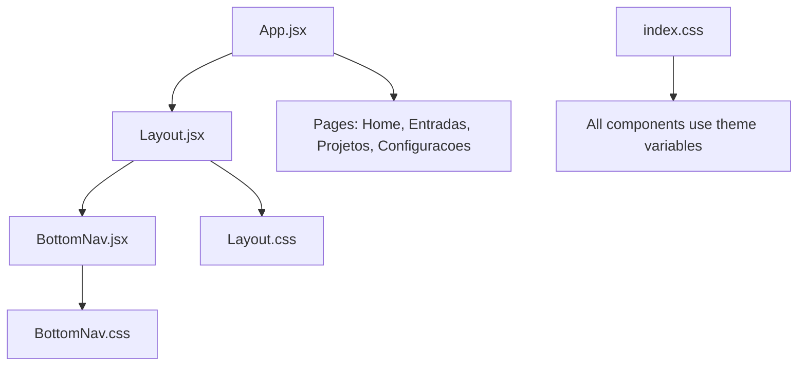
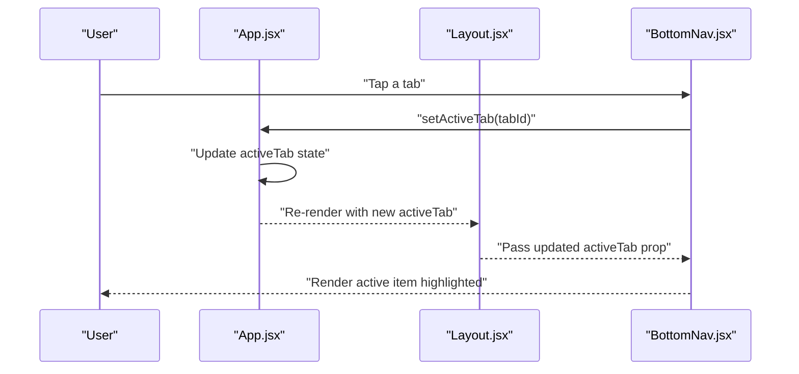
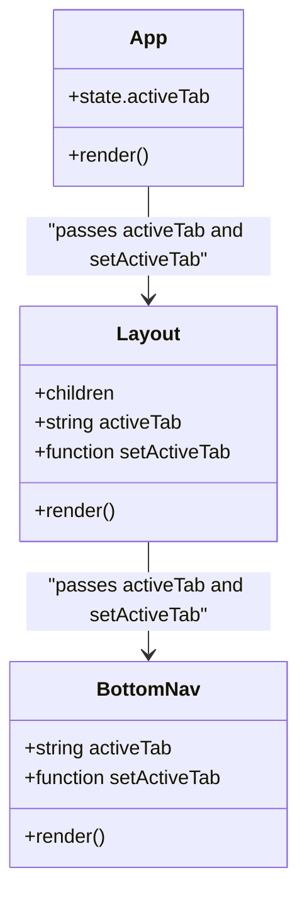
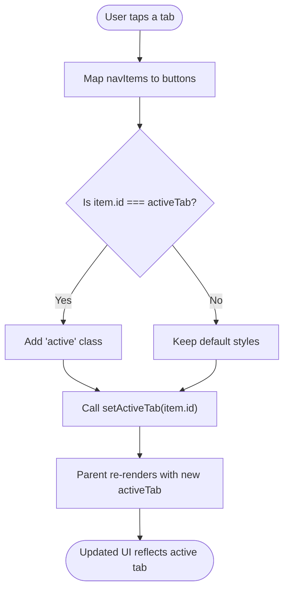
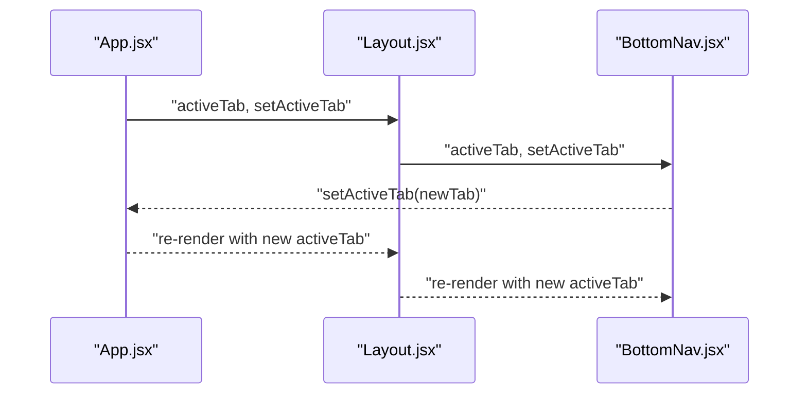
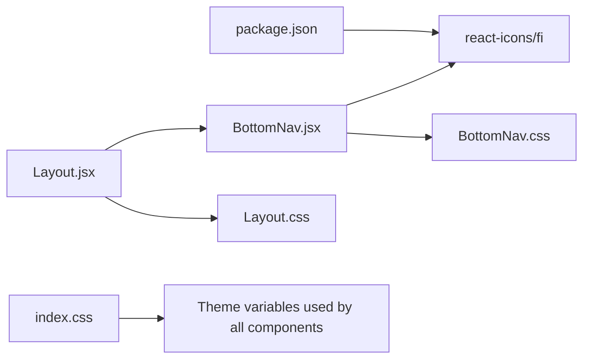

# Bottom Navigation Component

<cite>
**Referenced Files in This Document**
- [BottomNav.jsx](file://src/components/BottomNav/BottomNav.jsx)
- [BottomNav.css](file://src/components/BottomNav/BottomNav.css)
- [Layout.jsx](file://src/components/Layout/Layout.jsx)
- [Layout.css](file://src/components/Layout/Layout.css)
- [App.jsx](file://src/App.jsx)
- [index.css](file://src/index.css)
- [package.json](file://package.json)
</cite>

## Table of Contents
1. [Introduction](#introduction)
2. [Project Structure](#project-structure)
3. [Core Components](#core-components)
4. [Architecture Overview](#architecture-overview)
5. [Detailed Component Analysis](#detailed-component-analysis)
6. [Dependency Analysis](#dependency-analysis)
7. [Performance Considerations](#performance-considerations)
8. [Troubleshooting Guide](#troubleshooting-guide)
9. [Conclusion](#conclusion)

## Introduction
This document provides comprehensive documentation for the BottomNav component, a tab-based navigation bar used across the application. It explains how the four main tabs (home, entradas, projetos, configuracoes) are implemented, how state is managed by the parent component, and how visual feedback indicates the active tab. It also covers icon mapping using React Icons, CSS styling for fixed bottom positioning, responsive design considerations, and mobile-first approach. Usage examples show how the parent component manages navigation state and passes it to BottomNav.

## Project Structure
The BottomNav component lives under src/components/BottomNav and is integrated into the app via the Layout component. The root App component owns the navigation state and renders the corresponding page based on the active tab.

**Diagram sources**
- [App.jsx:1-39](file://src/App.jsx#L1-L39)
- [Layout.jsx:1-49](file://src/components/Layout/Layout.jsx#L1-L49)
- [BottomNav.jsx:1-37](file://src/components/BottomNav/BottomNav.jsx#L1-L37)
- [BottomNav.css:1-59](file://src/components/BottomNav/BottomNav.css#L1-L59)
- [Layout.css:1-74](file://src/components/Layout/Layout.css#L1-L74)
- [index.css:1-86](file://src/index.css#L1-L86)

**Section sources**
- [App.jsx:1-39](file://src/App.jsx#L1-L39)
- [Layout.jsx:1-49](file://src/components/Layout/Layout.jsx#L1-L49)
- [BottomNav.jsx:1-37](file://src/components/BottomNav/BottomNav.jsx#L1-L37)
- [BottomNav.css:1-59](file://src/components/BottomNav/BottomNav.css#L1-L59)
- [Layout.css:1-74](file://src/components/Layout/Layout.css#L1-L74)
- [index.css:1-86](file://src/index.css#L1-L86)

## Core Components
- BottomNav: Renders four navigation items with icons and labels. Accepts activeTab and setActiveTab props to reflect and update the current tab.
- Layout: Wraps content and injects BottomNav at the bottom. Passes activeTab and setActiveTab down to BottomNav.
- App: Owns the activeTab state and switches the rendered page based on that state.

Key behaviors:
- Tab list includes home, entradas, projetos, configuracoes.
- Active tab is visually highlighted using an active class.
- Clicking a tab triggers setActiveTab with the selected tab id.

**Section sources**
- [BottomNav.jsx:10-36](file://src/components/BottomNav/BottomNav.jsx#L10-L36)
- [Layout.jsx:11-46](file://src/components/Layout/Layout.jsx#L11-L46)
- [App.jsx:12-35](file://src/App.jsx#L12-L35)

## Architecture Overview
The navigation flow is controlled by a single source of truth: the activeTab state in App. Layout receives this state and forwards it to BottomNav. When a user taps a tab, BottomNav calls setActiveTab, which updates App’s state and re-renders the appropriate page.

**Diagram sources**
- [App.jsx:12-35](file://src/App.jsx#L12-L35)
- [Layout.jsx:11-46](file://src/components/Layout/Layout.jsx#L11-L46)
- [BottomNav.jsx:22-32](file://src/components/BottomNav/BottomNav.jsx#L22-L32)

## Detailed Component Analysis

### BottomNav Component
Responsibilities:
- Define the four tabs with ids, labels, and icons.
- Render a row of buttons with icons and labels.
- Apply an active class when a tab matches activeTab.
- Call setActiveTab with the selected tab id on click.

Props:
- activeTab: string — the currently selected tab id.
- setActiveTab: function — callback to update the active tab.

Icons:
- Uses react-icons/fi for minimal line icons:
  - FiHome for home
  - FiClock for entradas
  - FiBriefcase for projetos
  - FiSettings for configuracoes

Visual feedback:
- Active tab gets the .active class, changing text color to accent-color and applying a subtle transform to the icon.

Accessibility:
- Each button has an aria-label describing its destination.

Usage example (parent integration):
- In App, maintain activeTab state and pass both activeTab and setActiveTab to Layout, which forwards them to BottomNav.

**Section sources**
- [BottomNav.jsx:1-37](file://src/components/BottomNav/BottomNav.jsx#L1-L37)
- [package.json:12-16](file://package.json#L12-L16)

#### Class Diagram

**Diagram sources**
- [App.jsx:12-35](file://src/App.jsx#L12-L35)
- [Layout.jsx:11-46](file://src/components/Layout/Layout.jsx#L11-L46)
- [BottomNav.jsx:10-36](file://src/components/BottomNav/BottomNav.jsx#L10-L36)

### Styling and Visual System
Fixed positioning:
- BottomNav uses position: fixed; bottom: 0; left: 0; right: 0; to anchor to the viewport bottom.
- z-index ensures it appears above content.

Container layout:
- Flexbox distributes items evenly with space-around and centers vertically.
- Max-width keeps the bar elegant on larger screens.

Typography and icons:
- Icon size and label font sizes are tuned for a minimal look.
- Transitions provide smooth color changes and micro-interactions.

Theme variables:
- Colors and transitions come from CSS custom properties defined in index.css, supporting light and dark themes.

Safe area support:
- padding-bottom uses env(safe-area-inset-bottom) to avoid iPhone notch overlap.

Responsive and mobile-first:
- The layout is designed for small screens first, with max-width constraints for larger displays.
- Touch-friendly sizing and tap highlight removal improve mobile UX.

Content spacing:
- Layout.css adds bottom padding to the content area to prevent content from being hidden behind the fixed BottomNav.

**Section sources**
- [BottomNav.css:1-59](file://src/components/BottomNav/BottomNav.css#L1-L59)
- [Layout.css:40-54](file://src/components/Layout/Layout.css#L40-L54)
- [index.css:7-28](file://src/index.css#L7-L28)
- [index.css:31-46](file://src/index.css#L31-L46)

#### Flowchart: Tab Selection Logic

**Diagram sources**
- [BottomNav.jsx:22-32](file://src/components/BottomNav/BottomNav.jsx#L22-L32)
- [App.jsx:16-29](file://src/App.jsx#L16-L29)

### Integration with Layout and App
- Layout renders BottomNav at the bottom and passes activeTab and setActiveTab.
- App maintains activeTab state and switches the page based on the current tab.

**Diagram sources**
- [App.jsx:12-35](file://src/App.jsx#L12-L35)
- [Layout.jsx:11-46](file://src/components/Layout/Layout.jsx#L11-L46)
- [BottomNav.jsx:22-32](file://src/components/BottomNav/BottomNav.jsx#L22-L32)

**Section sources**
- [Layout.jsx:11-46](file://src/components/Layout/Layout.jsx#L11-L46)
- [App.jsx:12-35](file://src/App.jsx#L12-L35)

## Dependency Analysis
External dependencies:
- react-icons/fi provides the icons used in BottomNav.
- React and React DOM are core runtime dependencies.

Internal dependencies:
- BottomNav depends on CSS variables from index.css for theming.
- Layout composes BottomNav and applies global layout styles from Layout.css.

**Diagram sources**
- [package.json:12-16](file://package.json#L12-L16)
- [BottomNav.jsx:1-3](file://src/components/BottomNav/BottomNav.jsx#L1-L3)
- [BottomNav.css:1-13](file://src/components/BottomNav/BottomNav.css#L1-L13)
- [Layout.jsx:1-3](file://src/components/Layout/Layout.jsx#L1-L3)
- [Layout.css:1-22](file://src/components/Layout/Layout.css#L1-L22)
- [index.css:7-28](file://src/index.css#L7-L28)

**Section sources**
- [package.json:12-16](file://package.json#L12-L16)
- [BottomNav.jsx:1-3](file://src/components/BottomNav/BottomNav.jsx#L1-L3)
- [BottomNav.css:1-13](file://src/components/BottomNav/BottomNav.css#L1-L13)
- [Layout.jsx:1-3](file://src/components/Layout/Layout.jsx#L1-L3)
- [Layout.css:1-22](file://src/components/Layout/Layout.css#L1-L22)
- [index.css:7-28](file://src/index.css#L7-L28)

## Performance Considerations
- Minimal re-renders: Only the active tab changes, so BottomNav re-renders efficiently due to simple prop updates.
- Lightweight icons: Using react-icons/fi avoids heavy assets and leverages SVG rendering.
- CSS transitions: Smooth animations are hardware-accelerated where possible, keeping interactions fluid.
- Fixed positioning: Avoids layout thrashing by anchoring the bar outside the scrollable content.

[No sources needed since this section provides general guidance]

## Troubleshooting Guide
Common issues and resolutions:
- Tabs not highlighting: Ensure activeTab matches one of the tab ids ('home', 'entradas', 'projetos', 'configuracoes') and that setActiveTab is called with the correct id.
- Content hidden behind BottomNav: Verify Layout.css applies sufficient bottom padding to the content area to account for the fixed BottomNav height and safe area insets.
- Theme colors not updating: Confirm index.css defines the required CSS variables and that the root element has the correct theme class if toggling between light/dark.
- Safe area overlap on newer devices: Ensure env(safe-area-inset-bottom) is supported and applied in BottomNav.css padding.

**Section sources**
- [BottomNav.jsx:22-32](file://src/components/BottomNav/BottomNav.jsx#L22-L32)
- [BottomNav.css:4-12](file://src/components/BottomNav/BottomNav.css#L4-L12)
- [Layout.css:40-54](file://src/components/Layout/Layout.css#L40-L54)
- [index.css:7-28](file://src/index.css#L7-L28)

## Conclusion
The BottomNav component implements a clean, accessible, and responsive tab-based navigation system. It integrates seamlessly with the parent state management in App and Layout, providing clear visual feedback through CSS classes and theme-aware styling. Its fixed positioning and mobile-first design ensure a consistent experience across devices.

[No sources needed since this section summarizes without analyzing specific files]