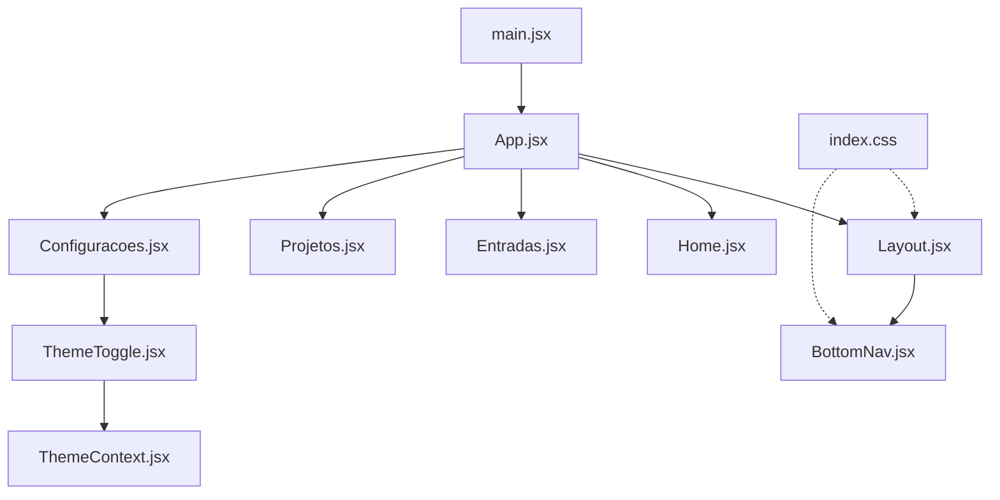
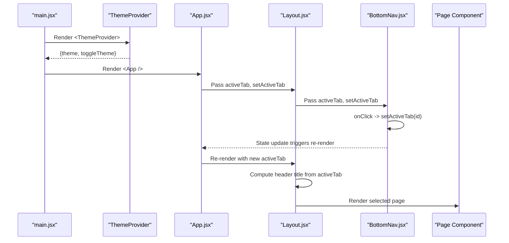
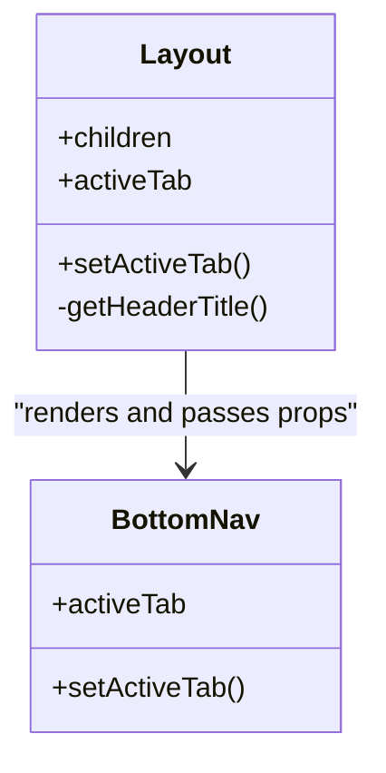
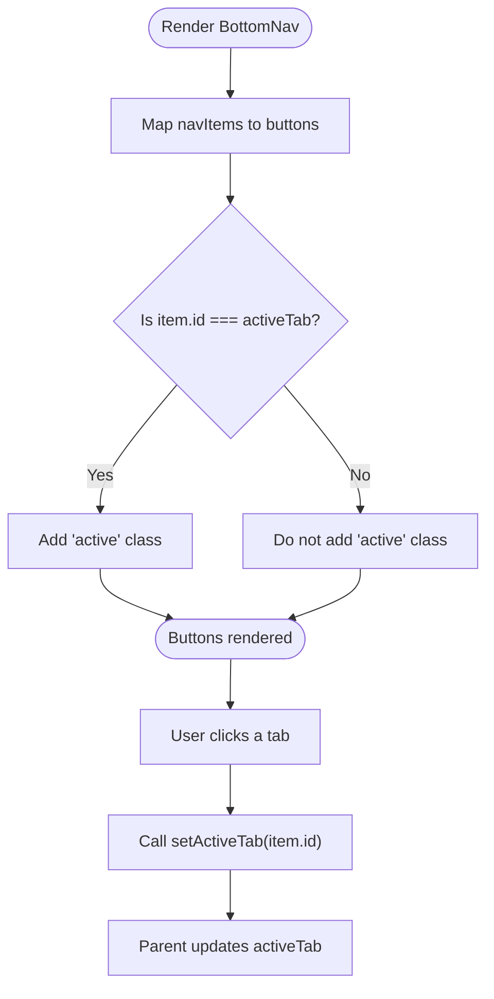
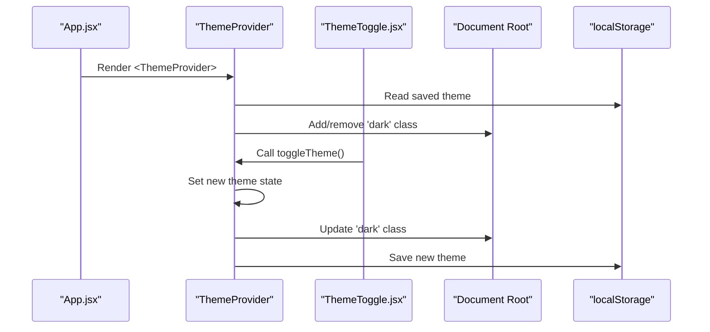
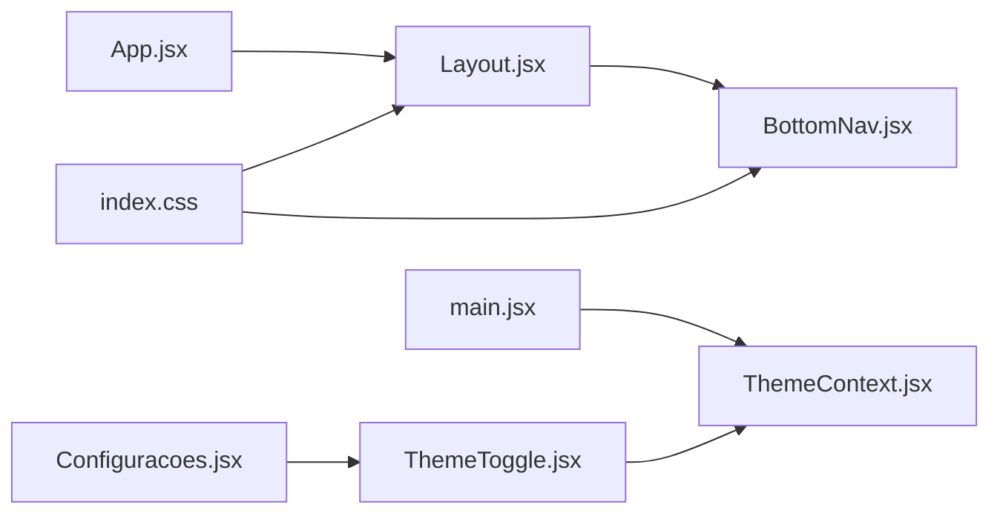

# Core Components

<cite>
**Referenced Files in This Document**
- [Layout.jsx](file://src/components/Layout/Layout.jsx)
- [Layout.css](file://src/components/Layout/Layout.css)
- [BottomNav.jsx](file://src/components/BottomNav/BottomNav.jsx)
- [BottomNav.css](file://src/components/BottomNav/BottomNav.css)
- [ThemeContext.jsx](file://src/context/ThemeContext.jsx)
- [App.jsx](file://src/App.jsx)
- [main.jsx](file://src/main.jsx)
- [index.css](file://src/index.css)
- [Configuracoes.jsx](file://src/pages/Configuracoes/Configuracoes.jsx)
- [ThemeToggle.jsx](file://src/pages/Configuracoes/components/ThemeToggle.jsx)
</cite>

## Table of Contents
1. [Introduction](#introduction)
2. [Project Structure](#project-structure)
3. [Core Components](#core-components)
4. [Architecture Overview](#architecture-overview)
5. [Detailed Component Analysis](#detailed-component-analysis)
6. [Dependency Analysis](#dependency-analysis)
7. [Performance Considerations](#performance-considerations)
8. [Troubleshooting Guide](#troubleshooting-guide)
9. [Conclusion](#conclusion)
10. [Appendices](#appendices)

## Introduction
This document explains the core components that power Nordic Worklog’s shell and navigation: Layout, BottomNav, and ThemeContext. It covers how header management, content area organization, and bottom navigation integrate to deliver a tab-based routing experience, and how global theme state is managed with light/dark mode switching and localStorage persistence. The guide includes component props, events, customization options, usage examples, and diagrams mapping directly to source files.

## Project Structure
The application uses a simple React structure with a root provider for theming and an App component that manages active tabs and renders pages inside a shared Layout shell.

**Diagram sources**
- [main.jsx:1-15](file://src/main.jsx#L1-L15)
- [App.jsx:1-39](file://src/App.jsx#L1-L39)
- [Layout.jsx:1-49](file://src/components/Layout/Layout.jsx#L1-L49)
- [BottomNav.jsx:1-37](file://src/components/BottomNav/BottomNav.jsx#L1-L37)
- [Configuracoes.jsx:1-70](file://src/pages/Configuracoes/Configuracoes.jsx#L1-L70)
- [ThemeToggle.jsx:1-55](file://src/pages/Configuracoes/components/ThemeToggle.jsx#L1-L55)
- [ThemeContext.jsx:1-49](file://src/context/ThemeContext.jsx#L1-L49)
- [index.css:1-86](file://src/index.css#L1-L86)

**Section sources**
- [main.jsx:1-15](file://src/main.jsx#L1-L15)
- [App.jsx:1-39](file://src/App.jsx#L1-L39)
- [Layout.jsx:1-49](file://src/components/Layout/Layout.jsx#L1-L49)
- [BottomNav.jsx:1-37](file://src/components/BottomNav/BottomNav.jsx#L1-L37)
- [ThemeContext.jsx:1-49](file://src/context/ThemeContext.jsx#L1-L49)
- [index.css:1-86](file://src/index.css#L1-L86)

## Core Components
- Layout: Provides a fixed header, scrollable content area, and integrates BottomNav at the bottom. It computes the header title based on the active tab.
- BottomNav: Renders a set of tabs with icons and labels, highlights the active tab, and calls setActiveTab when clicked.
- ThemeContext: Supplies global theme state (light/dark), persists selection to localStorage, applies a class to the document root, and exposes a toggle function.

Key integration points:
- App holds activeTab state and passes it to Layout; Layout forwards it to BottomNav.
- ThemeProvider wraps the entire app in main.jsx; ThemeToggle consumes useTheme to switch modes.

**Section sources**
- [Layout.jsx:1-49](file://src/components/Layout/Layout.jsx#L1-L49)
- [BottomNav.jsx:1-37](file://src/components/BottomNav/BottomNav.jsx#L1-L37)
- [ThemeContext.jsx:1-49](file://src/context/ThemeContext.jsx#L1-L49)
- [App.jsx:1-39](file://src/App.jsx#L1-L39)
- [main.jsx:1-15](file://src/main.jsx#L1-L15)

## Architecture Overview
The following diagram shows how the top-level providers and components interact to manage navigation and theming.

**Diagram sources**
- [main.jsx:1-15](file://src/main.jsx#L1-L15)
- [ThemeContext.jsx:1-49](file://src/context/ThemeContext.jsx#L1-L49)
- [App.jsx:1-39](file://src/App.jsx#L1-L39)
- [Layout.jsx:1-49](file://src/components/Layout/Layout.jsx#L1-L49)
- [BottomNav.jsx:1-37](file://src/components/BottomNav/BottomNav.jsx#L1-L37)

## Detailed Component Analysis

### Layout Component
Responsibilities:
- Fixed header with dynamic title derived from activeTab.
- Scrollable content area with safe padding for fixed header and bottom nav.
- Integration point for BottomNav.

Props:
- children: ReactNode — the active page content.
- activeTab: string — current tab identifier used to compute header title and passed to BottomNav.
- setActiveTab: function — callback to change the active tab.

Events:
- None directly; delegates navigation to BottomNav via setActiveTab.

Styling and behavior:
- Uses CSS classes for fixed header and content area.
- Header title mapping is handled internally.

Usage example (composition):
- Wrap page content in Layout and pass activeTab and setActiveTab from App.

**Section sources**
- [Layout.jsx:1-49](file://src/components/Layout/Layout.jsx#L1-L49)
- [Layout.css:1-74](file://src/components/Layout/Layout.css#L1-L74)

#### Layout Class Diagram

**Diagram sources**
- [Layout.jsx:1-49](file://src/components/Layout/Layout.jsx#L1-L49)
- [BottomNav.jsx:1-37](file://src/components/BottomNav/BottomNav.jsx#L1-L37)

### BottomNav Component
Responsibilities:
- Renders a list of tabs with icons and labels.
- Highlights the active tab using a conditional class.
- Emits navigation by calling setActiveTab with the selected tab id.

Props:
- activeTab: string — currently selected tab id.
- setActiveTab: function — callback invoked with the new tab id.

Events:
- onClick on each tab item invokes setActiveTab(item.id).

Customization:
- Tab items are defined locally; extend by adding entries to the internal list.
- Active styling is applied via a CSS class.

Usage example (integration):
- Receive activeTab and setActiveTab from parent (Layout or App) and render accordingly.

**Section sources**
- [BottomNav.jsx:1-37](file://src/components/BottomNav/BottomNav.jsx#L1-L37)
- [BottomNav.css:1-59](file://src/components/BottomNav/BottomNav.css#L1-L59)

#### BottomNav Flowchart

**Diagram sources**
- [BottomNav.jsx:1-37](file://src/components/BottomNav/BottomNav.jsx#L1-L37)

### ThemeContext Provider Pattern
Responsibilities:
- Provide global theme state (light/dark).
- Persist theme to localStorage.
- Apply a dark class to the document root for CSS variable overrides.
- Expose a toggle function to switch themes.

Exports:
- ThemeProvider: Context provider wrapping children.
- useTheme: Custom hook to consume theme context.

State and effects:
- Initial theme reads from localStorage or system preference.
- Effect updates document class and localStorage whenever theme changes.

Usage example (consumption):
- Use useTheme in any descendant component to read theme and call toggleTheme.

Integration example:
- ThemeToggle reads theme and toggles via useTheme.

**Section sources**
- [ThemeContext.jsx:1-49](file://src/context/ThemeContext.jsx#L1-L49)
- [ThemeToggle.jsx:1-55](file://src/pages/Configuracoes/components/ThemeToggle.jsx#L1-L55)
- [index.css:1-86](file://src/index.css#L1-L86)

#### ThemeContext Sequence Diagram

**Diagram sources**
- [ThemeContext.jsx:1-49](file://src/context/ThemeContext.jsx#L1-L49)
- [ThemeToggle.jsx:1-55](file://src/pages/Configuracoes/components/ThemeToggle.jsx#L1-L55)
- [index.css:1-86](file://src/index.css#L1-L86)

## Dependency Analysis
High-level dependencies between core components and their styles:

**Diagram sources**
- [App.jsx:1-39](file://src/App.jsx#L1-L39)
- [Layout.jsx:1-49](file://src/components/Layout/Layout.jsx#L1-L49)
- [BottomNav.jsx:1-37](file://src/components/BottomNav/BottomNav.jsx#L1-L37)
- [main.jsx:1-15](file://src/main.jsx#L1-L15)
- [ThemeContext.jsx:1-49](file://src/context/ThemeContext.jsx#L1-L49)
- [Configuracoes.jsx:1-70](file://src/pages/Configuracoes/Configuracoes.jsx#L1-L70)
- [ThemeToggle.jsx:1-55](file://src/pages/Configuracoes/components/ThemeToggle.jsx#L1-L55)
- [index.css:1-86](file://src/index.css#L1-L86)

**Section sources**
- [App.jsx:1-39](file://src/App.jsx#L1-L39)
- [Layout.jsx:1-49](file://src/components/Layout/Layout.jsx#L1-L49)
- [BottomNav.jsx:1-37](file://src/components/BottomNav/BottomNav.jsx#L1-L37)
- [ThemeContext.jsx:1-49](file://src/context/ThemeContext.jsx#L1-L49)
- [index.css:1-86](file://src/index.css#L1-L86)

## Performance Considerations
- Navigation state is kept in App and passed down; this is efficient for small apps. For larger apps, consider memoizing page components or lazy-loading routes.
- BottomNav maps a small static array; performance impact is negligible. If the list grows, consider memoization or virtualization.
- ThemeContext effect runs only on theme changes; ensure no heavy operations are added there.
- CSS transitions are lightweight and rely on CSS variables; avoid excessive inline styles in hot paths.

[No sources needed since this section provides general guidance]

## Troubleshooting Guide
Common issues and resolutions:
- Theme not persisting: Ensure ThemeProvider wraps the app and that localStorage is accessible in the environment. Verify the document root receives the correct class.
- useTheme error outside provider: Confirm all consumers are descendants of ThemeProvider.
- Header title mismatch: Verify activeTab values match those used in Layout’s header mapping.
- BottomNav not highlighting: Ensure activeTab prop matches the item.id strings and that setActiveTab updates the parent state.

**Section sources**
- [ThemeContext.jsx:1-49](file://src/context/ThemeContext.jsx#L1-L49)
- [Layout.jsx:1-49](file://src/components/Layout/Layout.jsx#L1-L49)
- [BottomNav.jsx:1-37](file://src/components/BottomNav/BottomNav.jsx#L1-L37)

## Conclusion
Nordic Worklog’s core components provide a clean, minimal shell with tab-based navigation and robust global theming. Layout centralizes header and content layout while delegating navigation to BottomNav. ThemeContext offers a simple yet effective pattern for persistent theme management. Together, they form a cohesive foundation for building feature-rich pages within a consistent UI framework.

[No sources needed since this section summarizes without analyzing specific files]

## Appendices

### Component Props and Events Summary
- Layout
  - Props: children, activeTab, setActiveTab
  - Events: none (delegates to BottomNav)
- BottomNav
  - Props: activeTab, setActiveTab
  - Events: onClick per tab calls setActiveTab(item.id)
- ThemeContext
  - Provider exports: ThemeProvider, useTheme
  - State: theme ('light' | 'dark')
  - Actions: toggleTheme()
  - Side effects: applies 'dark' class to document root, persists to localStorage

**Section sources**
- [Layout.jsx:1-49](file://src/components/Layout/Layout.jsx#L1-L49)
- [BottomNav.jsx:1-37](file://src/components/BottomNav/BottomNav.jsx#L1-L37)
- [ThemeContext.jsx:1-49](file://src/context/ThemeContext.jsx#L1-L49)

### Usage Examples (Composition Patterns)
- App composition with Layout and pages:
  - See [App.jsx:1-39](file://src/App.jsx#L1-L39)
- Using ThemeToggle to switch theme:
  - See [ThemeToggle.jsx:1-55](file://src/pages/Configuracoes/components/ThemeToggle.jsx#L1-L55)
- Settings page integrating ThemeToggle:
  - See [Configuracoes.jsx:1-70](file://src/pages/Configuracoes/Configuracoes.jsx#L1-L70)

**Section sources**
- [App.jsx:1-39](file://src/App.jsx#L1-L39)
- [ThemeToggle.jsx:1-55](file://src/pages/Configuracoes/components/ThemeToggle.jsx#L1-L55)
- [Configuracoes.jsx:1-70](file://src/pages/Configuracoes/Configuracoes.jsx#L1-L70)