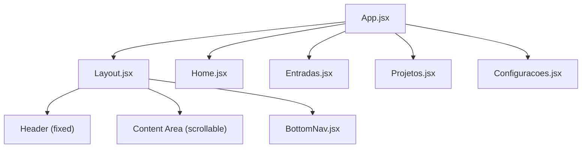
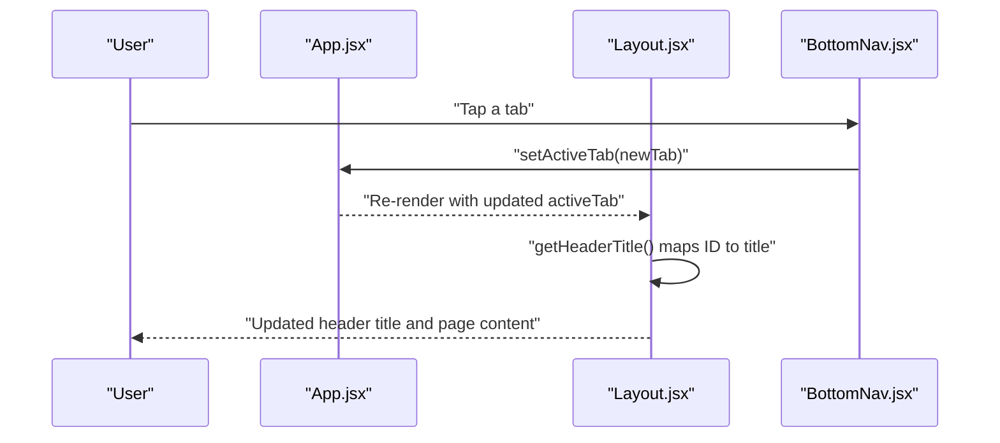
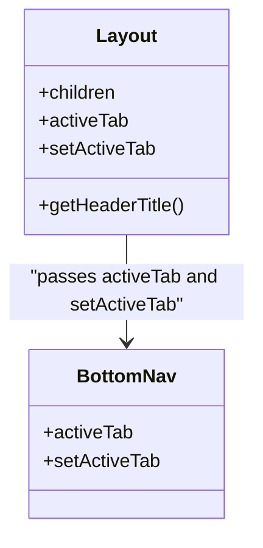
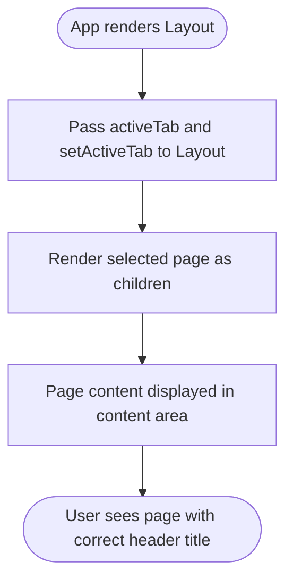
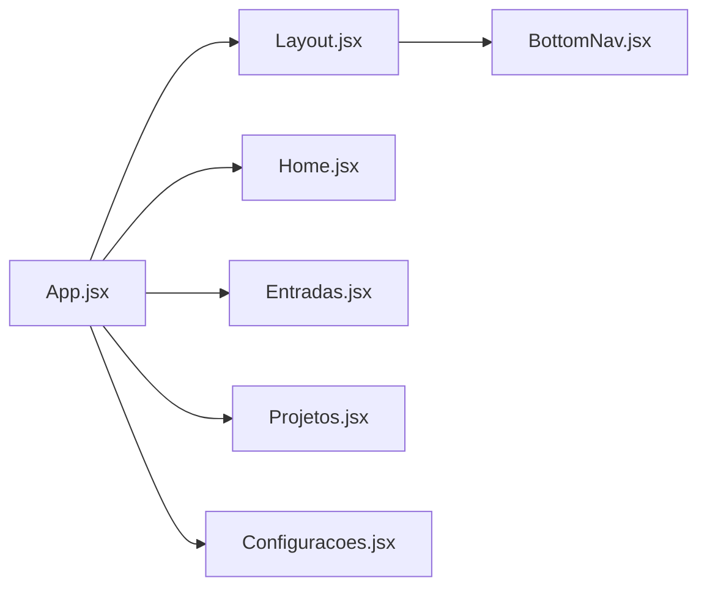

# Layout Component

<cite>
**Referenced Files in This Document**
- [Layout.jsx](file://src/components/Layout/Layout.jsx)
- [Layout.css](file://src/components/Layout/Layout.css)
- [BottomNav.jsx](file://src/components/BottomNav/BottomNav.jsx)
- [BottomNav.css](file://src/components/BottomNav/BottomNav.css)
- [App.jsx](file://src/App.jsx)
- [Home.jsx](file://src/pages/Home/Home.jsx)
- [Entradas.jsx](file://src/pages/Entradas/Entradas.jsx)
- [Projetos.jsx](file://src/pages/Projetos/Projetos.jsx)
- [Configuracoes.jsx](file://src/pages/Configuracoes/Configuracoes.jsx)
</cite>

## Table of Contents
1. [Introduction](#introduction)
2. [Project Structure](#project-structure)
3. [Core Components](#core-components)
4. [Architecture Overview](#architecture-overview)
5. [Detailed Component Analysis](#detailed-component-analysis)
6. [Dependency Analysis](#dependency-analysis)
7. [Performance Considerations](#performance-considerations)
8. [Troubleshooting Guide](#troubleshooting-guide)
9. [Conclusion](#conclusion)
10. [Appendices](#appendices)

## Introduction
The Layout component is the structural wrapper for the entire application. It provides a fixed header with dynamic titles and a main content area, while integrating a fixed bottom navigation bar. Pages are rendered as children inside the layout, and the active tab determines both the page content and the header title. The header title mapping uses localized Portuguese strings based on the current tab identifier.

## Project Structure
At a high level:
- App manages the active tab state and renders the selected page inside Layout.
- Layout composes the header, content area, and BottomNav.
- BottomNav handles tab switching by calling setActiveTab.
- Each page (Home, Entradas, Projetos, Configuracoes) is a child of Layout and receives no direct props from it; they rely on global state managed at the App level.

**Diagram sources**
- [App.jsx:1-39](file://src/App.jsx#L1-L39)
- [Layout.jsx:1-49](file://src/components/Layout/Layout.jsx#L1-L49)
- [BottomNav.jsx:1-37](file://src/components/BottomNav/BottomNav.jsx#L1-L37)
- [Home.jsx:1-19](file://src/pages/Home/Home.jsx#L1-L19)
- [Entradas.jsx:1-19](file://src/pages/Entradas/Entradas.jsx#L1-L19)
- [Projetos.jsx:1-31](file://src/pages/Projetos/Projetos.jsx#L1-L31)
- [Configuracoes.jsx:1-70](file://src/pages/Configuracoes/Configuracoes.jsx#L1-L70)

**Section sources**
- [App.jsx:1-39](file://src/App.jsx#L1-L39)
- [Layout.jsx:1-49](file://src/components/Layout/Layout.jsx#L1-L49)

## Core Components
- Layout: Structural wrapper providing fixed header, scrollable content area, and integration with BottomNav.
- BottomNav: Fixed bottom navigation that updates the active tab via setActiveTab.
- Pages: Home, Entradas, Projetos, Configuracoes render their own content within the Layout’s content area.

Key responsibilities:
- Layout renders the header title based on activeTab using getHeaderTitle.
- Layout passes activeTab and setActiveTab to BottomNav to keep navigation synchronized.
- Pages receive only children content; they do not directly access activeTab or setActiveTab.

**Section sources**
- [Layout.jsx:1-49](file://src/components/Layout/Layout.jsx#L1-L49)
- [BottomNav.jsx:1-37](file://src/components/BottomNav/BottomNav.jsx#L1-L37)

## Architecture Overview
The app follows a simple top-down state model:
- App holds activeTab state and a function to update it.
- App renders Layout with activeTab and setActiveTab.
- Layout renders the header title dynamically and forwards activeTab/setActiveTab to BottomNav.
- BottomNav calls setActiveTab when a user taps a tab.
- App re-renders the corresponding page based on activeTab.

**Diagram sources**
- [App.jsx:12-35](file://src/App.jsx#L12-L35)
- [Layout.jsx:11-47](file://src/components/Layout/Layout.jsx#L11-L47)
- [BottomNav.jsx:10-36](file://src/components/BottomNav/BottomNav.jsx#L10-L36)

## Detailed Component Analysis

### Layout Component
Role:
- Provides the overall shell: fixed header, scrollable content area, and fixed bottom navigation.
- Determines the header title based on the active tab using getHeaderTitle.

Props:
- children: ReactNode — The currently active page content.
- activeTab: string — The current tab identifier used to compute the header title and passed to BottomNav.
- setActiveTab: function — Callback invoked by BottomNav to change the active tab.

Header Title Mapping:
- getHeaderTitle maps tab IDs to localized Portuguese titles:
  - 'home' → "Nordic Worklog"
  - 'entradas' → "Histórico de Entradas"
  - 'projetos' → "Meus Projetos"
  - 'configuracoes' → "Configurações"
  - default → "Nordic Worklog"

Integration:
- Passes activeTab and setActiveTab to BottomNav so navigation remains consistent across the app.
- Renders children inside a centered content container with appropriate padding to account for fixed header and bottom nav.

CSS structure overview:
- .app-layout: Flex column container spanning full viewport height.
- .app-header: Fixed header at the top with background, border, z-index, and transition effects.
- .header-container: Centers and constrains header content width.
- .header-title: Minimalist title styling.
- .app-content-area: Main scrollable area with top/bottom padding to avoid overlap with fixed header and bottom nav.
- .content-container: Centers and constrains page content width.
- .card and .card-title: Reusable card styles used by pages.

**Section sources**
- [Layout.jsx:1-49](file://src/components/Layout/Layout.jsx#L1-L49)
- [Layout.css:1-74](file://src/components/Layout/Layout.css#L1-L74)

#### Class Diagram

**Diagram sources**
- [Layout.jsx:11-47](file://src/components/Layout/Layout.jsx#L11-L47)
- [BottomNav.jsx:10-36](file://src/components/BottomNav/BottomNav.jsx#L10-L36)

### BottomNav Component
Responsibilities:
- Displays four tabs: home, entradas, projetos, configuracoes.
- Highlights the active tab based on activeTab.
- Calls setActiveTab(item.id) when a tab is clicked.

Styling:
- Fixed at the bottom with safe area support.
- Active state changes color and applies a subtle icon animation.

**Section sources**
- [BottomNav.jsx:1-37](file://src/components/BottomNav/BottomNav.jsx#L1-L37)
- [BottomNav.css:1-59](file://src/components/BottomNav/BottomNav.css#L1-L59)

### Page Integration Examples
Pages integrate with Layout by being rendered as children. They do not need to know about activeTab or setActiveTab; those concerns are handled by App and Layout.

Examples:
- Home: Simple placeholder content inside a card.
- Entradas: Placeholder list area for work entries.
- Projetos: Lists projects using a subcomponent.
- Configuracoes: Theme toggle, export option, account info, and parameter settings.

How to pass props correctly:
- In App, maintain activeTab and setActiveTab state.
- Render Layout with activeTab and setActiveTab props.
- Provide the selected page component as children to Layout.

[No sources needed since this diagram shows conceptual workflow, not actual code structure]

**Section sources**
- [App.jsx:12-35](file://src/App.jsx#L12-L35)
- [Home.jsx:1-19](file://src/pages/Home/Home.jsx#L1-L19)
- [Entradas.jsx:1-19](file://src/pages/Entradas/Entradas.jsx#L1-L19)
- [Projetos.jsx:1-31](file://src/pages/Projetos/Projetos.jsx#L1-L31)
- [Configuracoes.jsx:1-70](file://src/pages/Configuracoes/Configuracoes.jsx#L1-L70)

## Dependency Analysis
- Layout depends on BottomNav for navigation UI.
- App depends on Layout and all page components.
- CSS variables (e.g., --bg-secondary, --border-color, --text-primary, --accent-color, --transition-speed, --safe-area-bottom) are consumed by Layout and BottomNav for theming and spacing.

**Diagram sources**
- [App.jsx:1-39](file://src/App.jsx#L1-L39)
- [Layout.jsx:1-49](file://src/components/Layout/Layout.jsx#L1-L49)
- [BottomNav.jsx:1-37](file://src/components/BottomNav/BottomNav.jsx#L1-L37)
- [Home.jsx:1-19](file://src/pages/Home/Home.jsx#L1-L19)
- [Entradas.jsx:1-19](file://src/pages/Entradas/Entradas.jsx#L1-L19)
- [Projetos.jsx:1-31](file://src/pages/Projetos/Projetos.jsx#L1-L31)
- [Configuracoes.jsx:1-70](file://src/pages/Configuracoes/Configuracoes.jsx#L1-L70)

**Section sources**
- [Layout.jsx:1-49](file://src/components/Layout/Layout.jsx#L1-L49)
- [BottomNav.jsx:1-37](file://src/components/BottomNav/BottomNav.jsx#L1-L37)
- [App.jsx:1-39](file://src/App.jsx#L1-L39)

## Performance Considerations
- Header title computation is O(1) due to a simple switch statement over a small set of tab IDs.
- Layout does not introduce heavy computations; rendering cost is dominated by the active page content.
- Using fixed positioning for header and bottom nav avoids layout thrashing during scroll.
- Keep page components lightweight and memoize expensive lists if needed to prevent unnecessary re-renders.

[No sources needed since this section provides general guidance]

## Troubleshooting Guide
Common issues and resolutions:
- Header title not updating: Ensure activeTab is correctly passed to Layout and that getHeaderTitle includes the new tab ID mapping.
- Bottom nav not highlighting active tab: Verify that activeTab matches the item.id values defined in BottomNav and that setActiveTab is called with the correct id.
- Content overlapping header or bottom nav: Confirm that .app-content-area has sufficient top and bottom padding to account for fixed header and bottom nav heights.
- Safe area not respected on devices with notches: Ensure --safe-area-bottom is defined in theme variables and applied by BottomNav and content area.

**Section sources**
- [Layout.jsx:13-26](file://src/components/Layout/Layout.jsx#L13-L26)
- [BottomNav.jsx:12-32](file://src/components/BottomNav/BottomNav.jsx#L12-L32)
- [Layout.css:10-48](file://src/components/Layout/Layout.css#L10-L48)
- [BottomNav.css:1-22](file://src/components/BottomNav/BottomNav.css#L1-22)

## Conclusion
The Layout component centralizes the application’s shell, ensuring consistent header behavior and content presentation. By delegating navigation state to App and passing it down to BottomNav, it maintains a clean separation of concerns. Pages remain simple and focused on their own content, while Layout and BottomNav handle structural and navigational concerns.

[No sources needed since this section summarizes without analyzing specific files]

## Appendices

### CSS Classes Reference
- .app-layout: Root flex container for the app shell.
- .app-header: Fixed header with background, border, and transitions.
- .header-container: Centered container for header content.
- .header-title: Minimalist header title style.
- .app-content-area: Scrollable main area with padding to avoid overlaps.
- .content-container: Centered container for page content.
- .card and .card-title: Reusable card styles used by pages.

**Section sources**
- [Layout.css:1-74](file://src/components/Layout/Layout.css#L1-L74)

### Tab-to-Title Mapping
- 'home' → "Nordic Worklog"
- 'entradas' → "Histórico de Entradas"
- 'projetos' → "Meus Projetos"
- 'configuracoes' → "Configurações"
- default → "Nordic Worklog"

**Section sources**
- [Layout.jsx:13-26](file://src/components/Layout/Layout.jsx#L13-L26)