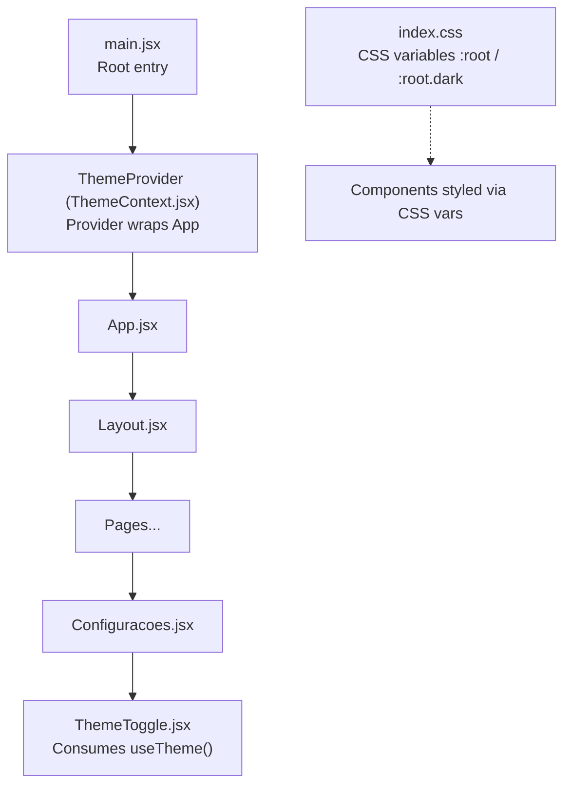
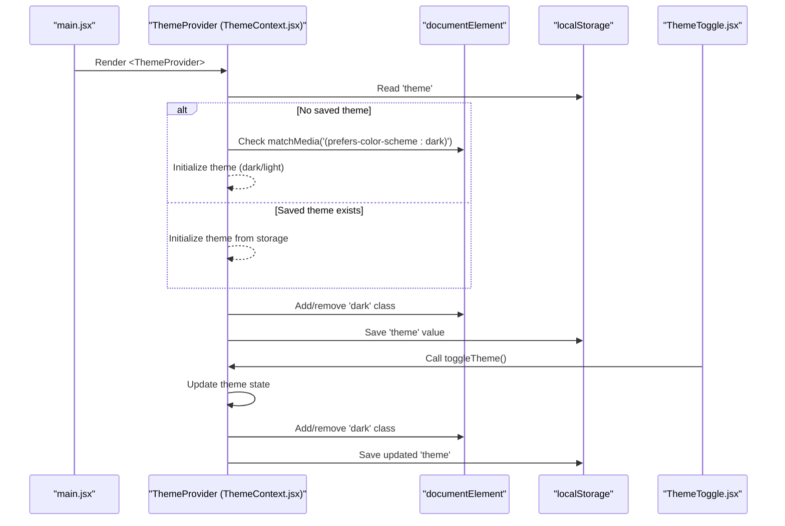
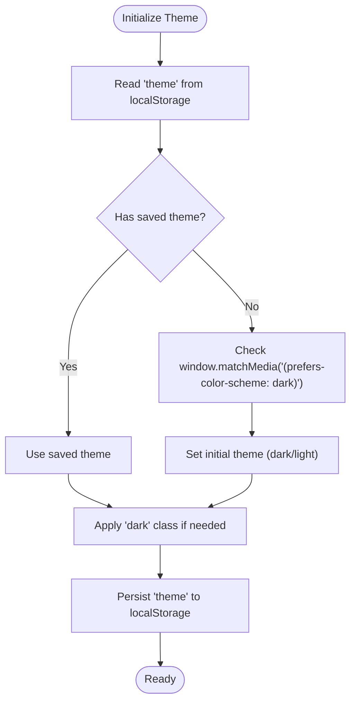
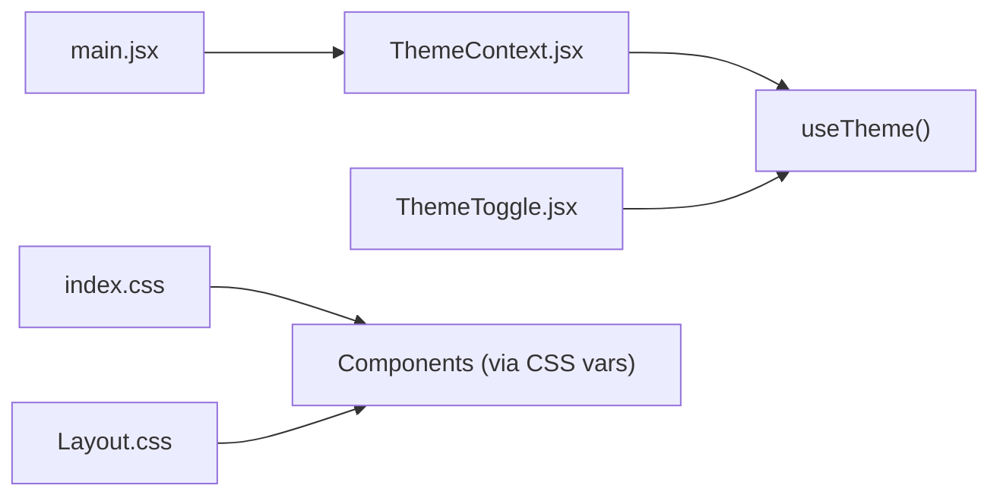

# Theme Context Provider

<cite>
**Referenced Files in This Document**
- [ThemeContext.jsx](file://src/context/ThemeContext.jsx)
- [main.jsx](file://src/main.jsx)
- [ThemeToggle.jsx](file://src/pages/Configuracoes/components/ThemeToggle.jsx)
- [index.css](file://src/index.css)
- [Layout.css](file://src/components/Layout/Layout.css)
- [Configuracoes.jsx](file://src/pages/Configuracoes/Configuracoes.jsx)
</cite>

## Table of Contents
1. [Introduction](#introduction)
2. [Project Structure](#project-structure)
3. [Core Components](#core-components)
4. [Architecture Overview](#architecture-overview)
5. [Detailed Component Analysis](#detailed-component-analysis)
6. [Dependency Analysis](#dependency-analysis)
7. [Performance Considerations](#performance-considerations)
8. [Troubleshooting Guide](#troubleshooting-guide)
9. [Conclusion](#conclusion)

## Introduction
This document explains the global theme state management system implemented with React Context API for light/dark mode switching. It covers:
- The ThemeContext provider structure and state initialization
- The useTheme custom hook for consuming theme state
- localStorage persistence to maintain user preferences across sessions
- System preference detection using window.matchMedia for automatic dark mode based on OS settings
- How components consume theme state and toggle functionality
- Theme-aware styling using CSS custom properties

## Project Structure
The theme system is centered around a single context module, integrated at the application root, and consumed by UI components that need theme access.

**Diagram sources**
- [main.jsx:6-14](file://src/main.jsx#L6-L14)
- [ThemeContext.jsx:7-39](file://src/context/ThemeContext.jsx#L7-L39)
- [ThemeToggle.jsx:1-55](file://src/pages/Configuracoes/components/ThemeToggle.jsx#L1-L55)
- [index.css:7-28](file://src/index.css#L7-L28)

**Section sources**
- [main.jsx:1-15](file://src/main.jsx#L1-L15)
- [ThemeContext.jsx:1-49](file://src/context/ThemeContext.jsx#L1-L49)
- [ThemeToggle.jsx:1-55](file://src/pages/Configuracoes/components/ThemeToggle.jsx#L1-L55)
- [index.css:1-86](file://src/index.css#L1-L86)

## Core Components
- ThemeContext provider: Creates and exposes theme state and toggle function via React Context.
- useTheme hook: Provides a simple way for any component to read and update the theme.
- ThemeToggle component: Demonstrates consumption of theme state and toggling behavior.
- CSS theming: Uses CSS custom properties under :root and :root.dark to style the app consistently.

Key responsibilities:
- Initialization: Reads from localStorage or falls back to system preference.
- Persistence: Writes current theme to localStorage whenever it changes.
- DOM integration: Adds/removes a class on the document element to switch CSS variable sets.
- Consumption: Components call useTheme to get current theme and toggle function.

**Section sources**
- [ThemeContext.jsx:7-48](file://src/context/ThemeContext.jsx#L7-L48)
- [ThemeToggle.jsx:9-54](file://src/pages/Configuracoes/components/ThemeToggle.jsx#L9-L54)
- [index.css:7-28](file://src/index.css#L7-L28)

## Architecture Overview
The theme system follows a unidirectional data flow pattern:
- Provider initializes theme once and persists updates.
- Consumers subscribe to theme via Context and re-render when it changes.
- Styling is driven by CSS variables scoped to :root and :root.dark.

**Diagram sources**
- [main.jsx:6-14](file://src/main.jsx#L6-L14)
- [ThemeContext.jsx:9-32](file://src/context/ThemeContext.jsx#L9-L32)
- [ThemeToggle.jsx:9-54](file://src/pages/Configuracoes/components/ThemeToggle.jsx#L9-L54)
- [index.css:7-28](file://src/index.css#L7-L28)

## Detailed Component Analysis

### ThemeContext Provider
Responsibilities:
- Create a React Context for theme.
- Manage theme state initialized from localStorage or system preference.
- Apply a 'dark' class to the document element to switch CSS variables.
- Persist theme to localStorage on change.
- Expose a toggle function to flip between light and dark.

Implementation highlights:
- State initialization checks localStorage first; if absent, uses window.matchMedia('(prefers-color-scheme: dark)').matches to infer initial theme.
- A useEffect adds/removes the 'dark' class on document.documentElement and writes the new theme to localStorage.
- The provider exposes { theme, toggleTheme } through the context value.

**Diagram sources**
- [ThemeContext.jsx:9-27](file://src/context/ThemeContext.jsx#L9-L27)

**Section sources**
- [ThemeContext.jsx:7-39](file://src/context/ThemeContext.jsx#L7-L39)

### useTheme Custom Hook
Purpose:
- Provide a convenient interface to consume theme state and toggle function from anywhere inside the provider tree.
- Guard against misuse by throwing an error if used outside ThemeProvider.

Behavior:
- Returns the context value containing theme and toggleTheme.
- Throws a descriptive error if called without a surrounding ThemeProvider.

Usage example path:
- See how ThemeToggle consumes the hook to render icons and handle clicks.

**Section sources**
- [ThemeContext.jsx:42-48](file://src/context/ThemeContext.jsx#L42-L48)
- [ThemeToggle.jsx:9-10](file://src/pages/Configuracoes/components/ThemeToggle.jsx#L9-L10)

### ThemeToggle Component
Purpose:
- Demonstrate consumption of theme state and toggling behavior.
- Show theme-aware styling using CSS custom properties.

Behavior:
- Calls useTheme to get current theme and toggle function.
- Renders different icon based on current theme.
- Toggles theme on button click.
- Uses CSS variables for colors and borders to adapt to theme.

Integration point:
- Used within the Settings page to allow users to switch themes.

**Section sources**
- [ThemeToggle.jsx:9-54](file://src/pages/Configuracoes/components/ThemeToggle.jsx#L9-L54)
- [Configuracoes.jsx:18-19](file://src/pages/Configuracoes/Configuracoes.jsx#L18-L19)

### CSS Theming with Custom Properties
Mechanism:
- Define default CSS variables under :root for light theme.
- Override variables under :root.dark for dark theme.
- Components reference these variables for background, text, border, and accent colors.

Effect:
- When the 'dark' class is added to document.documentElement, all components automatically pick up the dark palette.
- Smooth transitions are applied to background and color changes.

Styling examples paths:
- Global variables and dark overrides: see index.css.
- Layout elements using variables: see Layout.css.

**Section sources**
- [index.css:7-28](file://src/index.css#L7-L28)
- [index.css:39-46](file://src/index.css#L39-L46)
- [Layout.css:16-22](file://src/components/Layout/Layout.css#L16-L22)
- [Layout.css:57-64](file://src/components/Layout/Layout.css#L57-L64)

## Dependency Analysis
High-level dependencies:
- main.jsx imports and wraps App with ThemeProvider.
- ThemeContext.jsx exports ThemeProvider and useTheme.
- ThemeToggle.jsx imports useTheme and renders theme-aware UI.
- index.css defines CSS variables used throughout the app.

**Diagram sources**
- [main.jsx:6-14](file://src/main.jsx#L6-L14)
- [ThemeContext.jsx:1-49](file://src/context/ThemeContext.jsx#L1-L49)
- [ThemeToggle.jsx:1-55](file://src/pages/Configuracoes/components/ThemeToggle.jsx#L1-L55)
- [index.css:1-86](file://src/index.css#L1-L86)
- [Layout.css:1-74](file://src/components/Layout/Layout.css#L1-L74)

**Section sources**
- [main.jsx:1-15](file://src/main.jsx#L1-L15)
- [ThemeContext.jsx:1-49](file://src/context/ThemeContext.jsx#L1-L49)
- [ThemeToggle.jsx:1-55](file://src/pages/Configuracoes/components/ThemeToggle.jsx#L1-L55)
- [index.css:1-86](file://src/index.css#L1-L86)
- [Layout.css:1-74](file://src/components/Layout/Layout.css#L1-L74)

## Performance Considerations
- Minimal re-renders: Only components that call useTheme will re-render when theme changes.
- Efficient DOM updates: Adding/removing a single class on documentElement triggers CSS variable changes globally without heavy JS manipulation.
- LocalStorage writes: Occur only on theme changes; consider debouncing if you plan to add more frequent updates.
- CSS transitions: Smooth visual feedback with minimal cost due to GPU-friendly properties like background-color and color.

[No sources needed since this section provides general guidance]

## Troubleshooting Guide
Common issues and resolutions:
- Error when using useTheme outside provider: Ensure your component tree is wrapped with ThemeProvider at the root.
- Theme not persisting: Verify localStorage is available and not blocked; check that the effect runs after state updates.
- Dark mode not applying: Confirm the 'dark' class is present on document.documentElement and that CSS variables are correctly defined under :root.dark.
- Initial theme mismatch: If no saved theme exists, the app defaults to system preference; ensure matchMedia is supported in the target environment.

**Section sources**
- [ThemeContext.jsx:42-48](file://src/context/ThemeContext.jsx#L42-L48)
- [ThemeContext.jsx:19-27](file://src/context/ThemeContext.jsx#L19-L27)
- [index.css:7-28](file://src/index.css#L7-L28)

## Conclusion
The ThemeContext provider system offers a clean, scalable approach to global theme management in React:
- Centralized state and logic in a single context module
- Simple consumption via a custom hook
- Robust persistence and system preference detection
- Consistent styling through CSS custom properties

This pattern can be extended to support additional themes or per-user preferences while maintaining clarity and performance.