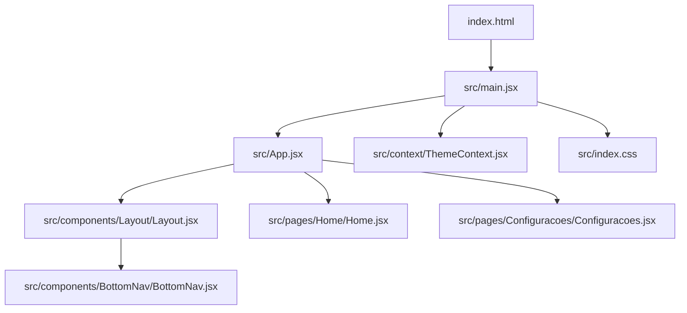
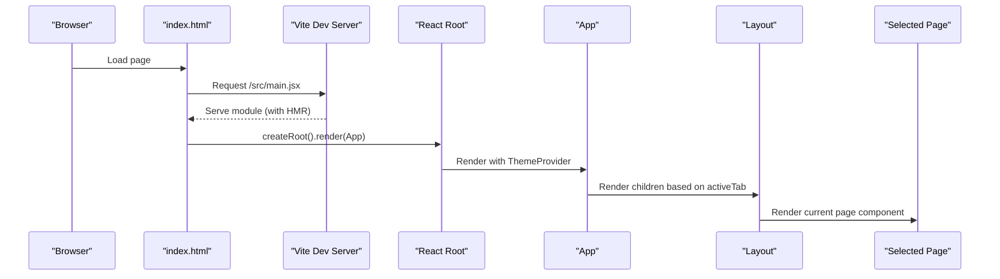
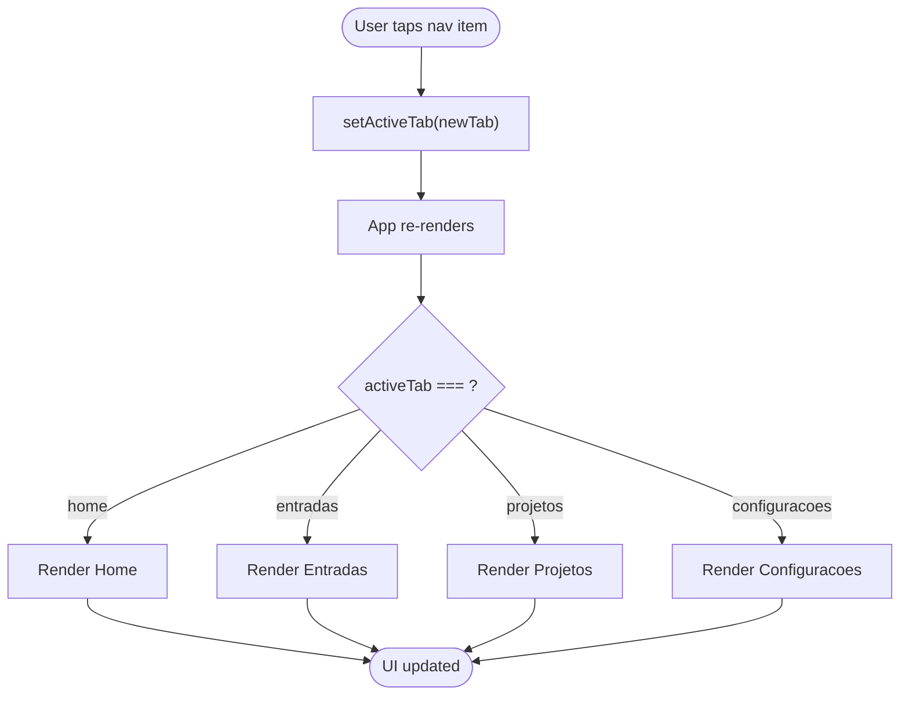
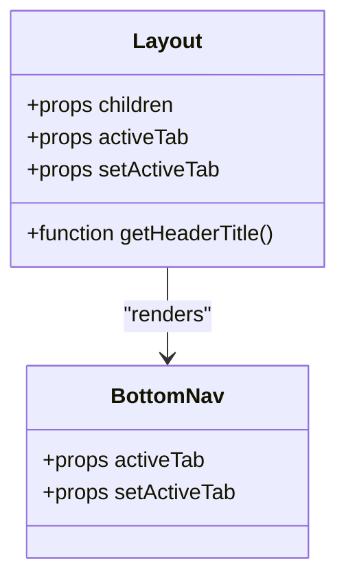
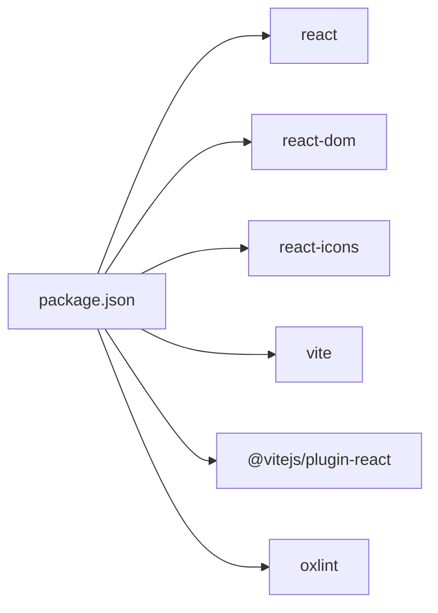

# Development Guide

<cite>
**Referenced Files in This Document**
- [package.json](file://package.json)
- [vite.config.js](file://vite.config.js)
- [.oxlintrc.json](file://.oxlintrc.json)
- [Dockerfile](file://Dockerfile)
- [docker-compose.yml](file://docker-compose.yml)
- [README.md](file://README.md)
- [index.html](file://index.html)
- [src/main.jsx](file://src/main.jsx)
- [src/App.jsx](file://src/App.jsx)
- [src/context/ThemeContext.jsx](file://src/context/ThemeContext.jsx)
- [src/components/Layout/Layout.jsx](file://src/components/Layout/Layout.jsx)
- [src/components/BottomNav/BottomNav.jsx](file://src/components/BottomNav/BottomNav.jsx)
- [src/pages/Home/Home.jsx](file://src/pages/Home/Home.jsx)
- [src/pages/Configuracoes/Configuracoes.jsx](file://src/pages/Configuracoes/Configuracoes.jsx)
- [src/index.css](file://src/index.css)
- [src/components/Layout/Layout.css](file://src/components/Layout/Layout.css)
</cite>

## Table of Contents
1. Introduction
2. Project Structure
3. Core Components
4. Architecture Overview
5. Detailed Component Analysis
6. Dependency Analysis
7. Performance Considerations
8. Troubleshooting Guide
9. Contribution Guidelines
10. Conclusion

## Introduction
This guide explains how to develop and contribute to Nordic Worklog. It covers local development with Vite, hot module replacement (HMR), build processes, code quality with Oxlint, Docker-based development, component and page creation patterns, testing strategies, debugging approaches, performance optimization, and contribution workflows.

## Project Structure
The project is a React + Vite application with a minimal structure:
- Entry points: index.html and src/main.jsx
- App shell: src/App.jsx with Layout and BottomNav
- Pages: src/pages/*
- Shared components: src/components/*
- Global styles: src/index.css and per-component CSS modules
- Configuration: package.json, vite.config.js, .oxlintrc.json
- Containerization: Dockerfile, docker-compose.yml



**Diagram sources**
- [index.html](file://index.html)
- [src/main.jsx](file://src/main.jsx)
- [src/App.jsx](file://src/App.jsx)
- [src/components/Layout/Layout.jsx](file://src/components/Layout/Layout.jsx)
- [src/components/BottomNav/BottomNav.jsx](file://src/components/BottomNav/BottomNav.jsx)
- [src/pages/Home/Home.jsx](file://src/pages/Home/Home.jsx)
- [src/pages/Configuracoes/Configuracoes.jsx](file://src/pages/Configuracoes/Configuracoes.jsx)
- [src/context/ThemeContext.jsx](file://src/context/ThemeContext.jsx)
- [src/index.css](file://src/index.css)

**Section sources**
- [index.html](file://index.html)
- [src/main.jsx](file://src/main.jsx)
- [src/App.jsx](file://src/App.jsx)
- [src/components/Layout/Layout.jsx](file://src/components/Layout/Layout.jsx)
- [src/components/BottomNav/BottomNav.jsx](file://src/components/BottomNav/BottomNav.jsx)
- [src/pages/Home/Home.jsx](file://src/pages/Home/Home.jsx)
- [src/pages/Configuracoes/Configuracoes.jsx](file://src/pages/Configuracoes/Configuracoes.jsx)
- [src/context/ThemeContext.jsx](file://src/context/ThemeContext.jsx)
- [src/index.css](file://src/index.css)

## Core Components
- Application entrypoint: mounts the app under StrictMode and provides theme context.
- App shell: manages active tab state and renders the selected page inside Layout.
- Layout: fixed header, scrollable content area, and bottom navigation.
- BottomNav: navigational items that update the active tab via callback.
- Theme provider: persists theme preference and toggles dark/light mode.

Key responsibilities:
- State ownership for navigation resides in App.
- UI composition and layout are handled by Layout and BottomNav.
- Global theming is provided through ThemeProvider and useTheme hook.

**Section sources**
- [src/main.jsx](file://src/main.jsx)
- [src/App.jsx](file://src/App.jsx)
- [src/components/Layout/Layout.jsx](file://src/components/Layout/Layout.jsx)
- [src/components/BottomNav/BottomNav.jsx](file://src/components/BottomNav/BottomNav.jsx)
- [src/context/ThemeContext.jsx](file://src/context/ThemeContext.jsx)

## Architecture Overview
The runtime flow starts from index.html, which loads the module entry point. The entrypoint creates a React root, wraps the app with ThemeProvider, and renders App. App controls navigation state and delegates rendering to pages within Layout.



**Diagram sources**
- [index.html](file://index.html)
- [src/main.jsx](file://src/main.jsx)
- [src/App.jsx](file://src/App.jsx)
- [src/components/Layout/Layout.jsx](file://src/components/Layout/Layout.jsx)

## Detailed Component Analysis

### Navigation Flow
Navigation is implemented using local state in App and a BottomNav component. Changing a tab updates the activeTab state, causing App to re-render the corresponding page.



**Diagram sources**
- [src/App.jsx](file://src/App.jsx)
- [src/components/BottomNav/BottomNav.jsx](file://src/components/BottomNav/BottomNav.jsx)

**Section sources**
- [src/App.jsx](file://src/App.jsx)
- [src/components/BottomNav/BottomNav.jsx](file://src/components/BottomNav/BottomNav.jsx)

### Theming System
ThemeProvider initializes theme from localStorage or system preference, applies a class to the document root, and exposes toggleTheme. useTheme provides access to theme state and toggle function.

```mermaid
classDiagram
class ThemeProvider {
+state theme
+function toggleTheme()
+effect applyClassToDocument()
}
class useTheme {
+returns { theme, toggleTheme }
}
ThemeProvider --> useTheme : "exposes via Context"
```

**Diagram sources**
- [src/context/ThemeContext.jsx](file://src/context/ThemeContext.jsx)
- [src/index.css](file://src/index.css)

**Section sources**
- [src/context/ThemeContext.jsx](file://src/context/ThemeContext.jsx)
- [src/index.css](file://src/index.css)

### Layout and Content Area
Layout composes a fixed header, a scrollable content area, and a fixed bottom navigation. It maps activeTab to a header title and passes navigation props to BottomNav.



**Diagram sources**
- [src/components/Layout/Layout.jsx](file://src/components/Layout/Layout.jsx)
- [src/components/BottomNav/BottomNav.jsx](file://src/components/BottomNav/BottomNav.jsx)

**Section sources**
- [src/components/Layout/Layout.jsx](file://src/components/Layout/Layout.jsx)
- [src/components/BottomNav/BottomNav.jsx](file://src/components/BottomNav/BottomNav.jsx)

## Dependency Analysis
Top-level dependencies include React, ReactDOM, react-icons, and dev tooling such as Vite, the React plugin, and Oxlint.



**Diagram sources**
- [package.json](file://package.json)

**Section sources**
- [package.json](file://package.json)

## Performance Considerations
- Keep navigation state minimal and co-located in App to avoid unnecessary re-renders.
- Prefer memoization for expensive computations if added later.
- Use CSS variables for theming to minimize style recalculation.
- Avoid heavy work in render paths; defer to effects when necessary.
- For production builds, leverage Vite’s optimized bundling and minification.

[No sources needed since this section provides general guidance]

## Troubleshooting Guide
- Port conflicts: Vite server defaults to port 3000. If another process uses it, change the port in configuration.
- HMR not working: Ensure you are running the dev script and not a stale build output.
- Lint errors: Run the lint script to identify issues early.
- Docker volume sync: When using compose, ensure volumes map correctly so changes reflect in the container.

**Section sources**
- [vite.config.js](file://vite.config.js)
- [package.json](file://package.json)
- [docker-compose.yml](file://docker-compose.yml)

## Contribution Guidelines

### Local Setup and Development Workflow
- Install dependencies and start the dev server:
  - npm install
  - npm run dev
- The dev server runs with HMR enabled by default via Vite.
- Preview production build locally:
  - npm run build
  - npm run preview

**Section sources**
- [package.json](file://package.json)
- [vite.config.js](file://vite.config.js)

### Code Quality and Style Enforcement with Oxlint
- Configuration file: .oxlintrc.json
- Scripts: npm run lint
- Enabled plugins: react, oxc
- Rules:
  - react/rules-of-hooks: error
  - react/only-export-components: warn with allowConstantExport true

Recommendations:
- Fix all errors before committing.
- Treat warnings as opportunities to improve consistency.
- Extend rules gradually as the codebase grows.

**Section sources**
- [.oxlintrc.json](file://.oxlintrc.json)
- [package.json](file://package.json)

### Dockerized Development Environment
Two options are available:

- Using Docker Compose (recommended for convenience):
  - docker compose up
  - The service installs dependencies and runs the dev server.
  - Host port mapping example: 3002 -> 3000.

- Using Dockerfile directly:
  - Build image: docker build -t nordic-worklog .
  - Run container: docker run -p 3000:3000 --rm -v $(pwd):/app -w /app nordic-worklog
  - CMD executes the dev server.

Notes:
- The container exposes port 3000 internally.
- Volume mounting ensures live reload during development.

**Section sources**
- [Dockerfile](file://Dockerfile)
- [docker-compose.yml](file://docker-compose.yml)

### Creating New Components
Follow established patterns:
- Place reusable UI in src/components/<ComponentName>/ with a JSX file and optional CSS.
- Export a default functional component.
- Keep props minimal and typed via JSDoc comments where helpful.
- Use global CSS variables from index.css for consistent theming.

Example pattern references:
- [src/components/Layout/Layout.jsx](file://src/components/Layout/Layout.jsx)
- [src/components/BottomNav/BottomNav.jsx](file://src/components/BottomNav/BottomNav.jsx)
- [src/components/Layout/Layout.css](file://src/components/Layout/Layout.css)

**Section sources**
- [src/components/Layout/Layout.jsx](file://src/components/Layout/Layout.jsx)
- [src/components/BottomNav/BottomNav.jsx](file://src/components/BottomNav/BottomNav.jsx)
- [src/components/Layout/Layout.css](file://src/components/Layout/Layout.css)
- [src/index.css](file://src/index.css)

### Adding New Pages
- Create a folder under src/pages/<PageName>/ with a main component file.
- Register the page in App’s navigation switch logic.
- Optionally add subcomponents under src/pages/<PageName>/components/.

References:
- [src/App.jsx](file://src/App.jsx)
- [src/pages/Home/Home.jsx](file://src/pages/Home/Home.jsx)
- [src/pages/Configuracoes/Configuracoes.jsx](file://src/pages/Configuracoes/Configuracoes.jsx)

**Section sources**
- [src/App.jsx](file://src/App.jsx)
- [src/pages/Home/Home.jsx](file://src/pages/Home/Home.jsx)
- [src/pages/Configuracoes/Configuracoes.jsx](file://src/pages/Configuracoes/Configuracoes.jsx)

### Implementing Features
- Keep feature-specific state close to the feature’s page or component.
- Use ThemeProvider/useTheme for any theme-aware behavior.
- Follow the same import/export conventions used across the codebase.

References:
- [src/context/ThemeContext.jsx](file://src/context/ThemeContext.jsx)

**Section sources**
- [src/context/ThemeContext.jsx](file://src/context/ThemeContext.jsx)

### Testing Strategy
- Unit tests: Add a test framework (e.g., Vitest or Jest) and write unit tests for utilities and pure functions.
- Component tests: Use a React testing library to assert rendering and interactions.
- Integration tests: Validate navigation flows and user actions across components.
- CI integration: Add lint and test scripts to your pipeline.

[No sources needed since this section provides general guidance]

### Debugging Approaches
- Use browser developer tools to inspect DOM, network requests, and console logs.
- Leverage React DevTools to inspect component trees and state.
- For Docker-based development, check container logs and ensure volume mounts are correct.

[No sources needed since this section provides general guidance]

### Commit Conventions and Pull Requests
- Use clear, descriptive commit messages.
- Keep commits focused and atomic.
- Before opening a PR:
  - Run npm run lint and fix issues.
  - Build successfully with npm run build.
  - Test locally with npm run dev and npm run preview.
- Provide a concise description of changes and rationale in the PR.

[No sources needed since this section provides general guidance]

## Conclusion
You now have everything needed to set up, develop, and contribute to Nordic Worklog efficiently. Follow the patterns for components and pages, enforce code quality with Oxlint, use Docker for consistent environments, and adopt the suggested testing and debugging practices.