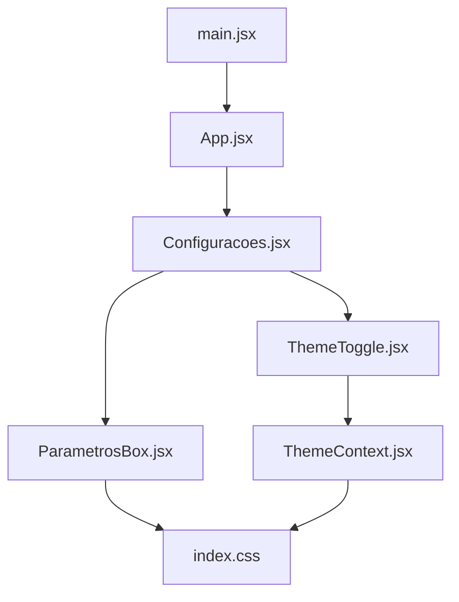
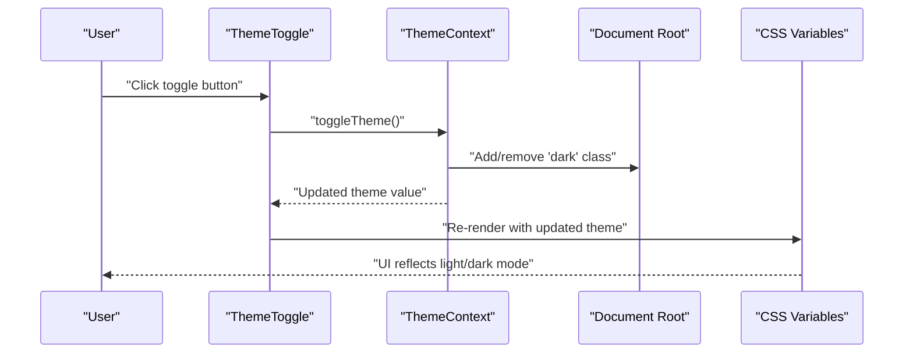
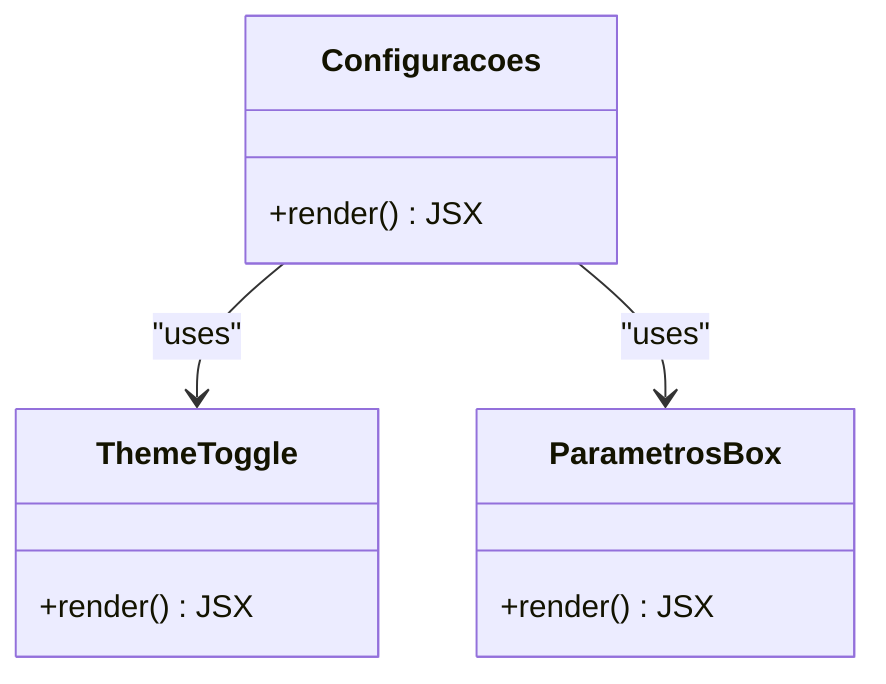
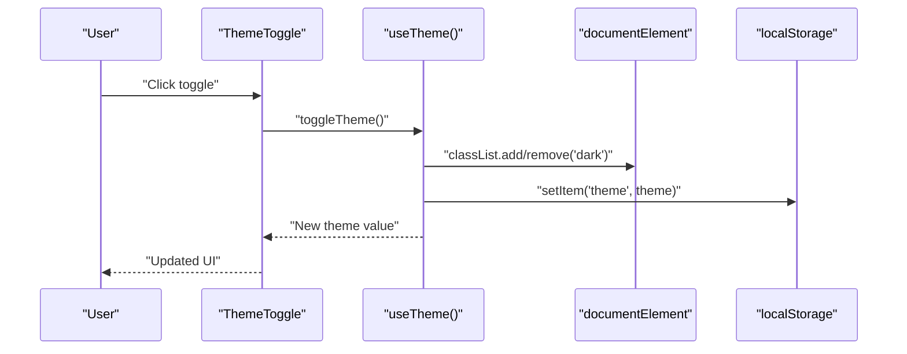
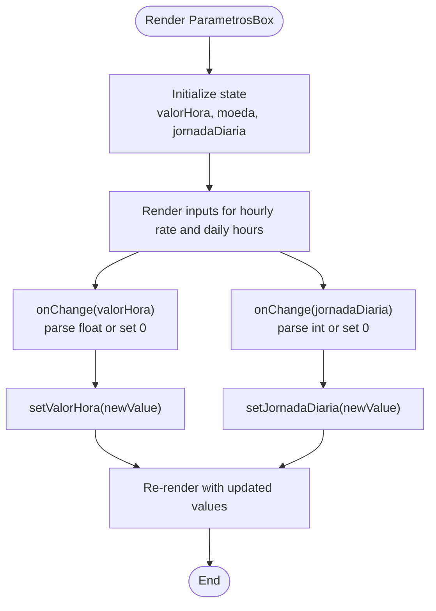
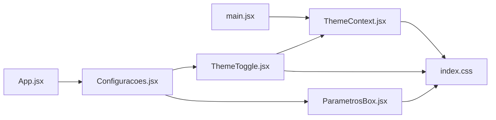

# Configuration Module

<cite>
**Referenced Files in This Document**
- [Configuracoes.jsx](file://src/pages/Configuracoes/Configuracoes.jsx)
- [ThemeToggle.jsx](file://src/pages/Configuracoes/components/ThemeToggle.jsx)
- [ParametrosBox.jsx](file://src/pages/Configuracoes/components/ParametrosBox.jsx)
- [ThemeContext.jsx](file://src/context/ThemeContext.jsx)
- [index.css](file://src/index.css)
- [main.jsx](file://src/main.jsx)
- [App.jsx](file://src/App.jsx)
</cite>

## Table of Contents
1. [Introduction](#introduction)
2. [Project Structure](#project-structure)
3. [Core Components](#core-components)
4. [Architecture Overview](#architecture-overview)
5. [Detailed Component Analysis](#detailed-component-analysis)
6. [Dependency Analysis](#dependency-analysis)
7. [Performance Considerations](#performance-considerations)
8. [Troubleshooting Guide](#troubleshooting-guide)
9. [Conclusion](#conclusion)
10. [Appendices](#appendices)

## Introduction
This document explains the Configuration module, focusing on the main Configuracoes component and its sub-components ThemeToggle and ParametrosBox. It covers:
- Settings panel organization
- Theme toggle functionality (light/dark mode switching)
- Parameter configuration box for hourly rates, currency, and daily schedules
- Component hierarchy and state management patterns
- User interaction flows
- Practical examples for extending the system with new options, theme variants, and export placeholders

## Project Structure
The Configuration module is organized under pages/Configuracoes with a clear separation between the page container and reusable settings components. The theme system is provided via a context provider at the application root.

**Diagram sources**
- [main.jsx:1-15](file://src/main.jsx#L1-L15)
- [App.jsx:1-39](file://src/App.jsx#L1-L39)
- [Configuracoes.jsx:1-70](file://src/pages/Configuracoes/Configuracoes.jsx#L1-L70)
- [ThemeToggle.jsx:1-55](file://src/pages/Configuracoes/components/ThemeToggle.jsx#L1-L55)
- [ParametrosBox.jsx:1-85](file://src/pages/Configuracoes/components/ParametrosBox.jsx#L1-L85)
- [ThemeContext.jsx:1-49](file://src/context/ThemeContext.jsx#L1-L49)
- [index.css:1-86](file://src/index.css#L1-L86)

**Section sources**
- [main.jsx:1-15](file://src/main.jsx#L1-L15)
- [App.jsx:1-39](file://src/App.jsx#L1-L39)
- [Configuracoes.jsx:1-70](file://src/pages/Configuracoes/Configuracoes.jsx#L1-L70)
- [ThemeToggle.jsx:1-55](file://src/pages/Configuracoes/components/ThemeToggle.jsx#L1-L55)
- [ParametrosBox.jsx:1-85](file://src/pages/Configuracoes/components/ParametrosBox.jsx#L1-L85)
- [ThemeContext.jsx:1-49](file://src/context/ThemeContext.jsx#L1-L49)
- [index.css:1-86](file://src/index.css#L1-L86)

## Core Components
- Configuracoes: Main settings page that groups general options and parameter configuration into two cards.
- ThemeToggle: Minimalist light/dark mode switch using the global theme context.
- ParametrosBox: Editable parameters for hourly rate, currency, and default daily schedule hours.

Key responsibilities:
- Configuracoes orchestrates layout and renders ThemeToggle and ParametrosBox.
- ThemeToggle reads and updates theme from ThemeContext.
- ParametrosBox manages local state for user preferences.

**Section sources**
- [Configuracoes.jsx:1-70](file://src/pages/Configuracoes/Configuracoes.jsx#L1-L70)
- [ThemeToggle.jsx:1-55](file://src/pages/Configuracoes/components/ThemeToggle.jsx#L1-L55)
- [ParametrosBox.jsx:1-85](file://src/pages/Configuracoes/components/ParametrosBox.jsx#L1-L85)

## Architecture Overview
The theme system uses React Context to provide a single source of truth for theme state across the app. CSS variables define light and dark palettes; toggling adds/removes a class on the document root.

**Diagram sources**
- [ThemeToggle.jsx:1-55](file://src/pages/Configuracoes/components/ThemeToggle.jsx#L1-L55)
- [ThemeContext.jsx:1-49](file://src/context/ThemeContext.jsx#L1-L49)
- [index.css:1-86](file://src/index.css#L1-L86)

## Detailed Component Analysis

### Configuracoes (Settings Page)
Responsibilities:
- Renders a card for general options including ThemeToggle and placeholder actions (Export CSV, Account Management).
- Renders a second card for parameter configuration via ParametrosBox.
- Uses consistent spacing and typography tokens from CSS variables.

User interactions:
- Clicking Export triggers an alert placeholder indicating export initiation.
- Account Management row displays a sample email and is clickable but has no action implemented.

State management:
- No local state; delegates theme control to ThemeToggle and parameters to ParametrosBox.

Extensibility:
- Add new rows by inserting additional flex items inside the first card.
- Integrate real export logic by replacing the alert with a function call.

**Section sources**
- [Configuracoes.jsx:1-70](file://src/pages/Configuracoes/Configuracoes.jsx#L1-L70)

#### Configuracoes Class Diagram

**Diagram sources**
- [Configuracoes.jsx:1-70](file://src/pages/Configuracoes/Configuracoes.jsx#L1-L70)
- [ThemeToggle.jsx:1-55](file://src/pages/Configuracoes/components/ThemeToggle.jsx#L1-L55)
- [ParametrosBox.jsx:1-85](file://src/pages/Configuracoes/components/ParametrosBox.jsx#L1-L85)

### ThemeToggle (Light/Dark Switch)
Responsibilities:
- Displays current theme icon (sun/moon) and label.
- Provides a minimal toggle button that calls toggleTheme from ThemeContext.
- Reflects theme visually through CSS variable-driven styles.

State management:
- Reads theme and toggleTheme from useTheme hook.
- No local state; fully controlled by ThemeContext.

Accessibility:
- Button includes aria-label for screen readers.

Integration:
- Relies on ThemeProvider wrapping the app and CSS variables defined for both themes.

**Section sources**
- [ThemeToggle.jsx:1-55](file://src/pages/Configuracoes/components/ThemeToggle.jsx#L1-L55)
- [ThemeContext.jsx:1-49](file://src/context/ThemeContext.jsx#L1-L49)
- [index.css:1-86](file://src/index.css#L1-L86)

#### ThemeToggle Sequence Diagram

**Diagram sources**
- [ThemeToggle.jsx:1-55](file://src/pages/Configuracoes/components/ThemeToggle.jsx#L1-L55)
- [ThemeContext.jsx:1-49](file://src/context/ThemeContext.jsx#L1-L49)

### ParametrosBox (Parameters Card)
Responsibilities:
- Manages local state for:
  - Hourly rate (Valor por Hora)
  - Currency (Moeda)
  - Default daily schedule (Jornada Diária)
- Renders inputs with labels and icons.

State management:
- Uses useState for each parameter.
- Input handlers parse values and update state accordingly.

Notes:
- Currency field is declared in state but not rendered in the current UI.
- Daily schedule input accepts numeric hours.

Validation and UX:
- Inputs fall back to zero when parsing fails.
- Styling uses CSS variables for consistent theming.

**Section sources**
- [ParametrosBox.jsx:1-85](file://src/pages/Configuracoes/components/ParametrosBox.jsx#L1-L85)

#### ParametrosBox Flowchart

**Diagram sources**
- [ParametrosBox.jsx:1-85](file://src/pages/Configuracoes/components/ParametrosBox.jsx#L1-L85)

## Dependency Analysis
High-level dependencies:
- Configuracoes depends on ThemeToggle and ParametrosBox.
- ThemeToggle depends on ThemeContext (useTheme).
- ThemeContext provides theme state and persistence via localStorage.
- All components consume CSS variables defined in index.css.
- App routes to Configuracoes based on active tab.
- main.jsx wraps the app with ThemeProvider.

**Diagram sources**
- [main.jsx:1-15](file://src/main.jsx#L1-L15)
- [ThemeContext.jsx:1-49](file://src/context/ThemeContext.jsx#L1-L49)
- [index.css:1-86](file://src/index.css#L1-L86)
- [App.jsx:1-39](file://src/App.jsx#L1-L39)
- [Configuracoes.jsx:1-70](file://src/pages/Configuracoes/Configuracoes.jsx#L1-L70)
- [ThemeToggle.jsx:1-55](file://src/pages/Configuracoes/components/ThemeToggle.jsx#L1-L55)
- [ParametrosBox.jsx:1-85](file://src/pages/Configuracoes/components/ParametrosBox.jsx#L1-L85)

**Section sources**
- [main.jsx:1-15](file://src/main.jsx#L1-L15)
- [App.jsx:1-39](file://src/App.jsx#L1-L39)
- [Configuracoes.jsx:1-70](file://src/pages/Configuracoes/Configuracoes.jsx#L1-L70)
- [ThemeToggle.jsx:1-55](file://src/pages/Configuracoes/components/ThemeToggle.jsx#L1-L55)
- [ParametrosBox.jsx:1-85](file://src/pages/Configuracoes/components/ParametrosBox.jsx#L1-L85)
- [ThemeContext.jsx:1-49](file://src/context/ThemeContext.jsx#L1-L49)
- [index.css:1-86](file://src/index.css#L1-L86)

## Performance Considerations
- Theme changes trigger a single re-render due to context updates; CSS transitions are hardware-accelerated via transform and opacity.
- Local state in ParametrosBox is lightweight; avoid unnecessary re-renders by keeping state granular and avoiding large objects.
- Persisted theme via localStorage is synchronous and fast; consider debouncing if you later add frequent writes.

[No sources needed since this section provides general guidance]

## Troubleshooting Guide
Common issues and resolutions:
- Theme does not persist across reloads:
  - Ensure ThemeProvider wraps the app and that localStorage is accessible.
  - Verify the document root receives the correct class when toggling.
- useTheme throws an error:
  - Confirm that any component using useTheme is nested within ThemeProvider.
- Dark mode styles not applied:
  - Check that index.css defines both :root and :root.dark variables and that the root element has the expected classes.
- Export placeholder behavior:
  - Replace the alert with a proper handler; ensure event propagation is not prevented elsewhere.

**Section sources**
- [ThemeContext.jsx:1-49](file://src/context/ThemeContext.jsx#L1-L49)
- [index.css:1-86](file://src/index.css#L1-L86)
- [Configuracoes.jsx:1-70](file://src/pages/Configuracoes/Configuracoes.jsx#L1-L70)

## Conclusion
The Configuration module provides a clean, extensible foundation for user settings. ThemeToggle integrates seamlessly with a global theme context, while ParametrosBox demonstrates local state management for user preferences. The design leverages CSS variables for consistent theming and keeps component responsibilities focused and testable.

[No sources needed since this section summarizes without analyzing specific files]

## Appendices

### How to Add a New Configuration Option
Steps:
- Decide whether the option belongs in General Options or Parameters.
- For General Options:
  - Add a new row inside the first card in Configuracoes, following the existing pattern.
  - If it requires state, lift state up or create a small dedicated component.
- For Parameters:
  - Extend ParametrosBox with a new state field and corresponding input.
  - Optionally wire it to a central store or API later.

Example references:
- Adding a row similar to existing ones: [Configuracoes.jsx:17-56](file://src/pages/Configuracoes/Configuracoes.jsx#L17-L56)
- Adding a new parameter input like Valor/Hora: [ParametrosBox.jsx:28-53](file://src/pages/Configuracoes/components/ParametrosBox.jsx#L28-L53)

**Section sources**
- [Configuracoes.jsx:1-70](file://src/pages/Configuracoes/Configuracoes.jsx#L1-L70)
- [ParametrosBox.jsx:1-85](file://src/pages/Configuracoes/components/ParametrosBox.jsx#L1-L85)

### Extending the Theme System
Options:
- Add more theme modes by expanding ThemeContext state and toggle logic.
- Introduce a theme selector component that sets theme explicitly.
- Persist selected theme variant in localStorage.

Reference points:
- Theme state initialization and persistence: [ThemeContext.jsx:9-27](file://src/context/ThemeContext.jsx#L9-L27)
- Toggle implementation: [ThemeContext.jsx:30-32](file://src/context/ThemeContext.jsx#L30-L32)
- CSS variables for light/dark: [index.css:7-28](file://src/index.css#L7-L28)

**Section sources**
- [ThemeContext.jsx:1-49](file://src/context/ThemeContext.jsx#L1-L49)
- [index.css:1-86](file://src/index.css#L1-L86)

### Implementing Export Functionality Placeholders
Current behavior:
- Export Data (CSV) shows an alert placeholder.

Next steps:
- Replace the alert with a function that generates and downloads a CSV file.
- Consider adding progress feedback and error handling.

Reference point:
- Placeholder click handler: [Configuracoes.jsx:31](file://src/pages/Configuracoes/Configuracoes.jsx#L31)

**Section sources**
- [Configuracoes.jsx:1-70](file://src/pages/Configuracoes/Configuracoes.jsx#L1-L70)