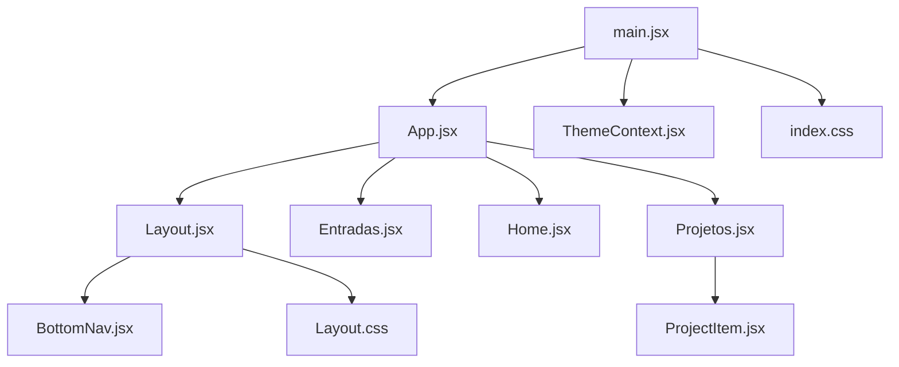
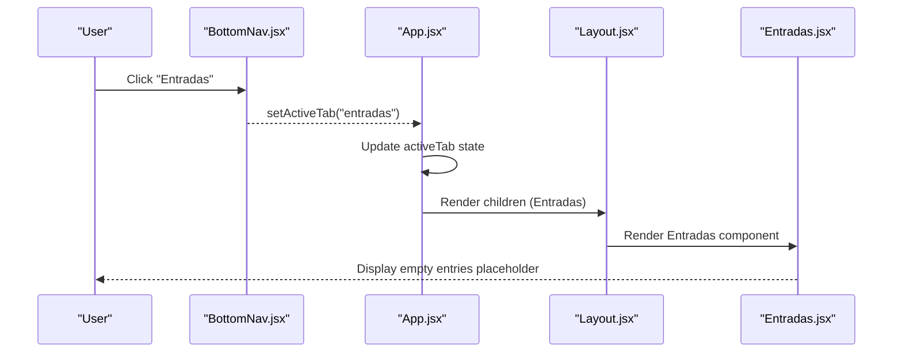
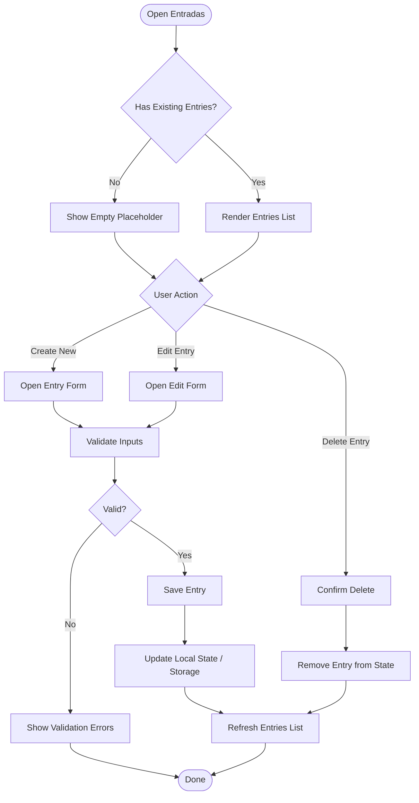
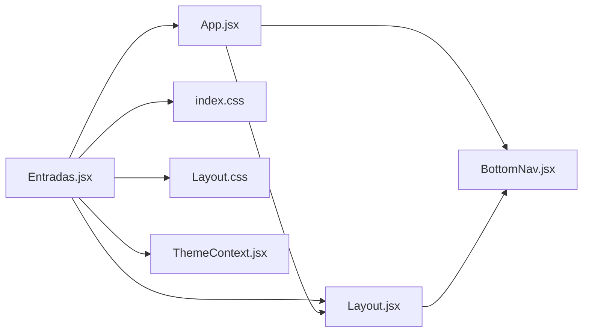

# Entries Module

<cite>
**Referenced Files in This Document**
- [Entradas.jsx](file://src/pages/Entradas/Entradas.jsx)
- [App.jsx](file://src/App.jsx)
- [Layout.jsx](file://src/components/Layout/Layout.jsx)
- [BottomNav.jsx](file://src/components/BottomNav/BottomNav.jsx)
- [ThemeContext.jsx](file://src/context/ThemeContext.jsx)
- [index.css](file://src/index.css)
- [Layout.css](file://src/components/Layout/Layout.css)
- [Home.jsx](file://src/pages/Home/Home.jsx)
- [Projetos.jsx](file://src/pages/Projetos/Projetos.jsx)
- [ProjectItem.jsx](file://src/pages/Projetos/components/ProjectItem.jsx)
- [main.jsx](file://src/main.jsx)
</cite>

## Table of Contents
1. [Introduction](#introduction)
2. [Project Structure](#project-structure)
3. [Core Components](#core-components)
4. [Architecture Overview](#architecture-overview)
5. [Detailed Component Analysis](#detailed-component-analysis)
6. [Dependency Analysis](#dependency-analysis)
7. [Performance Considerations](#performance-considerations)
8. [Troubleshooting Guide](#troubleshooting-guide)
9. [Conclusion](#conclusion)
10. [Appendices](#appendices)

## Introduction
This document provides detailed documentation for the Entries module component within the Nordic Worklog application. The Entries page currently serves as a placeholder for work entry logging and time tracking features. It is integrated into the application’s tab-based navigation and follows the project’s minimalistic design system.

The goal of this document is to:
- Describe the current structure and role of the Entries page in the worklog workflow
- Explain how it integrates with the overall application state
- Provide guidance on implementing actual time tracking functionality, data validation patterns, and user interaction flows
- Show examples of extending the entries interface with additional fields and business logic

## Project Structure
The Entries module is implemented as a simple React page component under pages/Entradas. It is rendered by the root App component when the active tab is set to "entradas". The Layout component wraps all pages and manages header title and bottom navigation.

**Diagram sources**
- [main.jsx:1-15](file://src/main.jsx#L1-L15)
- [App.jsx:1-39](file://src/App.jsx#L1-L39)
- [Layout.jsx:1-49](file://src/components/Layout/Layout.jsx#L1-L49)
- [BottomNav.jsx:1-37](file://src/components/BottomNav/BottomNav.jsx#L1-L37)
- [Entradas.jsx:1-19](file://src/pages/Entradas/Entradas.jsx#L1-L19)
- [Home.jsx:1-19](file://src/pages/Home/Home.jsx#L1-L19)
- [Projetos.jsx:1-31](file://src/pages/Projetos/Projetos.jsx#L1-L31)
- [ProjectItem.jsx:1-49](file://src/pages/Projetos/components/ProjectItem.jsx#L1-L49)
- [ThemeContext.jsx:1-49](file://src/context/ThemeContext.jsx#L1-L49)
- [index.css:1-86](file://src/index.css#L1-L86)
- [Layout.css:1-74](file://src/components/Layout/Layout.css#L1-L74)

**Section sources**
- [Entradas.jsx:1-19](file://src/pages/Entradas/Entradas.jsx#L1-L19)
- [App.jsx:1-39](file://src/App.jsx#L1-L39)
- [Layout.jsx:1-49](file://src/components/Layout/Layout.jsx#L1-L49)
- [BottomNav.jsx:1-37](file://src/components/BottomNav/BottomNav.jsx#L1-L37)
- [ThemeContext.jsx:1-49](file://src/context/ThemeContext.jsx#L1-L49)
- [index.css:1-86](file://src/index.css#L1-L86)
- [Layout.css:1-74](file://src/components/Layout/Layout.css#L1-L74)

## Core Components
- Entradas (Entries Page): A minimal placeholder that renders an empty card container indicating the list of work entries is empty. It uses global utility classes for consistent styling and fade-in animation.
- App (Root Router): Manages active tab state and conditionally renders the Entradas page when the "entradas" tab is selected.
- Layout: Provides fixed header and content area, and passes activeTab and setActiveTab to BottomNav.
- BottomNav: Renders navigation items including "Entradas" with a clock icon; clicking updates the active tab in App.
- ThemeProvider: Supplies theme context used globally via CSS variables.

Key responsibilities:
- Entradas: Placeholder UI for future work entry logging and time tracking
- App: Tab routing and rendering
- Layout: Structural wrapper and header title mapping
- BottomNav: Navigation control
- ThemeProvider: Global theme management

**Section sources**
- [Entradas.jsx:1-19](file://src/pages/Entradas/Entradas.jsx#L1-L19)
- [App.jsx:1-39](file://src/App.jsx#L1-L39)
- [Layout.jsx:1-49](file://src/components/Layout/Layout.jsx#L1-L49)
- [BottomNav.jsx:1-37](file://src/components/BottomNav/BottomNav.jsx#L1-L37)
- [ThemeContext.jsx:1-49](file://src/context/ThemeContext.jsx#L1-L49)

## Architecture Overview
The Entries module participates in a simple tab-based architecture. The root App holds the active tab state and renders the corresponding page. The Layout component wraps each page and displays a dynamic header title based on the active tab. The BottomNav component allows switching tabs, which updates App’s state and re-renders the Entradas page when selected.

**Diagram sources**
- [BottomNav.jsx:10-36](file://src/components/BottomNav/BottomNav.jsx#L10-L36)
- [App.jsx:12-35](file://src/App.jsx#L12-L35)
- [Layout.jsx:11-47](file://src/components/Layout/Layout.jsx#L11-L47)
- [Entradas.jsx:7-18](file://src/pages/Entradas/Entradas.jsx#L7-L18)

## Detailed Component Analysis

### Entradas (Entries Page)
Current implementation:
- Renders a minimal card container with a centered message indicating an empty list of work entries
- Uses global CSS utilities like "fade-in" and "card" for consistent appearance
- No form fields or time tracking logic yet

Work entry logging interface structure (current):
- Container: Card layout with dashed border and center alignment
- Message: Secondary text describing the empty state

Time tracking placeholders:
- None currently present; this is a blank canvas for adding inputs such as start/end times, duration, description, and project association

Form layout patterns:
- Follows the project’s minimal card pattern
- Vertical stacking using flexbox for future form elements
- Consistent spacing and typography via CSS variables

Integration with application state:
- Currently stateless; no props or local state beyond default render
- Will need to integrate with global state or local state for managing entries once implemented

Guidance for implementing actual time tracking functionality:
- Add local state for form fields (e.g., date, start time, end time, description, project)
- Implement input handlers to update state and validate values
- Persist entries to localStorage or a backend service
- Provide actions to create, edit, delete, and list entries
- Use the existing card layout to display entries and forms

Data validation patterns:
- Validate required fields (date, start time, end time)
- Ensure end time is after start time
- Normalize time formats and handle timezone considerations if needed
- Provide inline error messages and disable submit until valid

User interaction flows:
- Open Entries page -> see empty placeholder or existing entries list
- Tap "New Entry" -> open form modal or inline form
- Fill fields -> validate -> save -> update list
- Edit/Delete entries via row actions

Examples of extending the entries interface:
- Add fields: project selector, tags, billable flag, notes
- Add business logic: auto-calculate duration, prevent overlapping entries, sync with projects
- Add UX enhancements: quick add, templates, search/filter, export

[No sources needed since this diagram shows conceptual workflow, not actual code structure]

**Section sources**
- [Entradas.jsx:1-19](file://src/pages/Entradas/Entradas.jsx#L1-L19)

### App (Root Router)
Role:
- Holds activeTab state and switches between Home, Entradas, Projetos, Configuracoes
- Passes activeTab and setActiveTab to Layout

Integration with Entries:
- When activeTab equals "entradas", App renders Entradas
- Header title becomes "Histórico de Entradas" via Layout

**Section sources**
- [App.jsx:12-35](file://src/App.jsx#L12-L35)
- [Layout.jsx:13-26](file://src/components/Layout/Layout.jsx#L13-L26)

### Layout (Structural Wrapper)
Responsibilities:
- Fixed header with dynamic title based on activeTab
- Content area with padding compensation for fixed header and bottom nav
- Wraps children (pages) and includes BottomNav

Styling:
- Uses CSS variables for background, borders, transitions
- Card utility class for consistent containers

**Section sources**
- [Layout.jsx:11-47](file://src/components/Layout/Layout.jsx#L11-L47)
- [Layout.css:1-74](file://src/components/Layout/Layout.css#L1-L74)

### BottomNav (Navigation Bar)
Features:
- Displays four tabs: Início, Entradas, Projetos, Ajustes
- Uses icons from react-icons
- Updates activeTab via callback passed from App

Integration with Entries:
- "Entradas" item triggers setActiveTab("entradas"), causing App to render Entradas

**Section sources**
- [BottomNav.jsx:10-36](file://src/components/BottomNav/BottomNav.jsx#L10-L36)

### ThemeContext (Global Theme Provider)
Purpose:
- Provides theme state and toggle function
- Persists theme preference to localStorage
- Applies dark/light CSS variables to document root

Relevance to Entries:
- Ensures consistent theming across the Entries page and other components

**Section sources**
- [ThemeContext.jsx:7-38](file://src/context/ThemeContext.jsx#L7-L38)
- [index.css:7-28](file://src/index.css#L7-L28)

## Dependency Analysis
The Entries module depends on:
- App for routing and state
- Layout for structural presentation
- BottomNav for navigation
- Global CSS for styling and animations
- ThemeProvider for theme context

**Diagram sources**
- [Entradas.jsx:1-19](file://src/pages/Entradas/Entradas.jsx#L1-L19)
- [App.jsx:1-39](file://src/App.jsx#L1-L39)
- [Layout.jsx:1-49](file://src/components/Layout/Layout.jsx#L1-L49)
- [BottomNav.jsx:1-37](file://src/components/BottomNav/BottomNav.jsx#L1-L37)
- [ThemeContext.jsx:1-49](file://src/context/ThemeContext.jsx#L1-L49)
- [index.css:1-86](file://src/index.css#L1-L86)
- [Layout.css:1-74](file://src/components/Layout/Layout.css#L1-L74)

**Section sources**
- [Entradas.jsx:1-19](file://src/pages/Entradas/Entradas.jsx#L1-L19)
- [App.jsx:1-39](file://src/App.jsx#L1-L39)
- [Layout.jsx:1-49](file://src/components/Layout/Layout.jsx#L1-L49)
- [BottomNav.jsx:1-37](file://src/components/BottomNav/BottomNav.jsx#L1-L37)
- [ThemeContext.jsx:1-49](file://src/context/ThemeContext.jsx#L1-L49)
- [index.css:1-86](file://src/index.css#L1-L86)
- [Layout.css:1-74](file://src/components/Layout/Layout.css#L1-L74)

## Performance Considerations
- Keep Entradas lightweight; avoid heavy computations during initial render
- Use memoization for expensive lists if entries grow large
- Prefer local state for small datasets; consider context or external store for shared state
- Debounce input handlers for real-time validation if needed
- Avoid unnecessary re-renders by splitting components and using stable keys

[No sources needed since this section provides general guidance]

## Troubleshooting Guide
Common issues and resolutions:
- Entries page does not appear: Verify activeTab is set to "entradas" in App and BottomNav onClick handler calls setActiveTab correctly
- Header title mismatch: Ensure Layout’s getHeaderTitle maps "entradas" to the correct title
- Styling inconsistencies: Confirm index.css and Layout.css are imported and CSS variables are applied; check theme context provider wrapping App
- Navigation not updating: Ensure BottomNav receives activeTab and setActiveTab props from Layout and App

**Section sources**
- [App.jsx:16-29](file://src/App.jsx#L16-L29)
- [Layout.jsx:13-26](file://src/components/Layout/Layout.jsx#L13-L26)
- [BottomNav.jsx:22-32](file://src/components/BottomNav/BottomNav.jsx#L22-L32)
- [ThemeContext.jsx:19-27](file://src/context/ThemeContext.jsx#L19-L27)
- [index.css:7-28](file://src/index.css#L7-L28)
- [Layout.css:1-74](file://src/components/Layout/Layout.css#L1-L74)

## Conclusion
The Entries module is currently a placeholder ready for expansion into a full work entry logging and time tracking feature. It integrates seamlessly with the app’s tab-based navigation and adheres to the project’s minimalistic design system. By following the guidance provided—adding form fields, validation, persistence, and user interactions—you can evolve the placeholder into a robust time tracking interface aligned with the overall application state and design patterns.

[No sources needed since this section summarizes without analyzing specific files]

## Appendices

### Data Model Suggestions for Entries
Suggested fields for a work entry:
- id: unique identifier
- date: ISO date string
- startTime: time string (HH:mm)
- endTime: time string (HH:mm)
- durationMinutes: number (computed)
- description: string
- projectId: reference to project
- tags: array of strings
- billable: boolean
- createdAt: timestamp
- updatedAt: timestamp

[No sources needed since this section provides conceptual model suggestions]

### Example Extension Patterns
- Adding a new field:
  - Extend form state with new field
  - Add input element with onChange handler
  - Include validation rules
  - Persist field on save
- Business logic:
  - Auto-calculate duration from start/end times
  - Prevent overlapping entries per project
  - Sync entries with projects list

[No sources needed since this section provides conceptual extension patterns]