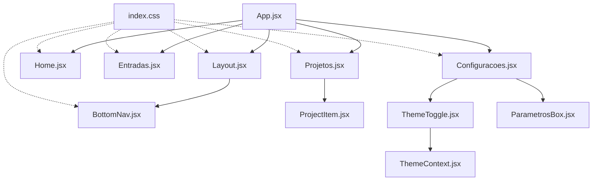
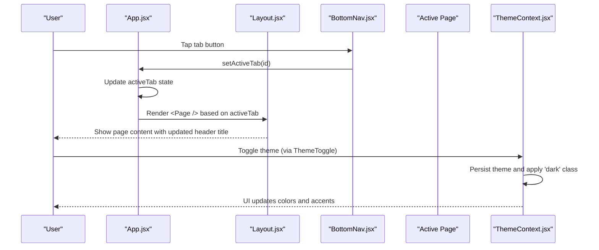
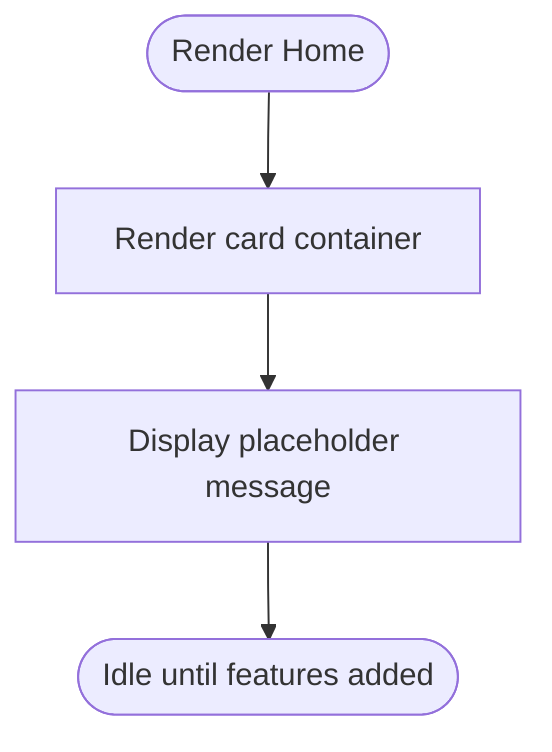
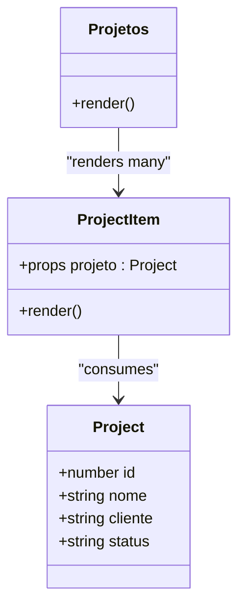
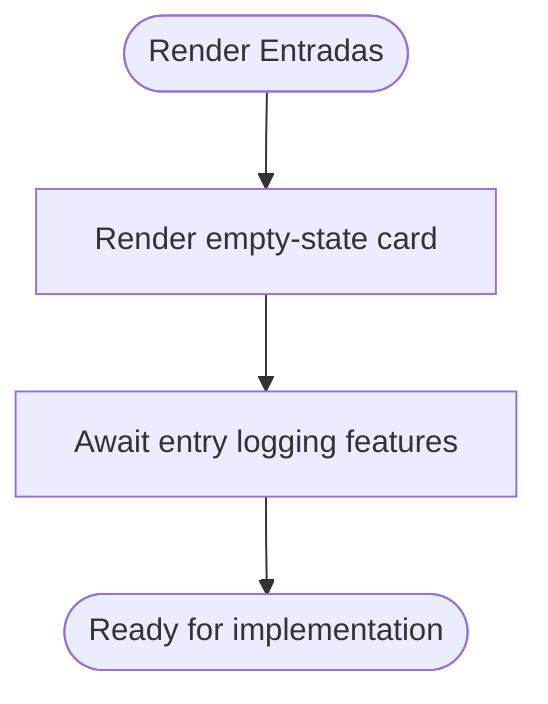
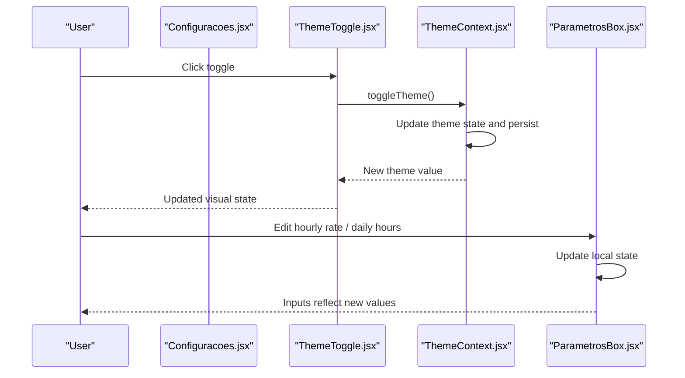
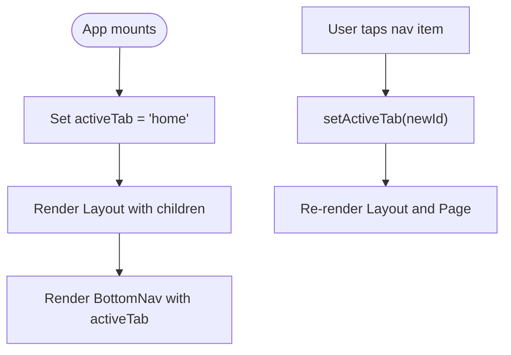
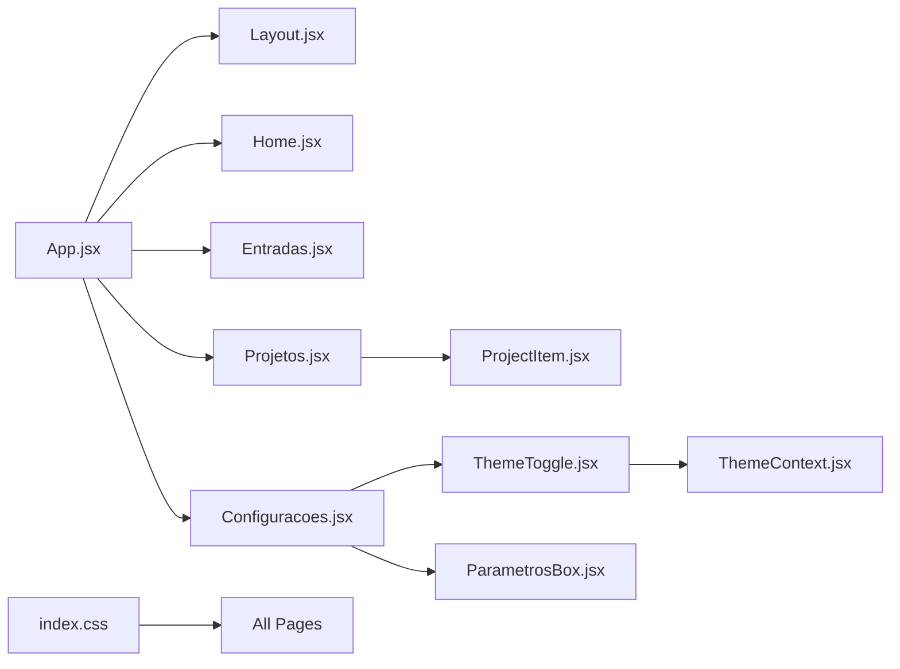

# Features & Pages

<cite>
**Referenced Files in This Document**
- [App.jsx](file://src/App.jsx)
- [Layout.jsx](file://src/components/Layout/Layout.jsx)
- [BottomNav.jsx](file://src/components/BottomNav/BottomNav.jsx)
- [ThemeContext.jsx](file://src/context/ThemeContext.jsx)
- [Home.jsx](file://src/pages/Home/Home.jsx)
- [Projetos.jsx](file://src/pages/Projetos/Projetos.jsx)
- [ProjectItem.jsx](file://src/pages/Projetos/components/ProjectItem.jsx)
- [Entradas.jsx](file://src/pages/Entradas/Entradas.jsx)
- [Configuracoes.jsx](file://src/pages/Configuracoes/Configuracoes.jsx)
- [ParametrosBox.jsx](file://src/pages/Configuracoes/components/ParametrosBox.jsx)
- [ThemeToggle.jsx](file://src/pages/Configuracoes/components/ThemeToggle.jsx)
- [index.css](file://src/index.css)
</cite>

## Table of Contents
1. [Introduction](#introduction)
2. [Project Structure](#project-structure)
3. [Core Components](#core-components)
4. [Architecture Overview](#architecture-overview)
5. [Detailed Component Analysis](#detailed-component-analysis)
6. [Dependency Analysis](#dependency-analysis)
7. [Performance Considerations](#performance-considerations)
8. [Troubleshooting Guide](#troubleshooting-guide)
9. [Conclusion](#conclusion)

## Introduction
This document describes the feature pages and components of Nordic Worklog, focusing on:
- Home page dashboard layout and placeholder structure for future features
- Projects module with project list display, ProjectItem component, status indicators, and client information
- Entries module placeholders for work entry logging and time tracking
- Configuration module including settings panel organization, theme toggle controls, parameter configuration box, and export functionality placeholders
It also covers component hierarchies, data structures, and user interaction patterns implemented across these pages.

## Project Structure
Nordic Worklog is a React application organized by feature pages under src/pages, shared UI shell components under src/components, and global theming via context and CSS variables. The root App manages navigation state and renders the active page within a Layout that provides a header and bottom navigation.

**Diagram sources**
- [App.jsx:1-39](file://src/App.jsx#L1-L39)
- [Layout.jsx:1-49](file://src/components/Layout/Layout.jsx#L1-L49)
- [BottomNav.jsx:1-37](file://src/components/BottomNav/BottomNav.jsx#L1-L37)
- [Home.jsx:1-19](file://src/pages/Home/Home.jsx#L1-L19)
- [Projetos.jsx:1-31](file://src/pages/Projetos/Projetos.jsx#L1-L31)
- [ProjectItem.jsx:1-49](file://src/pages/Projetos/components/ProjectItem.jsx#L1-L49)
- [Entradas.jsx:1-19](file://src/pages/Entradas/Entradas.jsx#L1-L19)
- [Configuracoes.jsx:1-70](file://src/pages/Configuracoes/Configuracoes.jsx#L1-L70)
- [ThemeToggle.jsx:1-55](file://src/pages/Configuracoes/components/ThemeToggle.jsx#L1-L55)
- [ParametrosBox.jsx:1-85](file://src/pages/Configuracoes/components/ParametrosBox.jsx#L1-L85)
- [ThemeContext.jsx:1-49](file://src/context/ThemeContext.jsx#L1-L49)
- [index.css:1-86](file://src/index.css#L1-L86)

**Section sources**
- [App.jsx:1-39](file://src/App.jsx#L1-L39)
- [Layout.jsx:1-49](file://src/components/Layout/Layout.jsx#L1-L49)
- [BottomNav.jsx:1-37](file://src/components/BottomNav/BottomNav.jsx#L1-L37)
- [index.css:1-86](file://src/index.css#L1-L86)

## Core Components
- App: Holds activeTab state and renders the corresponding page inside Layout.
- Layout: Provides fixed header and bottom navigation; injects children (active page).
- BottomNav: Renders four tabs (home, entradas, projetos, configuracoes) with icons and labels.
- ThemeContext: Provides theme state and toggle function; persists selection and applies dark class to document root.
- ThemeToggle: Uses ThemeContext to switch between light/dark themes with an animated toggle control.
- ParametrosBox: Local state for hourly rate, currency, and daily hours; inputs update local values.
- Configuracoes: Groups general options (theme, export placeholder, account placeholder) and parameters section.
- Projetos: Displays a small mock list of projects using ProjectItem.
- ProjectItem: Shows project name, client, and a status badge with conditional styling.
- Home and Entradas: Placeholder cards indicating empty states ready for future content.

**Section sources**
- [App.jsx:1-39](file://src/App.jsx#L1-L39)
- [Layout.jsx:1-49](file://src/components/Layout/Layout.jsx#L1-L49)
- [BottomNav.jsx:1-37](file://src/components/BottomNav/BottomNav.jsx#L1-L37)
- [ThemeContext.jsx:1-49](file://src/context/ThemeContext.jsx#L1-L49)
- [ThemeToggle.jsx:1-55](file://src/pages/Configuracoes/components/ThemeToggle.jsx#L1-L55)
- [ParametrosBox.jsx:1-85](file://src/pages/Configuracoes/components/ParametrosBox.jsx#L1-L85)
- [Configuracoes.jsx:1-70](file://src/pages/Configuracoes/Configuracoes.jsx#L1-L70)
- [Projetos.jsx:1-31](file://src/pages/Projetos/Projetos.jsx#L1-L31)
- [ProjectItem.jsx:1-49](file://src/pages/Projetos/components/ProjectItem.jsx#L1-L49)
- [Home.jsx:1-19](file://src/pages/Home/Home.jsx#L1-L19)
- [Entradas.jsx:1-19](file://src/pages/Entradas/Entradas.jsx#L1-L19)

## Architecture Overview
The app uses a simple tab-based navigation controlled by local state in App. Layout wraps each page and provides consistent header and bottom navigation. Theming is centralized via ThemeContext and applied through a CSS class on the document root. Pages are feature-scoped and composed of lightweight presentational components.

**Diagram sources**
- [App.jsx:12-35](file://src/App.jsx#L12-L35)
- [Layout.jsx:11-46](file://src/components/Layout/Layout.jsx#L11-L46)
- [BottomNav.jsx:10-36](file://src/components/BottomNav/BottomNav.jsx#L10-L36)
- [ThemeContext.jsx:7-38](file://src/context/ThemeContext.jsx#L7-L38)
- [ThemeToggle.jsx:9-54](file://src/pages/Configuracoes/components/ThemeToggle.jsx#L9-L54)

## Detailed Component Analysis

### Home Page Dashboard
- Purpose: Placeholder area for future dashboard widgets and summaries.
- Layout: A minimal card container with centered text and dashed border to indicate an empty state.
- Styling: Uses global fade-in animation and CSS variables for text color.
- Interaction: None currently; ready for future widgets such as totals, charts, or quick actions.

**Diagram sources**
- [Home.jsx:7-18](file://src/pages/Home/Home.jsx#L7-L18)
- [index.css:72-85](file://src/index.css#L72-L85)

**Section sources**
- [Home.jsx:1-19](file://src/pages/Home/Home.jsx#L1-L19)
- [index.css:1-86](file://src/index.css#L1-L86)

### Projects Module
- Data Model:
  - Project object fields: id (number), nome (string), cliente (string), status (string).
  - Example statuses include “Ativo” and “Finalizado”.
- List Rendering:
  - Projetos maps over a small mock array and renders ProjectItem for each project.
- ProjectItem:
  - Displays project name and client.
  - Status badge shows conditional background and text color based on status value.
- Interactions:
  - Currently read-only; no edit/delete flows.
- Extensibility:
  - Can be connected to a backend API or state store to fetch real projects.
  - Status can be extended to more values with additional styling branches.

**Diagram sources**
- [Projetos.jsx:10-26](file://src/pages/Projetos/Projetos.jsx#L10-L26)
- [ProjectItem.jsx:12-47](file://src/pages/Projetos/components/ProjectItem.jsx#L12-L47)

**Section sources**
- [Projetos.jsx:1-31](file://src/pages/Projetos/Projetos.jsx#L1-L31)
- [ProjectItem.jsx:1-49](file://src/pages/Projetos/components/ProjectItem.jsx#L1-L49)

### Entries Module (Work Logging Placeholders)
- Purpose: Placeholder for work entry logging and time tracking features.
- Layout: Empty-state card similar to Home, indicating where entries will appear.
- Future Enhancements:
  - Entry form (date, project, description, duration).
  - Entry list with filters and sorting.
  - Time tracking integration and summary calculations.

**Diagram sources**
- [Entradas.jsx:7-18](file://src/pages/Entradas/Entradas.jsx#L7-L18)

**Section sources**
- [Entradas.jsx:1-19](file://src/pages/Entradas/Entradas.jsx#L1-L19)

### Configuration Module
- Organization:
  - General Options card includes:
    - Theme toggle control.
    - Export Data (CSV) placeholder action.
    - Account management placeholder with email display.
  - Parameters card contains ParametrosBox for default work settings.
- Theme Toggle:
  - Uses ThemeContext to read current theme and call toggleTheme.
  - Visual feedback via icon change and animated toggle knob.
- Parameter Configuration Box:
  - Fields:
    - Hourly rate (numeric input with currency prefix).
    - Daily hours (numeric input with unit label).
  - State is local to ParametrosBox; changes do not persist beyond component re-render.
- Export Placeholder:
  - Click triggers an alert simulating export initiation.

**Diagram sources**
- [Configuracoes.jsx:10-66](file://src/pages/Configuracoes/Configuracoes.jsx#L10-L66)
- [ThemeToggle.jsx:9-54](file://src/pages/Configuracoes/components/ThemeToggle.jsx#L9-L54)
- [ThemeContext.jsx:7-38](file://src/context/ThemeContext.jsx#L7-L38)
- [ParametrosBox.jsx:8-84](file://src/pages/Configuracoes/components/ParametrosBox.jsx#L8-L84)

**Section sources**
- [Configuracoes.jsx:1-70](file://src/pages/Configuracoes/Configuracoes.jsx#L1-L70)
- [ThemeToggle.jsx:1-55](file://src/pages/Configuracoes/components/ThemeToggle.jsx#L1-L55)
- [ParametrosBox.jsx:1-85](file://src/pages/Configuracoes/components/ParametrosBox.jsx#L1-L85)
- [ThemeContext.jsx:1-49](file://src/context/ThemeContext.jsx#L1-L49)

### Navigation Shell
- Header:
  - Title dynamically reflects the active tab via Layout’s getHeaderTitle mapping.
- Bottom Navigation:
  - Four items: Início (Home), Entradas (Entries), Projetos (Projects), Ajustes (Settings).
  - Active item receives an “active” class for highlighting.
- Routing:
  - No router library; navigation is driven by activeTab state in App and passed down to Layout and BottomNav.

**Diagram sources**
- [App.jsx:12-35](file://src/App.jsx#L12-L35)
- [Layout.jsx:13-26](file://src/components/Layout/Layout.jsx#L13-L26)
- [BottomNav.jsx:12-32](file://src/components/BottomNav/BottomNav.jsx#L12-L32)

**Section sources**
- [App.jsx:1-39](file://src/App.jsx#L1-L39)
- [Layout.jsx:1-49](file://src/components/Layout/Layout.jsx#L1-L49)
- [BottomNav.jsx:1-37](file://src/components/BottomNav/BottomNav.jsx#L1-L37)

## Dependency Analysis
- App depends on Layout and all four page modules.
- Layout depends on BottomNav and Layout.css.
- Projects depends on ProjectItem.
- Configuration depends on ThemeToggle and ParametrosBox.
- ThemeToggle depends on ThemeContext.
- All pages rely on global styles from index.css for theming and animations.

**Diagram sources**
- [App.jsx:1-39](file://src/App.jsx#L1-L39)
- [Layout.jsx:1-49](file://src/components/Layout/Layout.jsx#L1-L49)
- [BottomNav.jsx:1-37](file://src/components/BottomNav/BottomNav.jsx#L1-L37)
- [Home.jsx:1-19](file://src/pages/Home/Home.jsx#L1-L19)
- [Projetos.jsx:1-31](file://src/pages/Projetos/Projetos.jsx#L1-L31)
- [ProjectItem.jsx:1-49](file://src/pages/Projetos/components/ProjectItem.jsx#L1-L49)
- [Entradas.jsx:1-19](file://src/pages/Entradas/Entradas.jsx#L1-L19)
- [Configuracoes.jsx:1-70](file://src/pages/Configuracoes/Configuracoes.jsx#L1-L70)
- [ThemeToggle.jsx:1-55](file://src/pages/Configuracoes/components/ThemeToggle.jsx#L1-L55)
- [ParametrosBox.jsx:1-85](file://src/pages/Configuracoes/components/ParametrosBox.jsx#L1-L85)
- [ThemeContext.jsx:1-49](file://src/context/ThemeContext.jsx#L1-L49)
- [index.css:1-86](file://src/index.css#L1-L86)

**Section sources**
- [App.jsx:1-39](file://src/App.jsx#L1-L39)
- [index.css:1-86](file://src/index.css#L1-L86)

## Performance Considerations
- Minimal DOM: Pages use lightweight presentational components and inline styles for simplicity.
- Animations: Global fade-in animation is short and GPU-friendly.
- State Scope:
  - Navigation state is kept at App level to avoid unnecessary re-renders.
  - Theme state is persisted and toggled efficiently via Context.
  - Parameter inputs are local to ParametrosBox; consider lifting state if cross-page persistence is needed.
- Potential Optimizations:
  - Memoize expensive computations when adding heavy logic to pages.
  - Use React.memo for list items like ProjectItem if lists grow large.
  - Defer non-critical imports if the app scales.

[No sources needed since this section provides general guidance]

## Troubleshooting Guide
- Theme not applying:
  - Ensure ThemeProvider wraps the app and that the document root receives the ‘dark’ class when toggling.
  - Verify CSS variables are defined for both light and dark themes.
- Navigation not switching:
  - Confirm activeTab state is updated and passed to Layout and BottomNav.
  - Check that renderPage returns the correct page component for each tab ID.
- Parameter inputs not updating:
  - Validate onChange handlers in ParametrosBox and ensure state setters are called with parsed numeric values.
- Export placeholder behavior:
  - The current implementation shows an alert; replace with actual export logic when integrating backend or file generation.

**Section sources**
- [ThemeContext.jsx:19-32](file://src/context/ThemeContext.jsx#L19-L32)
- [index.css:7-28](file://src/index.css#L7-L28)
- [App.jsx:16-29](file://src/App.jsx#L16-L29)
- [ParametrosBox.jsx:36-77](file://src/pages/Configuracoes/components/ParametrosBox.jsx#L36-L77)
- [Configuracoes.jsx:31-38](file://src/pages/Configuracoes/Configuracoes.jsx#L31-L38)

## Conclusion
Nordic Worklog provides a clean, minimal foundation with four primary feature pages:
- Home: Placeholder for future dashboard elements.
- Projects: Functional list view with ProjectItem displaying name, client, and status.
- Entries: Placeholder for logging and tracking work entries.
- Configuration: Settings panel with theme toggle, export placeholder, account placeholder, and parameter configuration box.
The architecture leverages simple state-driven navigation, a global theme context, and reusable components, making it straightforward to extend with real data and advanced features while maintaining a cohesive design system.