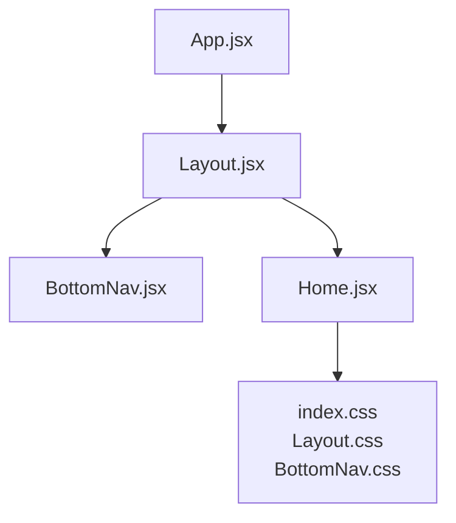
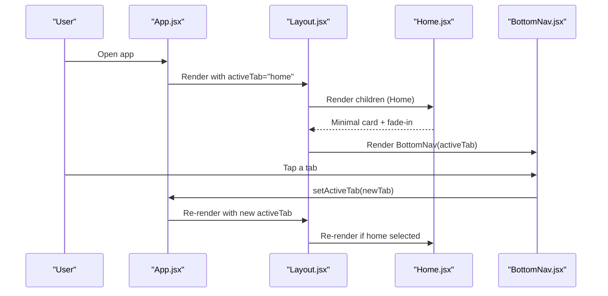
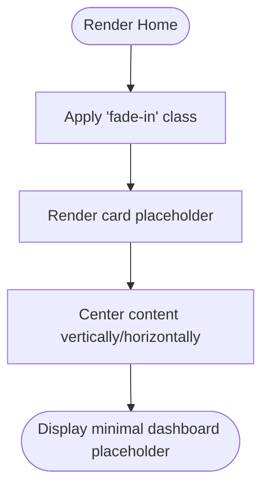
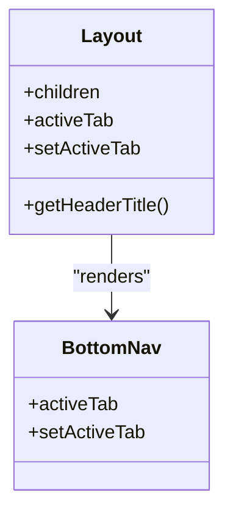
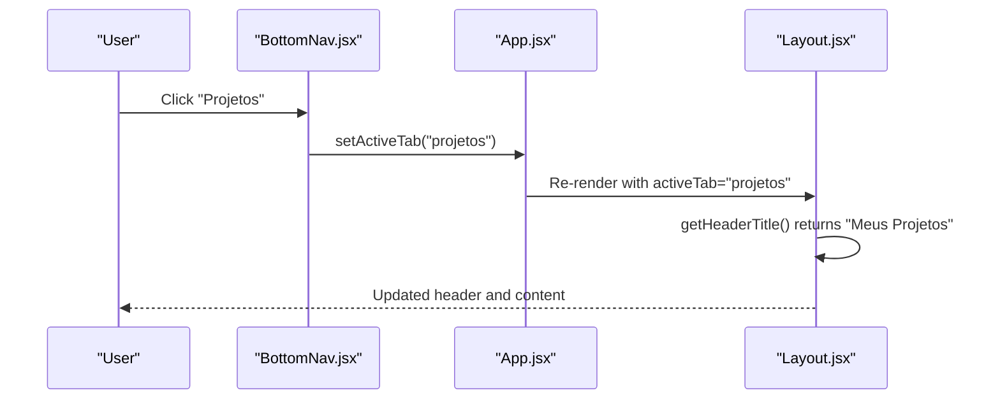
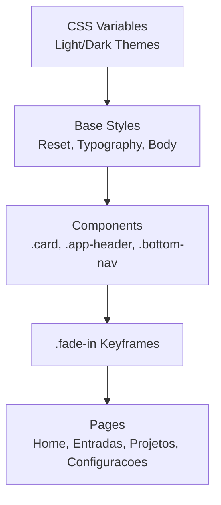
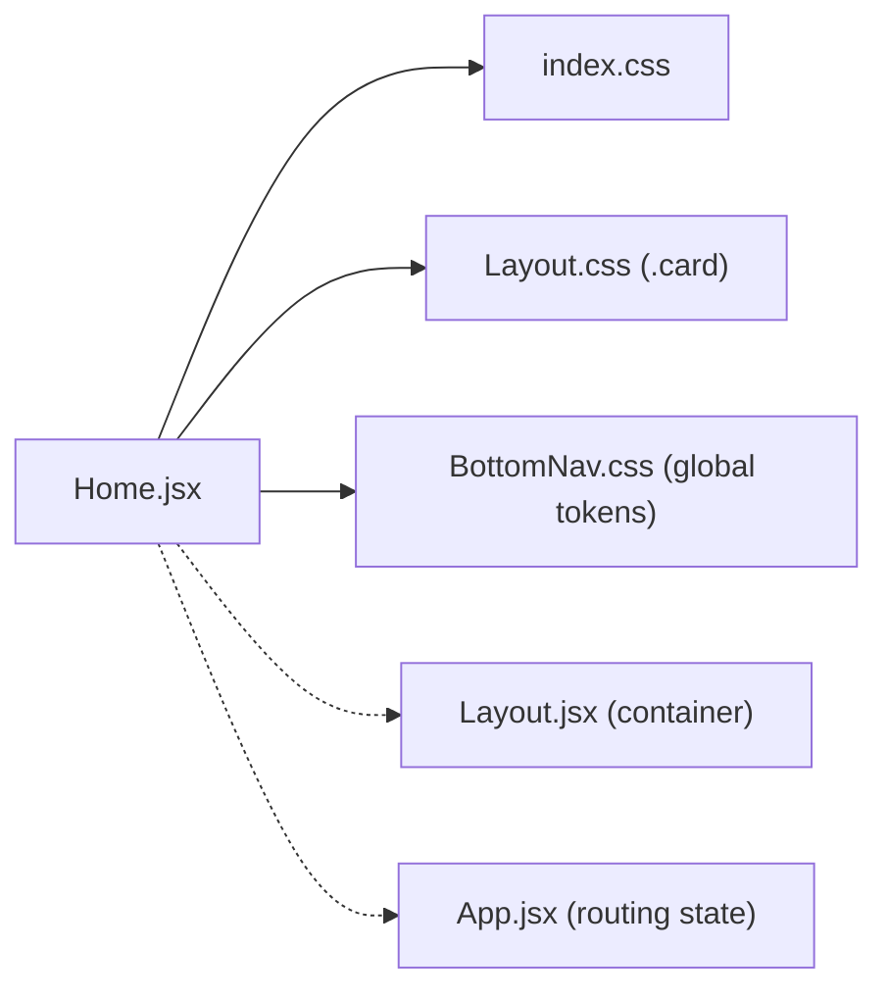

# Home Page

<cite>
**Referenced Files in This Document**
- [Home.jsx](file://src/pages/Home/Home.jsx)
- [Layout.jsx](file://src/components/Layout/Layout.jsx)
- [BottomNav.jsx](file://src/components/BottomNav/BottomNav.jsx)
- [App.jsx](file://src/App.jsx)
- [index.css](file://src/index.css)
- [Layout.css](file://src/components/Layout/Layout.css)
- [BottomNav.css](file://src/components/BottomNav/BottomNav.css)
- [ThemeContext.jsx](file://src/context/ThemeContext.jsx)
</cite>

## Table of Contents
1. [Introduction](#introduction)
2. [Project Structure](#project-structure)
3. [Core Components](#core-components)
4. [Architecture Overview](#architecture-overview)
5. [Detailed Component Analysis](#detailed-component-analysis)
6. [Dependency Analysis](#dependency-analysis)
7. [Performance Considerations](#performance-considerations)
8. [Troubleshooting Guide](#troubleshooting-guide)
9. [Conclusion](#conclusion)
10. [Appendices](#appendices)

## Introduction
This document explains the Home page component and its role as the main landing page within the application. It covers the minimalist dashboard layout structure, placeholder implementation, CSS styling patterns, fade-in animation integration, card usage, responsive design considerations, and how the Home page integrates with the navigation system. It also provides guidance for extending the page with future features while maintaining consistency with the application’s design system.

## Project Structure
The Home page is a simple React component that renders inside a shared Layout shell. The Layout manages a fixed header and a fixed bottom navigation bar, while the content area centers and constrains the page content. The Home page uses a minimal card placeholder and applies a global fade-in animation class to provide a smooth entry effect.

**Diagram sources**
- [App.jsx:1-39](file://src/App.jsx#L1-L39)
- [Layout.jsx:1-49](file://src/components/Layout/Layout.jsx#L1-L49)
- [BottomNav.jsx:1-37](file://src/components/BottomNav/BottomNav.jsx#L1-L37)
- [Home.jsx:1-19](file://src/pages/Home/Home.jsx#L1-L19)
- [index.css:1-86](file://src/index.css#L1-L86)
- [Layout.css:1-74](file://src/components/Layout/Layout.css#L1-L74)
- [BottomNav.css:1-59](file://src/components/BottomNav/BottomNav.css#L1-L59)

**Section sources**
- [App.jsx:1-39](file://src/App.jsx#L1-L39)
- [Layout.jsx:1-49](file://src/components/Layout/Layout.jsx#L1-L49)
- [BottomNav.jsx:1-37](file://src/components/BottomNav/BottomNav.jsx#L1-L37)
- [Home.jsx:1-19](file://src/pages/Home/Home.jsx#L1-L19)
- [index.css:1-86](file://src/index.css#L1-L86)
- [Layout.css:1-74](file://src/components/Layout/Layout.css#L1-L74)
- [BottomNav.css:1-59](file://src/components/BottomNav/BottomNav.css#L1-L59)

## Core Components
- Home page component: Renders a minimal container with a centered card placeholder and applies a fade-in animation class.
- Layout component: Provides a fixed header and a fixed bottom navigation, with a constrained content area for consistent alignment across pages.
- Bottom navigation component: Displays four tabs (Home, Entries, Projects, Settings) with icons and labels; highlights the active tab.
- Global styles: Define the Nordic minimalist theme variables, base typography, transitions, and the fade-in animation keyframes.

Key responsibilities:
- Home: Placeholder UI and animation hook via className.
- Layout: Structural shell and header title mapping based on active tab.
- BottomNav: Navigation state control via props and visual active state.
- index.css: Theme tokens, reset, and global animations.

**Section sources**
- [Home.jsx:1-19](file://src/pages/Home/Home.jsx#L1-L19)
- [Layout.jsx:1-49](file://src/components/Layout/Layout.jsx#L1-L49)
- [BottomNav.jsx:1-37](file://src/components/BottomNav/BottomNav.jsx#L1-L37)
- [index.css:1-86](file://src/index.css#L1-L86)

## Architecture Overview
The Home page is rendered by the root App component, which maintains the current tab state and passes it down to Layout. Layout composes the Header, content area, and BottomNav. The Home page receives no special props beyond being placed inside Layout; it simply contributes its own markup and styling classes.

**Diagram sources**
- [App.jsx:1-39](file://src/App.jsx#L1-L39)
- [Layout.jsx:1-49](file://src/components/Layout/Layout.jsx#L1-L49)
- [BottomNav.jsx:1-37](file://src/components/BottomNav/BottomNav.jsx#L1-L37)
- [Home.jsx:1-19](file://src/pages/Home/Home.jsx#L1-L19)

## Detailed Component Analysis

### Home Page Component
- Purpose: Serves as the initial landing view with a minimal placeholder.
- Structure: A wrapper div with a fade-in animation class, containing a single card element used as a placeholder container.
- Styling: Uses utility classes from the design system (card) and inline styles for centering and dashed border to indicate a placeholder zone.
- Animation: Applies the global .fade-in class to trigger a subtle opacity and vertical translation transition.

**Diagram sources**
- [Home.jsx:1-19](file://src/pages/Home/Home.jsx#L1-L19)
- [index.css:72-85](file://src/index.css#L72-L85)

**Section sources**
- [Home.jsx:1-19](file://src/pages/Home/Home.jsx#L1-L19)
- [index.css:72-85](file://src/index.css#L72-L85)

### Layout Shell and Content Area
- Purpose: Provide a consistent frame for all pages, including a fixed header and a fixed bottom navigation.
- Behavior: Centers and constrains page content to a max width, compensates for fixed header and bottom nav heights using padding.
- Design tokens: Uses CSS variables for background, text, borders, and transitions to support light/dark themes.

**Diagram sources**
- [Layout.jsx:1-49](file://src/components/Layout/Layout.jsx#L1-L49)
- [BottomNav.jsx:1-37](file://src/components/BottomNav/BottomNav.jsx#L1-L37)

**Section sources**
- [Layout.jsx:1-49](file://src/components/Layout/Layout.jsx#L1-L49)
- [Layout.css:1-74](file://src/components/Layout/Layout.css#L1-L74)

### Bottom Navigation Integration
- Purpose: Allow users to switch between primary sections (Home, Entries, Projects, Settings).
- Interaction: Each item calls setActiveTab with its id; the active item receives an additional class for highlighting.
- Visuals: Icons and small labels are centered; active state changes color and includes a micro-interaction.

**Diagram sources**
- [BottomNav.jsx:1-37](file://src/components/BottomNav/BottomNav.jsx#L1-L37)
- [App.jsx:1-39](file://src/App.jsx#L1-L39)
- [Layout.jsx:1-49](file://src/components/Layout/Layout.jsx#L1-L49)

**Section sources**
- [BottomNav.jsx:1-37](file://src/components/BottomNav/BottomNav.jsx#L1-L37)
- [BottomNav.css:1-59](file://src/components/BottomNav/BottomNav.css#L1-L59)
- [Layout.jsx:1-49](file://src/components/Layout/Layout.jsx#L1-L49)

### CSS Styling Patterns and Fade-in Animation
- Design tokens: Centralized CSS variables define colors, fonts, transitions, and safe areas for both light and dark themes.
- Base styles: Reset, body font sizing, line height, and overflow behavior ensure consistent rendering.
- Animations: A global .fade-in class triggers a short ease-in-out animation that fades in and slightly lifts content.
- Cards: A reusable .card class provides consistent backgrounds, borders, radius, and spacing across pages.

**Diagram sources**
- [index.css:1-86](file://src/index.css#L1-L86)
- [Layout.css:1-74](file://src/components/Layout/Layout.css#L1-L74)
- [BottomNav.css:1-59](file://src/components/BottomNav/BottomNav.css#L1-L59)

**Section sources**
- [index.css:1-86](file://src/index.css#L1-L86)
- [Layout.css:1-74](file://src/components/Layout/Layout.css#L1-L74)
- [BottomNav.css:1-59](file://src/components/BottomNav/BottomNav.css#L1-L59)

### Responsive Design Considerations
- Fixed header and bottom nav: Both are positioned fixed with z-indexes above content, ensuring they remain visible during scroll.
- Content constraints: The content area uses a max-width and horizontal centering to maintain readability on larger screens.
- Safe areas: Bottom padding accounts for device safe areas (e.g., iPhone notch/home indicator) to avoid overlap.
- Touch-friendly targets: Bottom nav items have adequate height and spacing for touch interactions.

**Section sources**
- [Layout.css:1-74](file://src/components/Layout/Layout.css#L1-L74)
- [BottomNav.css:1-59](file://src/components/BottomNav/BottomNav.css#L1-L59)
- [index.css:1-86](file://src/index.css#L1-L86)

### Relationship with Navigation System
- State ownership: The root App component owns activeTab and updates it when BottomNav items are clicked.
- Header synchronization: Layout maps activeTab to a localized header title, keeping the top bar consistent with the current page.
- Home as default: When activeTab is "home", the Home page is rendered as the landing view.

**Section sources**
- [App.jsx:1-39](file://src/App.jsx#L1-L39)
- [Layout.jsx:1-49](file://src/components/Layout/Layout.jsx#L1-L49)
- [BottomNav.jsx:1-37](file://src/components/BottomNav/BottomNav.jsx#L1-L37)

## Dependency Analysis
The Home page has minimal direct dependencies but relies on shared components and global styles.

**Diagram sources**
- [Home.jsx:1-19](file://src/pages/Home/Home.jsx#L1-L19)
- [index.css:1-86](file://src/index.css#L1-L86)
- [Layout.css:1-74](file://src/components/Layout/Layout.css#L1-L74)
- [BottomNav.css:1-59](file://src/components/BottomNav/BottomNav.css#L1-L59)
- [Layout.jsx:1-49](file://src/components/Layout/Layout.jsx#L1-L49)
- [App.jsx:1-39](file://src/App.jsx#L1-L39)

**Section sources**
- [Home.jsx:1-19](file://src/pages/Home/Home.jsx#L1-L19)
- [index.css:1-86](file://src/index.css#L1-L86)
- [Layout.css:1-74](file://src/components/Layout/Layout.css#L1-L74)
- [BottomNav.css:1-59](file://src/components/BottomNav/BottomNav.css#L1-L59)
- [Layout.jsx:1-49](file://src/components/Layout/Layout.jsx#L1-L49)
- [App.jsx:1-39](file://src/App.jsx#L1-L39)

## Performance Considerations
- Lightweight component: The Home page currently renders a minimal DOM tree, resulting in negligible render cost.
- Animation efficiency: The fade-in animation uses opacity and transform, which are GPU-accelerated properties and perform well.
- No external data or heavy libraries: Avoids unnecessary re-renders and keeps the initial load fast.

[No sources needed since this section provides general guidance]

## Troubleshooting Guide
- Missing fade-in effect: Ensure the wrapper element has the global .fade-in class applied so the keyframe animation runs.
- Card not visible: Verify the .card class is available through Layout.css and that theme variables resolve correctly in both light and dark modes.
- Overlapping content: Confirm that the content area’s top/bottom padding compensates for the fixed header and bottom nav heights.
- Active tab not updating: Check that BottomNav calls setActiveTab with the correct id and that App passes activeTab/setActiveTab to Layout.

**Section sources**
- [index.css:72-85](file://src/index.css#L72-L85)
- [Layout.css:1-74](file://src/components/Layout/Layout.css#L1-L74)
- [BottomNav.jsx:1-37](file://src/components/BottomNav/BottomNav.jsx#L1-L37)
- [App.jsx:1-39](file://src/App.jsx#L1-L39)

## Conclusion
The Home page acts as a clean, minimal landing view that leverages the shared Layout and BottomNav components. It uses the design system’s card and animation utilities to present a placeholder dashboard area. Its simplicity makes it easy to extend with real content while preserving consistent styling, responsiveness, and navigation behavior.

[No sources needed since this section summarizes without analyzing specific files]

## Appendices

### Extending the Home Page
- Add feature cards: Use the existing .card class to create multiple tiles for quick actions or summaries. Keep spacing and typography aligned with the design tokens.
- Introduce lists or tables: Wrap them in a .card container to maintain visual consistency.
- Incorporate theme-aware elements: Rely on CSS variables for colors and transitions to ensure seamless light/dark mode support.
- Maintain accessibility: Use semantic HTML and aria attributes where appropriate, especially for interactive elements.

[No sources needed since this section provides general guidance]

### Theme System Reference
- Theme provider and context are available for toggling themes and persisting preferences. While the Home page does not directly consume the context, it benefits from theme variables defined globally.

**Section sources**
- [ThemeContext.jsx:1-49](file://src/context/ThemeContext.jsx#L1-L49)
- [index.css:1-28](file://src/index.css#L1-L28)