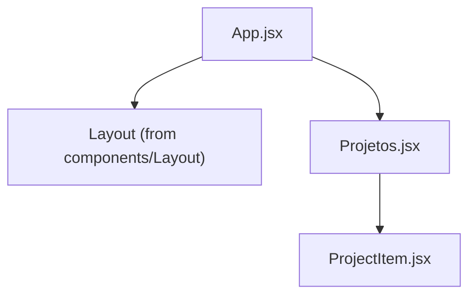
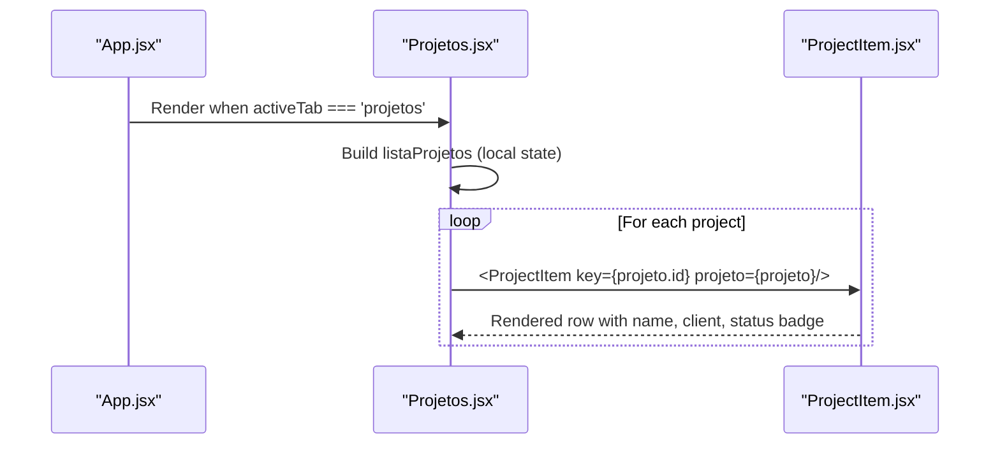
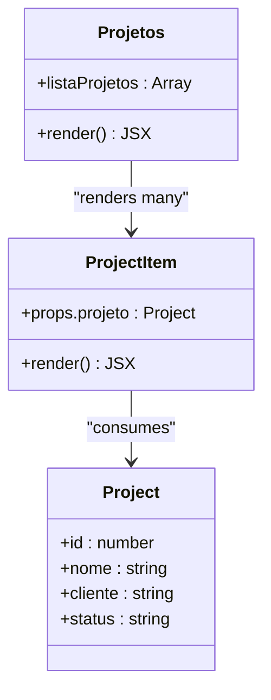
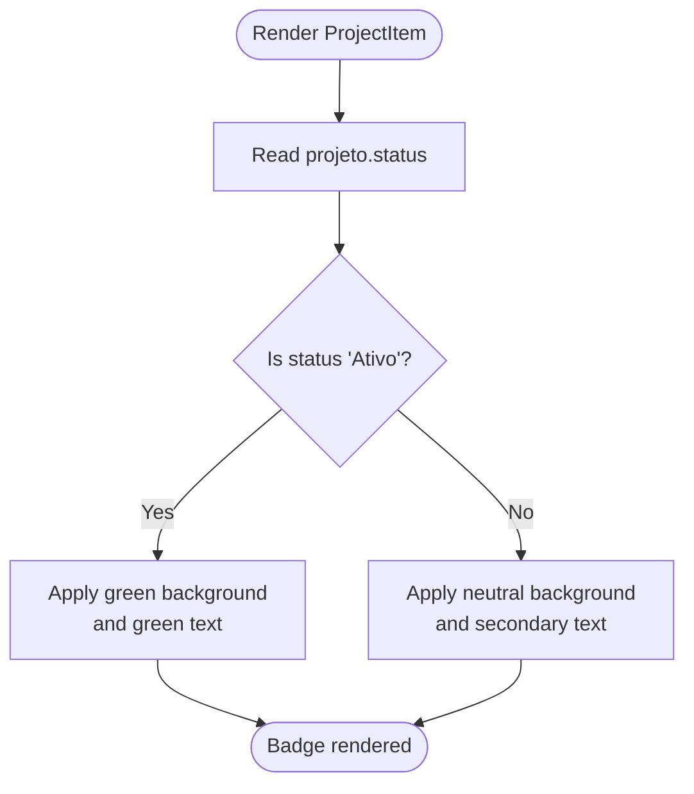
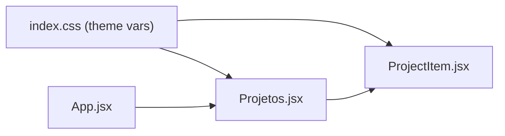

# Projects Module

<cite>
**Referenced Files in This Document**
- [Projetos.jsx](file://src/pages/Projetos/Projetos.jsx)
- [ProjectForm.jsx](file://src/pages/Projetos/components/ProjectForm.jsx)
- [ProjectItem.jsx](file://src/pages/Projetos/components/ProjectItem.jsx)
- [MapPicker.jsx](file://src/components/MapPicker/MapPicker.jsx)
- [mockData.js](file://src/data/mockData.js)
- [App.jsx](file://src/App.jsx)
</cite>

## Table of Contents
1. [Introduction](#introduction)
2. [Core Components](#core-components)
3. [ProjectForm Features](#projectform-features)
4. [Validation System](#validation-system)
5. [Technician Management](#technician-management)
6. [Map-based Location](#map-based-location)
7. [File Attachments](#file-attachments)
8. [Data Model](#data-model)

## Introduction
The Projects module manages wind turbine maintenance projects. It supports full CRUD operations with technician team management, map-based location picking, and file attachments. All fields are validated before saving.

## Core Components
- **Projetos** (page): Owns the projects state, manages list→detail navigation, accordion by status.
- **ProjectForm** (form): Full create/edit/delete form with sections for project info, technicians, and attachments. Includes validation and map picker.
- **ProjectItem** (list item): Compact display of a single project in the list.

## ProjectForm Features
- **Project Info**: nome, cliente, escopo, descricao, localizacao (via MapPicker with reverse geocoding).
- **Technician Team**: Inline CRUD for technicians with nome, irataLevel (L1/L2/L3), and windaId.
- **Attachments**: Multi-file upload with type/size validation and automatic image resizing (1024px max).
- **Validation**: All fields required except attachments; at least 1 technician required.

## Validation System
ProjectForm validates on save (`handleSalvar` → `validar`):

| Field | Rule | Error key |
|-------|------|-----------|
| Nome | Required (non-empty) | `erros.nome` |
| Cliente | Required | `erros.cliente` |
| Escopo | Required | `erros.escopo` |
| Descrição | Required | `erros.descricao` |
| Localização | Required | `erros.localizacao` |
| Técnicos | At least 1 technician | `erros.tecnicos` |

Validation UI:
- A red hint banner appears at the top of the card: "Verifique os campos obrigatórios destacados abaixo."
- Individual fields show error text next to their label and red border color.
- Errors clear automatically when the user edits the field.

## Technician Management
Technicians are managed inline within ProjectForm:
- **Add**: Click "Adicionar" to show inline form with nome, irataLevel (select: L1/L2/L3), windaId.
- **Edit**: Click edit icon on a technician to populate the inline form.
- **Delete**: Click trash icon to remove immediately.
- Each technician: `{ id, nome, irataLevel, windaId }`.
- Technicians are later available for selection in RegistroForm's team picker.

## Map-based Location
- Uses `MapPicker` component (react-leaflet) in a modal overlay.
- User moves the map to position a fixed pin.
- Reverse geocoding via Nominatim API (with debounce) to get location name.
- Stores `localizacao` (name), `latitude`, and `longitude`.
- MapPicker is lazy-loaded with `React.lazy` + `Suspense` and wrapped in an ErrorBoundary.

## File Attachments
- Multi-file upload via hidden file input.
- Accepted types: PDF, PNG, JPEG, XLS, XLSX, DOC, DOCX.
- Size limits: 10MB for documents, 5MB for photos.
- Photos are automatically resized to 1024px max via `useImageResize` hook.
- Each attachment: `{ id, nome, tipo, tamanho, preview, arquivo }`.

## Data Model
Each project object contains:

```
{
  id, nome, cliente, escopo, descricao,
  localizacao, latitude, longitude,
  tecnicos: [{ id, nome, irataLevel, windaId }],
  anexos: [{ id, nome, tipo, tamanho, preview, arquivo }]
}
```

Mock data is provided by `mockData.js` with 3 sample projects (Pannonia Gols with 10 technicians, and 2 placeholder projects).
# Projects Module

<cite>
**Referenced Files in This Document**
- [Projetos.jsx](file://src/pages/Projetos/Projetos.jsx)
- [ProjectItem.jsx](file://src/pages/Projetos/components/ProjectItem.jsx)
- [App.jsx](file://src/App.jsx)
- [index.css](file://src/index.css)
</cite>

## Table of Contents
1. [Introduction](#introduction)
2. [Project Structure](#project-structure)
3. [Core Components](#core-components)
4. [Architecture Overview](#architecture-overview)
5. [Detailed Component Analysis](#detailed-component-analysis)
6. [Dependency Analysis](#dependency-analysis)
7. [Performance Considerations](#performance-considerations)
8. [Troubleshooting Guide](#troubleshooting-guide)
9. [Conclusion](#conclusion)
10. [Appendices](#appendices)

## Introduction
This document explains the Projects module, focusing on the main Projetos page and its ProjectItem sub-component. It covers how projects are displayed, the data structure used for each project (id, nome, cliente, status), and the visual status indicator system that differentiates active versus completed projects. It also details ProjectItem’s props, rendering logic, styling patterns, and provides guidance for extending the list with features like filtering or sorting.

## Project Structure
The Projects module is organized as a small feature folder:
- src/pages/Projetos/Projetos.jsx — Main page component that owns the project list data and renders the list using ProjectItem.
- src/pages/Projetos/components/ProjectItem.jsx — Sub-component that renders a single project row with name, client, and status badge.



**Diagram sources**
- [App.jsx:1-39](file://src/App.jsx#L1-L39)
- [Projetos.jsx:1-31](file://src/pages/Projetos/Projetos.jsx#L1-L31)
- [ProjectItem.jsx:1-49](file://src/pages/Projetos/components/ProjectItem.jsx#L1-L49)

**Section sources**
- [App.jsx:1-39](file://src/App.jsx#L1-L39)
- [Projetos.jsx:1-31](file://src/pages/Projetos/Projetos.jsx#L1-L31)
- [ProjectItem.jsx:1-49](file://src/pages/Projetos/components/ProjectItem.jsx#L1-L49)

## Core Components
- Projetos (main page): Owns a local array of project objects and maps them to ProjectItem instances. Uses global utility classes for fade-in animation and card layout.
- ProjectItem (list item): Receives a single project object via a projeto prop and renders the project name, client, and a status badge. Status styling changes based on whether the project is active or completed.

Key responsibilities:
- Data ownership: The list lives in the parent component (Projetos).
- Rendering: Parent maps over the list; child displays one item at a time.
- Styling: Inline styles in ProjectItem use CSS variables from the global theme.

**Section sources**
- [Projetos.jsx:1-31](file://src/pages/Projetos/Projetos.jsx#L1-L31)
- [ProjectItem.jsx:1-49](file://src/pages/Projetos/components/ProjectItem.jsx#L1-L49)
- [index.css:1-86](file://src/index.css#L1-L86)

## Architecture Overview
At runtime, the application root renders the current page based on navigation state. When the “projetos” tab is active, the Projetos page is rendered, which in turn renders multiple ProjectItem rows.



**Diagram sources**
- [App.jsx:12-36](file://src/App.jsx#L12-L36)
- [Projetos.jsx:8-30](file://src/pages/Projetos/Projetos.jsx#L8-L30)
- [ProjectItem.jsx:12-48](file://src/pages/Projetos/components/ProjectItem.jsx#L12-L48)

## Detailed Component Analysis

### Data Model: Project
Each project is an object with the following fields:
- id: number — Unique identifier used as React key.
- nome: string — Project title.
- cliente: string — Client name.
- status: string — Displayed status value. In the sample data, values include “Ativo” (active) and “Finalizado” (completed).

Notes:
- The status field drives the visual indicator. The implementation treats “Ativo” as active and any other value as non-active (e.g., completed).
- The model is currently defined locally within the parent component.

**Section sources**
- [Projetos.jsx:10-14](file://src/pages/Projetos/Projetos.jsx#L10-L14)
- [ProjectItem.jsx:7-11](file://src/pages/Projetos/components/ProjectItem.jsx#L7-L11)

### Component: Projetos (Parent)
Responsibilities:
- Define the project list data.
- Render a container with a heading and a vertical stack of items.
- Map the list to ProjectItem components, passing each project object and a stable key.

Rendering highlights:
- Uses a flex column with a small gap between items.
- Wraps content in a card-like container and applies a fade-in animation class.

Data flow:
- Local array → map → ProjectItem props.

Extensibility points:
- Replace the static array with state (useState) to support adding/removing/updating projects.
- Introduce derived lists for filtering/sorting before mapping.

**Section sources**
- [Projetos.jsx:8-30](file://src/pages/Projetos/Projetos.jsx#L8-L30)

#### Class Diagram: Projects Module


**Diagram sources**
- [Projetos.jsx:8-30](file://src/pages/Projetos/Projetos.jsx#L8-L30)
- [ProjectItem.jsx:12-48](file://src/pages/Projetos/components/ProjectItem.jsx#L12-L48)

### Component: ProjectItem (Child)
Props:
- projeto: Object — Must contain id, nome, cliente, status.

Rendering logic:
- Displays the project name and client in a two-line block.
- Renders a status badge whose background and text color change depending on the status value.

Status indicator system:
- If status equals “Ativo”, the badge uses a green accent background and green text.
- Otherwise, it uses a neutral background and secondary text color.

Styling patterns:
- Inline styles for layout and typography.
- Uses CSS custom properties (--border-color, --text-primary, --text-secondary) for theme-aware colors.
- Badge uses rounded corners and compact padding for a pill shape.

Accessibility considerations:
- Ensure sufficient contrast between badge text and background across themes.
- Consider adding aria-label or role attributes if interactive behavior is added later.

**Section sources**
- [ProjectItem.jsx:12-48](file://src/pages/Projetos/components/ProjectItem.jsx#L12-L48)
- [index.css:7-28](file://src/index.css#L7-L28)

#### Flowchart: Status Badge Logic


**Diagram sources**
- [ProjectItem.jsx:33-44](file://src/pages/Projetos/components/ProjectItem.jsx#L33-L44)

## Dependency Analysis
High-level dependencies:
- App.jsx imports and conditionally renders Projetos.jsx based on navigation state.
- Projetos.jsx imports ProjectItem.jsx and composes multiple instances.
- Both components rely on global CSS variables defined in index.css for consistent theming.



**Diagram sources**
- [App.jsx:1-39](file://src/App.jsx#L1-L39)
- [Projetos.jsx:1-31](file://src/pages/Projetos/Projetos.jsx#L1-L31)
- [ProjectItem.jsx:1-49](file://src/pages/Projetos/components/ProjectItem.jsx#L1-L49)
- [index.css:1-86](file://src/index.css#L1-L86)

**Section sources**
- [App.jsx:1-39](file://src/App.jsx#L1-L39)
- [Projetos.jsx:1-31](file://src/pages/Projetos/Projetos.jsx#L1-L31)
- [ProjectItem.jsx:1-49](file://src/pages/Projetos/components/ProjectItem.jsx#L1-L49)
- [index.css:1-86](file://src/index.css#L1-L86)

## Performance Considerations
- Keys: Each ProjectItem receives a unique key (projeto.id), ensuring efficient re-renders during list updates.
- List size: For large datasets, consider virtualization or pagination to avoid rendering too many nodes at once.
- Derived data: Compute filtered/sorted lists outside the render path or memoize them to prevent unnecessary recalculations.
- Theme variables: Using CSS variables avoids style recalculation overhead and keeps theme switching efficient.

[No sources needed since this section provides general guidance]

## Troubleshooting Guide
Common issues and resolutions:
- Missing or invalid project fields:
  - Symptom: Blank names, clients, or unexpected badge appearance.
  - Resolution: Validate that each project object includes id, nome, cliente, and status before mapping.
- Status not showing correctly:
  - Symptom: All badges appear inactive.
  - Resolution: Ensure status values match expected strings (e.g., “Ativo”) or update the conditional logic to handle additional statuses.
- Theme-related contrast problems:
  - Symptom: Badge text hard to read in dark mode.
  - Resolution: Adjust badge colors to maintain contrast against both light and dark backgrounds using the provided CSS variables.

**Section sources**
- [ProjectItem.jsx:33-44](file://src/pages/Projetos/components/ProjectItem.jsx#L33-L44)
- [index.css:7-28](file://src/index.css#L7-L28)

## Conclusion
The Projects module demonstrates a simple yet effective composition pattern: a parent component owns data and renders a list of presentational children. The ProjectItem component encapsulates the display of a single project, including a clear status indicator. The design leverages CSS variables for consistent theming and inline styles for localized layout. With minimal changes, the module can be extended to support dynamic data, filtering, sorting, and more advanced interactions.

[No sources needed since this section summarizes without analyzing specific files]

## Appendices

### A. Extending the Project List

- Add filtering:
  - Create a filter input in the parent component.
  - Derive a filtered list by comparing input text against project fields (e.g., nome or cliente).
  - Map the filtered list to ProjectItem.

- Add sorting:
  - Provide sort options (e.g., by name or status).
  - Sort the list before mapping to ProjectItem.
  - Use stable keys (id) to preserve identity across sorts.

- Add new statuses:
  - Extend the status badge logic to handle additional values (e.g., “Pausado”).
  - Assign appropriate colors while maintaining contrast.

- Move data to state:
  - Replace the static array with useState to enable add/update/delete operations.
  - Lift actions up to the parent and pass handlers down if needed.

[No sources needed since this section provides general guidance]