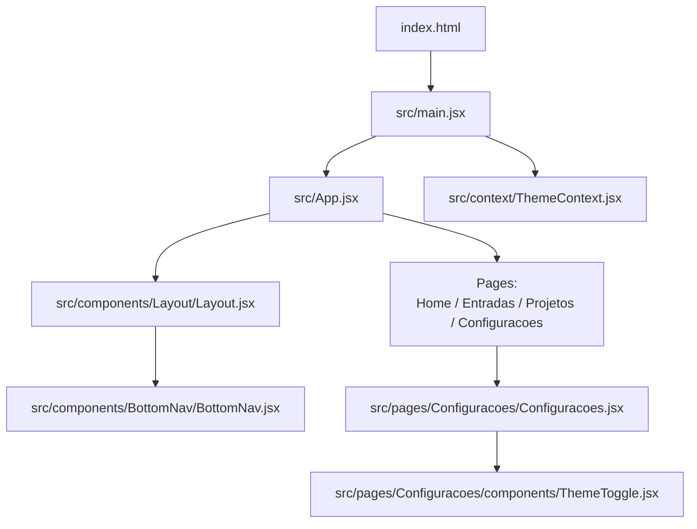
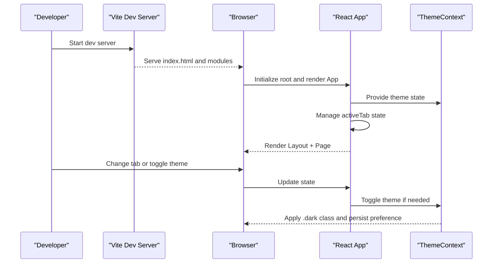
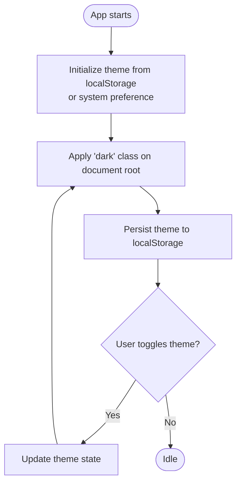
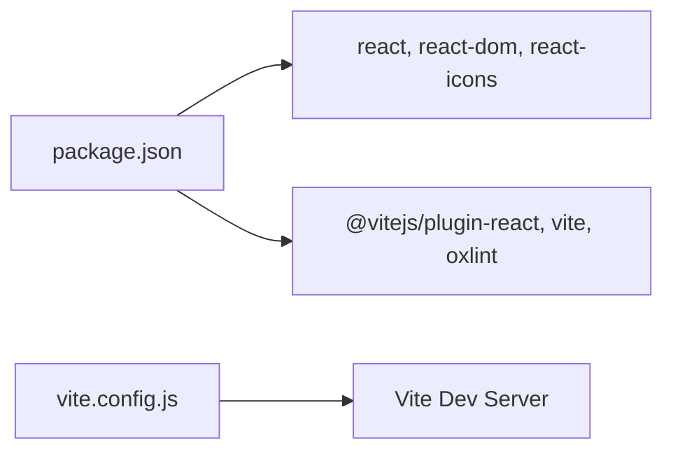

# Getting Started

<cite>
**Referenced Files in This Document**
- [package.json](file://package.json)
- [README.md](file://README.md)
- [Dockerfile](file://Dockerfile)
- [docker-compose.yml](file://docker-compose.yml)
- [vite.config.js](file://vite.config.js)
- [index.html](file://index.html)
- [src/main.jsx](file://src/main.jsx)
- [src/App.jsx](file://src/App.jsx)
- [src/components/Layout/Layout.jsx](file://src/components/Layout/Layout.jsx)
- [src/components/BottomNav/BottomNav.jsx](file://src/components/BottomNav/BottomNav.jsx)
- [src/context/ThemeContext.jsx](file://src/context/ThemeContext.jsx)
- [src/pages/Configuracoes/Configuracoes.jsx](file://src/pages/Configuracoes/Configuracoes.jsx)
- [src/pages/Configuracoes/components/ThemeToggle.jsx](file://src/pages/Configuracoes/components/ThemeToggle.jsx)
- [src/index.css](file://src/index.css)
</cite>

## Table of Contents
1. Introduction
2. Project Structure
3. Core Components
4. Architecture Overview
5. Detailed Component Analysis
6. Dependency Analysis
7. Performance Considerations
8. Troubleshooting Guide
9. Conclusion

## Introduction
Nordic Worklog is a minimal React + Vite application with a simple tab-based navigation and a light/dark theme system. It provides:
- A local development server with hot module replacement (HMR)
- A bottom navigation bar to switch between Home, Entries, Projects, and Settings
- A settings page with a theme toggle that persists your preference
- Optional Docker support for quick environment setup

This guide helps you install dependencies, run the app locally, explore basic features, and resolve common setup issues.

## Project Structure
At a high level:
- The HTML entry point loads the React root
- The React app initializes with a ThemeProvider and renders the main App component
- App manages active tab state and renders the Layout wrapper with the current page
- Layout shows a header and delegates navigation to BottomNav
- Settings includes a ThemeToggle that uses the global theme context

**Diagram sources**
- [index.html:1-14](file://index.html#L1-L14)
- [src/main.jsx:1-15](file://src/main.jsx#L1-L15)
- [src/App.jsx:1-39](file://src/App.jsx#L1-L39)
- [src/components/Layout/Layout.jsx:1-49](file://src/components/Layout/Layout.jsx#L1-L49)
- [src/components/BottomNav/BottomNav.jsx:1-37](file://src/components/BottomNav/BottomNav.jsx#L1-L37)
- [src/context/ThemeContext.jsx:1-49](file://src/context/ThemeContext.jsx#L1-L49)
- [src/pages/Configuracoes/Configuracoes.jsx:1-70](file://src/pages/Configuracoes/Configuracoes.jsx#L1-L70)
- [src/pages/Configuracoes/components/ThemeToggle.jsx:1-55](file://src/pages/Configuracoes/components/ThemeToggle.jsx#L1-L55)

**Section sources**
- [index.html:1-14](file://index.html#L1-L14)
- [src/main.jsx:1-15](file://src/main.jsx#L1-L15)
- [src/App.jsx:1-39](file://src/App.jsx#L1-L39)
- [src/components/Layout/Layout.jsx:1-49](file://src/components/Layout/Layout.jsx#L1-L49)
- [src/components/BottomNav/BottomNav.jsx:1-37](file://src/components/BottomNav/BottomNav.jsx#L1-L37)
- [src/context/ThemeContext.jsx:1-49](file://src/context/ThemeContext.jsx#L1-L49)
- [src/pages/Configuracoes/Configuracoes.jsx:1-70](file://src/pages/Configuracoes/Configuracoes.jsx#L1-L70)
- [src/pages/Configuracoes/components/ThemeToggle.jsx:1-55](file://src/pages/Configuracoes/components/ThemeToggle.jsx#L1-L55)

## Core Components
- Entry points
  - index.html: Loads the React root and the module entry script
  - src/main.jsx: Creates the React root, wraps the app with StrictMode and ThemeProvider
- Application shell
  - src/App.jsx: Manages activeTab state and renders the selected page inside Layout
  - src/components/Layout/Layout.jsx: Renders header and content area; passes navigation props to BottomNav
  - src/components/BottomNav/BottomNav.jsx: Renders tabs and updates activeTab via callback
- Theming
  - src/context/ThemeContext.jsx: Provides theme state, toggles theme, persists to localStorage, and applies a .dark class on the document root
  - src/pages/Configuracoes/components/ThemeToggle.jsx: UI control to switch themes using useTheme hook
  - src/index.css: Defines CSS variables for light and dark themes and global styles

Key behaviors:
- Navigation is controlled by a single activeTab state in App and passed down to Layout and BottomNav
- Theme persistence uses localStorage and respects system preference on first load
- The .dark class on the document root switches CSS variables for colors and fonts

**Section sources**
- [index.html:1-14](file://index.html#L1-L14)
- [src/main.jsx:1-15](file://src/main.jsx#L1-L15)
- [src/App.jsx:1-39](file://src/App.jsx#L1-L39)
- [src/components/Layout/Layout.jsx:1-49](file://src/components/Layout/Layout.jsx#L1-L49)
- [src/components/BottomNav/BottomNav.jsx:1-37](file://src/components/BottomNav/BottomNav.jsx#L1-L37)
- [src/context/ThemeContext.jsx:1-49](file://src/context/ThemeContext.jsx#L1-L49)
- [src/pages/Configuracoes/components/ThemeToggle.jsx:1-55](file://src/pages/Configuracoes/components/ThemeToggle.jsx#L1-L55)
- [src/index.css:1-86](file://src/index.css#L1-L86)

## Architecture Overview
The app follows a simple client-side architecture:
- Vite serves the app during development and builds it for production
- React renders components based on state (activeTab and theme)
- Theme changes propagate through Context and update CSS variables globally

**Diagram sources**
- [vite.config.js:1-12](file://vite.config.js#L1-L12)
- [index.html:1-14](file://index.html#L1-L14)
- [src/main.jsx:1-15](file://src/main.jsx#L1-L15)
- [src/App.jsx:1-39](file://src/App.jsx#L1-L39)
- [src/context/ThemeContext.jsx:1-49](file://src/context/ThemeContext.jsx#L1-L49)

## Detailed Component Analysis

### Installation and Local Development
Prerequisites:
- Node.js version compatible with the project’s tooling (the Docker image uses Node 20)
- npm (bundled with Node)

Steps:
1. Install dependencies
   - Run npm install at the repository root
2. Start the development server
   - Run npm run dev
   - The server runs on port 3000 by default and is accessible on all host interfaces
3. Open the app
   - Visit http://localhost:3000 in your browser

Notes:
- Scripts are defined in package.json
- Vite configuration sets the dev server port and host

**Section sources**
- [package.json:1-25](file://package.json#L1-L25)
- [vite.config.js:1-12](file://vite.config.js#L1-L12)

### Docker Quickstart
Use Docker Compose to spin up the app quickly without installing Node locally.

Steps:
1. Build and run
   - Run docker compose up --build
2. Access the app
   - The container maps host port 3002 to container port 3000
   - Visit http://localhost:3002

Details:
- The Dockerfile installs dependencies and runs the dev server on port 3000
- docker-compose.yml mounts the source directory into the container and runs install + dev

**Section sources**
- [Dockerfile:1-21](file://Dockerfile#L1-L21)
- [docker-compose.yml:1-14](file://docker-compose.yml#L1-L14)

### First-Time User Walkthrough
After starting the app:
- Navigate between tabs
  - Use the bottom navigation bar to switch among Home, Entries, Projects, and Settings
- Switch themes
  - Go to Settings and toggle the “Dark Mode” switch
  - Your choice is saved automatically and restored on reload
- Explore pages
  - Home displays a placeholder area
  - Settings includes options like export simulation and account info placeholders

How it works under the hood:
- App maintains activeTab state and renders the corresponding page
- Layout renders the header title based on activeTab and passes navigation callbacks to BottomNav
- ThemeContext provides theme state and a toggle function; ThemeToggle uses this to switch modes

**Section sources**
- [src/App.jsx:1-39](file://src/App.jsx#L1-L39)
- [src/components/Layout/Layout.jsx:1-49](file://src/components/Layout/Layout.jsx#L1-L49)
- [src/components/BottomNav/BottomNav.jsx:1-37](file://src/components/BottomNav/BottomNav.jsx#L1-L37)
- [src/context/ThemeContext.jsx:1-49](file://src/context/ThemeContext.jsx#L1-L49)
- [src/pages/Configuracoes/Configuracoes.jsx:1-70](file://src/pages/Configuracoes/Configuracoes.jsx#L1-L70)
- [src/pages/Configuracoes/components/ThemeToggle.jsx:1-55](file://src/pages/Configuracoes/components/ThemeToggle.jsx#L1-L55)

### Theme System Flow

**Diagram sources**
- [src/context/ThemeContext.jsx:1-49](file://src/context/ThemeContext.jsx#L1-L49)
- [src/index.css:1-86](file://src/index.css#L1-L86)

## Dependency Analysis
Core runtime dependencies:
- react and react-dom for UI rendering
- react-icons for icons used in navigation and settings

Development-time tooling:
- vite for building and serving
- @vitejs/plugin-react for React support
- oxlint for linting

**Diagram sources**
- [package.json:1-25](file://package.json#L1-L25)
- [vite.config.js:1-12](file://vite.config.js#L1-L12)

**Section sources**
- [package.json:1-25](file://package.json#L1-L25)
- [vite.config.js:1-12](file://vite.config.js#L1-L12)

## Performance Considerations
- Keep the number of re-renders low by avoiding unnecessary state updates in frequently changing components
- Prefer stable references for callbacks passed to child components to prevent redundant renders
- Use CSS variables for theming to avoid heavy DOM manipulation beyond class toggling
- For larger apps, consider code splitting per route/page when migrating to a router

[No sources needed since this section provides general guidance]

## Troubleshooting Guide
Common issues and resolutions:
- Port 3000 already in use
  - Change the dev server port in the Vite configuration and restart the server
- Dependencies fail to install
  - Ensure Node.js version matches the project’s expectations (Node 20 is used in Docker)
  - Clear node_modules and reinstall
- Docker container not reachable
  - Verify the host-to-container port mapping (host 3002 -> container 3000)
  - Confirm the container is running and logs show the dev server started
- Theme does not persist
  - Check browser storage permissions and ensure localStorage is available
  - Clear site data and reload to reset theme preference

**Section sources**
- [vite.config.js:1-12](file://vite.config.js#L1-L12)
- [Dockerfile:1-21](file://Dockerfile#L1-L21)
- [docker-compose.yml:1-14](file://docker-compose.yml#L1-L14)
- [src/context/ThemeContext.jsx:1-49](file://src/context/ThemeContext.jsx#L1-L49)

## Conclusion
You now have everything needed to set up, run, and explore Nordic Worklog locally or via Docker. Use the bottom navigation to move between sections and the Settings page to switch themes. If you encounter issues, consult the troubleshooting section for quick fixes.