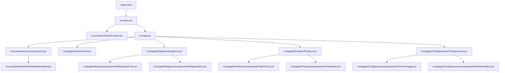
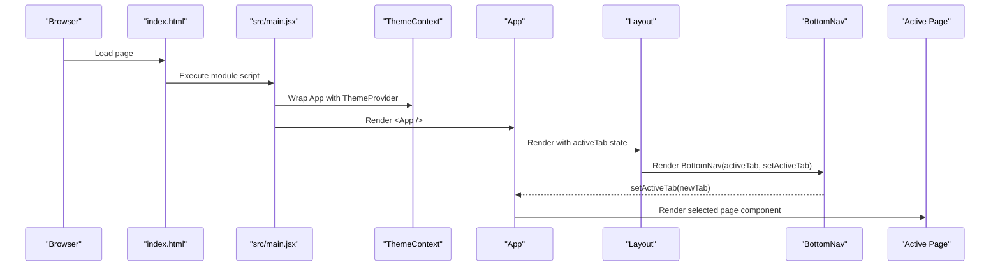
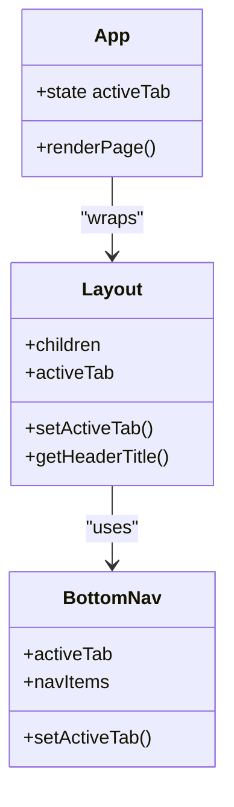
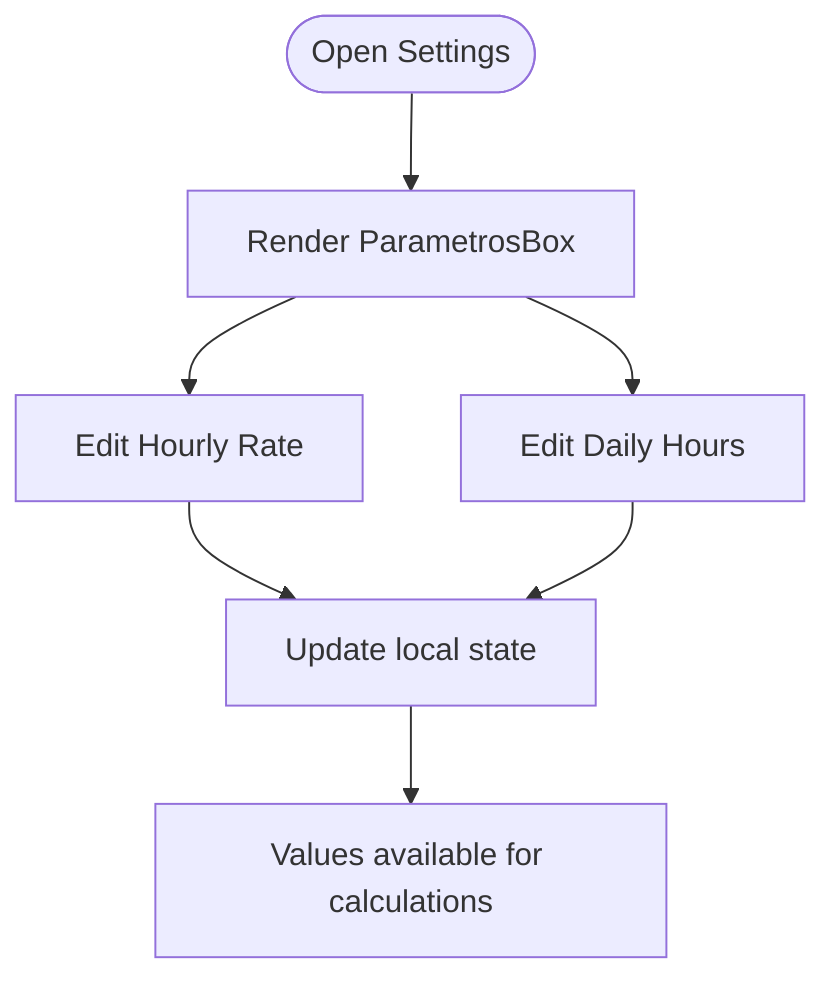
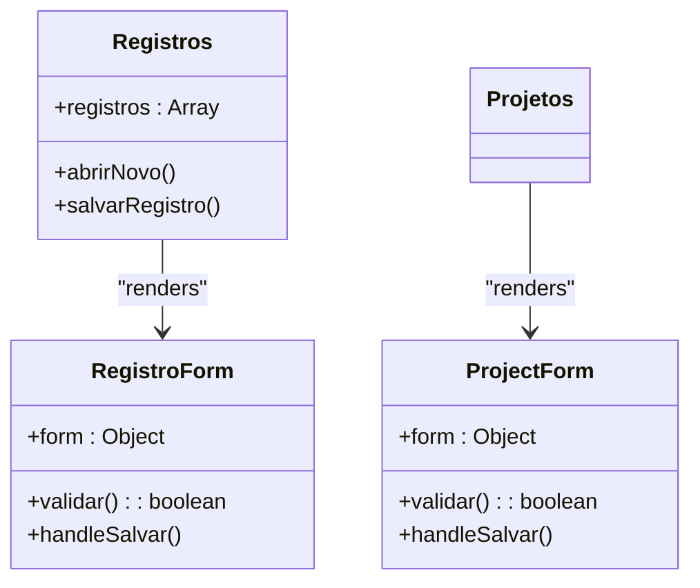
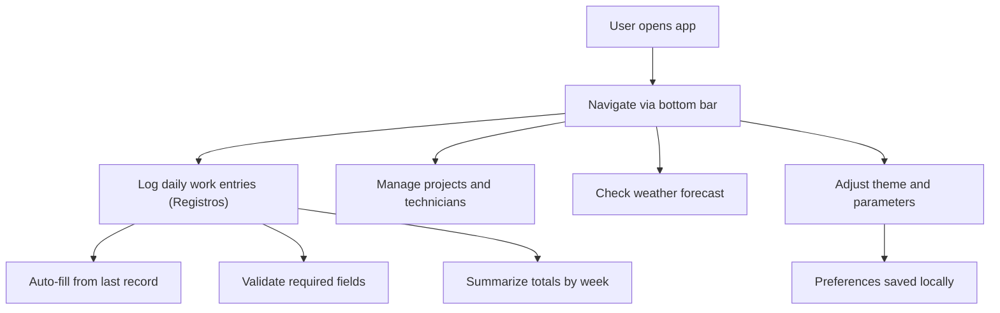
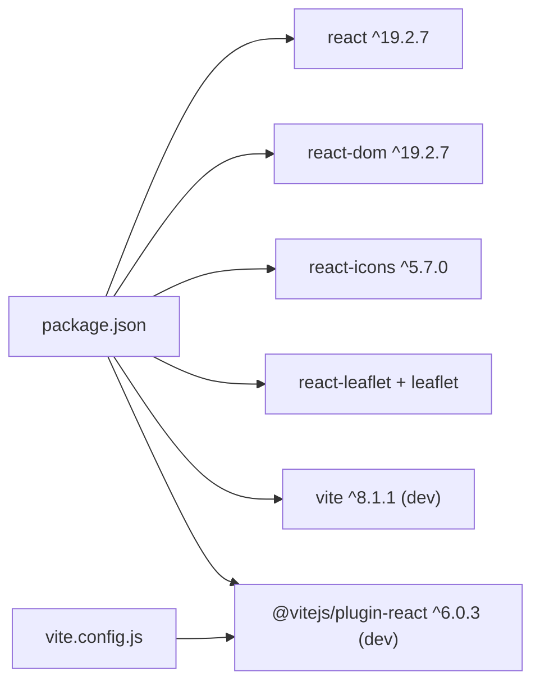

# Project Overview

<cite>
**Referenced Files in This Document**
- [package.json](file://package.json)
- [README.md](file://README.md)
- [vite.config.js](file://vite.config.js)
- [index.html](file://index.html)
- [src/main.jsx](file://src/main.jsx)
- [src/App.jsx](file://src/App.jsx)
- [src/components/Layout/Layout.jsx](file://src/components/Layout/Layout.jsx)
- [src/components/BottomNav/BottomNav.jsx](file://src/components/BottomNav/BottomNav.jsx)
- [src/context/ThemeContext.jsx](file://src/context/ThemeContext.jsx)
- [src/pages/Home/Home.jsx](file://src/pages/Home/Home.jsx)
- [src/pages/Registros/Registros.jsx](file://src/pages/Registros/Registros.jsx)
- [src/pages/Registros/components/RegistroForm.jsx](file://src/pages/Registros/components/RegistroForm.jsx)
- [src/pages/Registros/components/RegistroItem.jsx](file://src/pages/Registros/components/RegistroItem.jsx)
- [src/pages/Projetos/Projetos.jsx](file://src/pages/Projetos/Projetos.jsx)
- [src/pages/Projetos/components/ProjectForm.jsx](file://src/pages/Projetos/components/ProjectForm.jsx)
- [src/pages/Projetos/components/ProjectItem.jsx](file://src/pages/Projetos/components/ProjectItem.jsx)
- [src/pages/Configuracoes/Configuracoes.jsx](file://src/pages/Configuracoes/Configuracoes.jsx)
- [src/pages/Configuracoes/components/ThemeToggle.jsx](file://src/pages/Configuracoes/components/ThemeToggle.jsx)
- [src/pages/Configuracoes/components/ParametrosBox.jsx](file://src/pages/Configuracoes/components/ParametrosBox.jsx)
</cite>

## Table of Contents
1. Introduction
2. Project Structure
3. Core Components
4. Architecture Overview
5. Detailed Component Analysis
6. Dependency Analysis
7. Performance Considerations
8. Troubleshooting Guide
9. Conclusion

## Introduction
Nordic Worklog is a minimal, mobile-first React application designed for daily work tracking and project management on wind turbine maintenance sites. It provides:
- Daily work entry logging (Registros) with auto-fill from last record, automatic ISO week calculation, dynamic stand-by hour completion, and full field validation
- Project management with full CRUD, technician team management, map-based location picker, and file attachments
- Weather card with 5-day forecast, GPS location, and map-based city selector
- A configuration system including theme switching and editable parameters (hourly rate, stand-by rate, standard workday, per diem)
- Responsive design with a fixed header and bottom navigation bar
- Light/dark theme support with CSS variables

Target audience and use cases:
- Wind turbine technicians and team leaders who need to log daily work activities
- Teams managing maintenance projects with multiple technicians and turbine locations
- Field workers tracking working hours, stand-by time, and travel time per project

Technology stack:
- React 19 and Vite 8 with the official React plugin
- react-icons (Feather Icons) for lightweight iconography
- react-leaflet and Leaflet for interactive map components
- OpenWeather API for weather forecasts
- Google Fonts (Outfit) for typography
- Docker for containerized development and deployment

Practical examples:
- Switch between light and dark themes from Settings; the preference persists across sessions
- View a sample list of projects and their statuses
- Adjust default parameters such as hourly value and standard daily hours in Settings

**Section sources**
- [package.json:12-23](file://package.json#L12-L23)
- [README.md:1-17](file://README.md#L1-L17)
- [vite.config.js:1-12](file://vite.config.js#L1-L12)
- [index.html:1-14](file://index.html#L1-L14)

## Project Structure
The app follows a feature-oriented layout under src/pages, shared UI components under src/components, and global behavior via context. The root App manages tab-based navigation and renders pages inside a Layout shell with a fixed header and bottom navigation.

**Diagram sources**
- [index.html:1-14](file://index.html#L1-L14)
- [src/main.jsx:1-15](file://src/main.jsx#L1-L15)
- [src/context/ThemeContext.jsx:1-49](file://src/context/ThemeContext.jsx#L1-L49)
- [src/App.jsx:1-39](file://src/App.jsx#L1-L39)
- [src/components/Layout/Layout.jsx:1-49](file://src/components/Layout/Layout.jsx#L1-L49)
- [src/components/BottomNav/BottomNav.jsx:1-37](file://src/components/BottomNav/BottomNav.jsx#L1-L37)
- [src/pages/Home/Home.jsx:1-19](file://src/pages/Home/Home.jsx#L1-L19)
- [src/pages/Entradas/Entradas.jsx:1-19](file://src/pages/Entradas/Entradas.jsx#L1-L19)
- [src/pages/Projetos/Projetos.jsx:1-31](file://src/pages/Projetos/Projetos.jsx#L1-L31)
- [src/pages/Projetos/components/ProjectItem.jsx:1-49](file://src/pages/Projetos/components/ProjectItem.jsx#L1-L49)
- [src/pages/Configuracoes/Configuracoes.jsx:1-70](file://src/pages/Configuracoes/Configuracoes.jsx#L1-L70)
- [src/pages/Configuracoes/components/ThemeToggle.jsx:1-55](file://src/pages/Configuracoes/components/ThemeToggle.jsx#L1-L55)
- [src/pages/Configuracoes/components/ParametrosBox.jsx:1-85](file://src/pages/Configuracoes/components/ParametrosBox.jsx#L1-L85)

**Section sources**
- [src/App.jsx:1-39](file://src/App.jsx#L1-L39)
- [src/components/Layout/Layout.jsx:1-49](file://src/components/Layout/Layout.jsx#L1-L49)
- [src/components/BottomNav/BottomNav.jsx:1-37](file://src/components/BottomNav/BottomNav.jsx#L1-L37)
- [src/pages/Projetos/Projetos.jsx:1-31](file://src/pages/Projetos/Projetos.jsx#L1-L31)
- [src/pages/Configuracoes/Configuracoes.jsx:1-70](file://src/pages/Configuracoes/Configuracoes.jsx#L1-L70)

## Core Components
- Application shell:
  - Layout provides a fixed header and content area, delegating navigation to BottomNav.
  - BottomNav defines four tabs: Home, Entries, Projects, Settings, and updates the active tab via props.
- Navigation and routing:
  - App maintains activeTab state and conditionally renders the selected page.
- Theming:
  - ThemeContext exposes theme and toggleTheme, persisting the selection to localStorage and applying a class on the document element.
  - ThemeToggle reads and toggles the theme using the provided hook.
- Configuration:
  - Configuracoes groups general options and parameter inputs.
  - ParametrosBox holds local state for hourly rate and default daily hours, demonstrating how user preferences can drive calculations later.
- Work entries (Registros):
  - Registros displays daily work entries grouped by month and week in an accordion layout.
  - RegistroForm provides full CRUD with auto-fill from last record, automatic week calculation, dynamic stand-by completion, and validation.
  - New records auto-fill project, team, and turbine location from the most recent entry.
- Projects:
  - Projetos displays projects with full CRUD via ProjectForm.
  - ProjectForm includes technician team management, map-based location picker, and file attachments.
  - All project fields are validated as required (except attachments), with at least 1 team member.

Key behaviors:
- Tab navigation is state-driven and does not rely on a router library.
- Theme preference persists across reloads and respects system preference on first load.
- Parameter values are stored locally within the component and can be extended to persist globally.

**Section sources**
- [src/components/Layout/Layout.jsx:1-49](file://src/components/Layout/Layout.jsx#L1-L49)
- [src/components/BottomNav/BottomNav.jsx:1-37](file://src/components/BottomNav/BottomNav.jsx#L1-L37)
- [src/App.jsx:1-39](file://src/App.jsx#L1-L39)
- [src/context/ThemeContext.jsx:1-49](file://src/context/ThemeContext.jsx#L1-L49)
- [src/pages/Configuracoes/components/ThemeToggle.jsx:1-55](file://src/pages/Configuracoes/components/ThemeToggle.jsx#L1-L55)
- [src/pages/Configuracoes/Configuracoes.jsx:1-70](file://src/pages/Configuracoes/Configuracoes.jsx#L1-L70)
- [src/pages/Configuracoes/components/ParametrosBox.jsx:1-85](file://src/pages/Configuracoes/components/ParametrosBox.jsx#L1-L85)
- [src/pages/Projetos/Projetos.jsx:1-31](file://src/pages/Projetos/Projetos.jsx#L1-L31)
- [src/pages/Projetos/components/ProjectItem.jsx:1-49](file://src/pages/Projetos/components/ProjectItem.jsx#L1-L49)

## Architecture Overview
At runtime, the browser loads index.html, which mounts the React tree via main.jsx. The ThemeProvider wraps the entire app, making theme state available everywhere. App controls navigation by maintaining an active tab and rendering the corresponding page inside Layout. Layout composes the header and BottomNav, while pages implement specific features.

**Diagram sources**
- [index.html:1-14](file://index.html#L1-L14)
- [src/main.jsx:1-15](file://src/main.jsx#L1-L15)
- [src/context/ThemeContext.jsx:1-49](file://src/context/ThemeContext.jsx#L1-L49)
- [src/App.jsx:1-39](file://src/App.jsx#L1-L39)
- [src/components/Layout/Layout.jsx:1-49](file://src/components/Layout/Layout.jsx#L1-L49)
- [src/components/BottomNav/BottomNav.jsx:1-37](file://src/components/BottomNav/BottomNav.jsx#L1-L37)

## Detailed Component Analysis

### Navigation and Shell
- App manages activeTab and switches between Home, Entries, Projects, and Settings.
- Layout computes the header title based on the active tab and renders children plus BottomNav.
- BottomNav defines the four navigation items and triggers setActiveTab when clicked.

**Diagram sources**
- [src/App.jsx:1-39](file://src/App.jsx#L1-L39)
- [src/components/Layout/Layout.jsx:1-49](file://src/components/Layout/Layout.jsx#L1-L49)
- [src/components/BottomNav/BottomNav.jsx:1-37](file://src/components/BottomNav/BottomNav.jsx#L1-L37)

**Section sources**
- [src/App.jsx:1-39](file://src/App.jsx#L1-L39)
- [src/components/Layout/Layout.jsx:1-49](file://src/components/Layout/Layout.jsx#L1-L49)
- [src/components/BottomNav/BottomNav.jsx:1-37](file://src/components/BottomNav/BottomNav.jsx#L1-L37)

### Theming System
- ThemeContext initializes theme from localStorage or system preference, applies a class to the document root, and persists changes.
- ThemeToggle consumes the context to switch between light and dark modes.

**Diagram sources**
- [src/context/ThemeContext.jsx:1-49](file://src/context/ThemeContext.jsx#L1-L49)
- [src/pages/Configuracoes/components/ThemeToggle.jsx:1-55](file://src/pages/Configuracoes/components/ThemeToggle.jsx#L1-L55)

**Section sources**
- [src/context/ThemeContext.jsx:1-49](file://src/context/ThemeContext.jsx#L1-L49)
- [src/pages/Configuracoes/components/ThemeToggle.jsx:1-55](file://src/pages/Configuracoes/components/ThemeToggle.jsx#L1-L55)

### Configuration and Parameters
- Configuracoes groups general options and parameter settings.
- ParametrosBox stores local state for hourly rate and default daily hours, illustrating where future calculations could consume these values.

**Diagram sources**
- [src/pages/Configuracoes/Configuracoes.jsx:1-70](file://src/pages/Configuracoes/Configuracoes.jsx#L1-L70)
- [src/pages/Configuracoes/components/ParametrosBox.jsx:1-85](file://src/pages/Configuracoes/components/ParametrosBox.jsx#L1-L85)

**Section sources**
- [src/pages/Configuracoes/Configuracoes.jsx:1-70](file://src/pages/Configuracoes/Configuracoes.jsx#L1-L70)
- [src/pages/Configuracoes/components/ParametrosBox.jsx:1-85](file://src/pages/Configuracoes/components/ParametrosBox.jsx#L1-L85)

### Work Entries (Registros)
- Registros manages daily worklog entries with accordion grouping by month and week.
- RegistroForm handles create/edit/delete with auto-fill, validation, and dynamic hour calculation.
- Auto-fill: New records inherit project, team, and turbine data from the last record.
- Validation: Date (required, not future), project (required), team (≥1 member), hours (at least one > 0), daily progress (required).
- Dynamic hours: Stand-by auto-fills to complete the standard 10h workday when work or travel changes.
- Week number: Auto-calculated from date using ISO 8601.

### Projects and ProjectForm
- Projetos manages projects with full CRUD operations.
- ProjectForm validates all required fields: nome, cliente, escopo, descricao, localizacao.
- Technician team: At least 1 technician required per project.
- Map-based location picker (MapPicker) with reverse geocoding via Nominatim.
- File attachments with size limits and automatic image resizing.

### Configuration and Parameters
- Configuracoes groups general options and parameter settings.
- ParametrosBox stores local state for hourly rate (€/h), stand-by rate (%), standard workday (h), and per diem (€).

**Diagram sources**
- [src/pages/Registros/Registros.jsx](file://src/pages/Registros/Registros.jsx)
- [src/pages/Registros/components/RegistroForm.jsx](file://src/pages/Registros/components/RegistroForm.jsx)
- [src/pages/Projetos/Projetos.jsx](file://src/pages/Projetos/Projetos.jsx)
- [src/pages/Projetos/components/ProjectForm.jsx](file://src/pages/Projetos/components/ProjectForm.jsx)

**Section sources**
- [src/pages/Registros/Registros.jsx](file://src/pages/Registros/Registros.jsx)
- [src/pages/Projetos/Projetos.jsx](file://src/pages/Projetos/Projetos.jsx)
- [src/pages/Projetos/components/ProjectForm.jsx](file://src/pages/Projetos/components/ProjectForm.jsx)

### Conceptual Overview
This section summarizes how Nordic Worklog fits into everyday workflows without analyzing specific files.

[No sources needed since this diagram shows conceptual workflow, not actual code structure]

## Dependency Analysis
External dependencies and build tooling:
- React and ReactDOM provide the UI runtime.
- Vite powers development server, HMR, and production builds.
- The React plugin enables JSX transformation.
- react-icons supplies lightweight Feather Icons used throughout the UI.
- react-leaflet and Leaflet provide interactive maps for location picking.
- OpenWeather API integration for weather forecasts.
- Docker for containerized builds and deployment.

**Diagram sources**
- [package.json:12-23](file://package.json#L12-L23)
- [vite.config.js:1-12](file://vite.config.js#L1-L12)

**Section sources**
- [package.json:1-25](file://package.json#L1-L25)
- [vite.config.js:1-12](file://vite.config.js#L1-L12)

## Performance Considerations
- Keep the navigation logic simple and state-driven to avoid unnecessary re-renders.
- Prefer memoization for expensive computations in future features (e.g., aggregating work entries).
- Use CSS custom properties for theming to minimize style recalculation overhead.
- Leverage Vite’s fast refresh during development for rapid iteration.

[No sources needed since this section provides general guidance]

## Troubleshooting Guide
Common issues and resolutions:
- Theme not persisting: Ensure localStorage is accessible and that the document root receives the correct class. Verify the provider wraps the app at the root level.
- Incorrect header title: Confirm the activeTab matches the expected keys used in the header mapping.
- BottomNav not updating: Ensure setActiveTab is passed down correctly and that onClick handlers call it with the correct tab id.
- Build errors: Confirm the Vite config includes the React plugin and that the entry point imports the app component.

**Section sources**
- [src/context/ThemeContext.jsx:1-49](file://src/context/ThemeContext.jsx#L1-L49)
- [src/components/Layout/Layout.jsx:1-49](file://src/components/Layout/Layout.jsx#L1-L49)
- [src/components/BottomNav/BottomNav.jsx:1-37](file://src/components/BottomNav/BottomNav.jsx#L1-L37)
- [vite.config.js:1-12](file://vite.config.js#L1-L12)

## Conclusion
Nordic Worklog offers a focused, minimal foundation for daily work tracking on wind turbine maintenance projects. Its architecture emphasizes simplicity: state-driven navigation, a reusable layout, and a context-based theming system. The Registros module provides full work entry logging with auto-fill, validation, and dynamic hour calculation. The Projects module supports full CRUD with technician management and map-based location picking. The configuration surface allows users to tailor defaults that power work calculations. With React 19 and Vite 8, the project is well-positioned for incremental growth while remaining easy to understand and extend.

[No sources needed since this section summarizes without analyzing specific files]