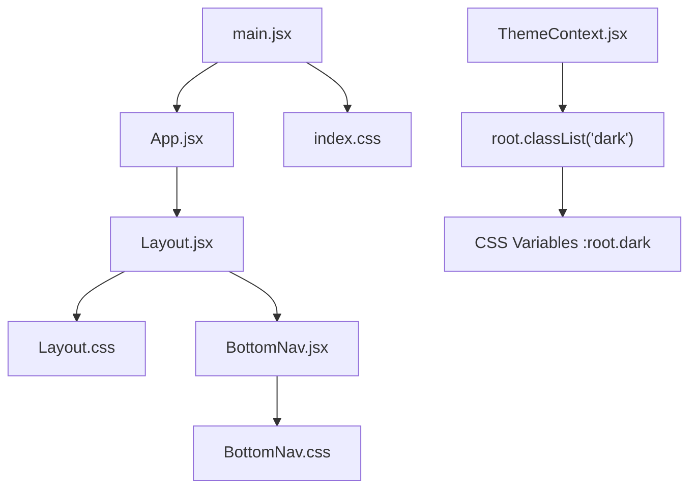
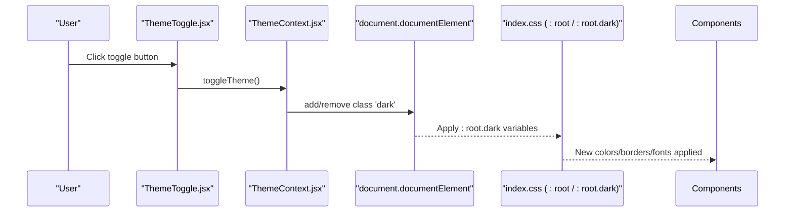
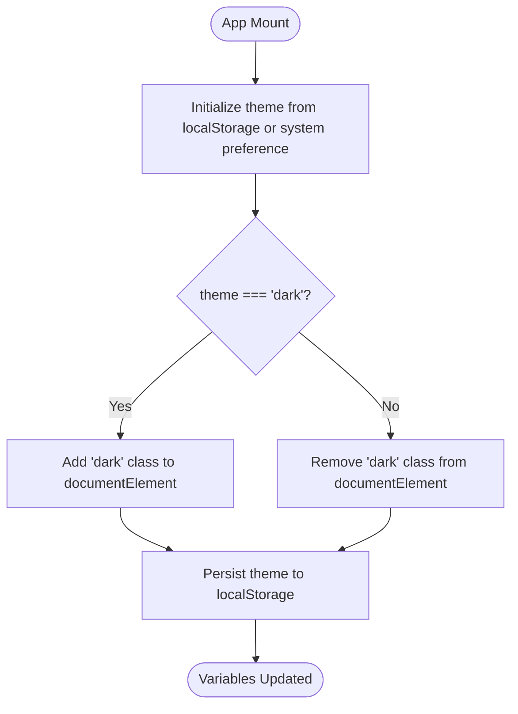
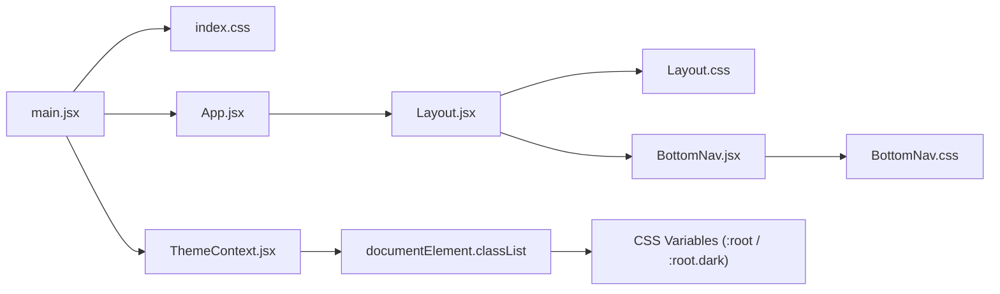

# Styling & Design System

<cite>
**Referenced Files in This Document**
- [index.css](file://src/index.css)
- [ThemeContext.jsx](file://src/context/ThemeContext.jsx)
- [Layout.css](file://src/components/Layout/Layout.css)
- [BottomNav.css](file://src/components/BottomNav/BottomNav.css)
- [ThemeToggle.jsx](file://src/pages/Configuracoes/components/ThemeToggle.jsx)
- [ParametrosBox.jsx](file://src/pages/Configuracoes/components/ParametrosBox.jsx)
- [ProjectItem.jsx](file://src/pages/Projetos/components/ProjectItem.jsx)
- [App.jsx](file://src/App.jsx)
- [main.jsx](file://src/main.jsx)
</cite>

## Table of Contents
1. Introduction
2. Project Structure
3. Core Components
4. Architecture Overview
5. Detailed Component Analysis
6. Dependency Analysis
7. Performance Considerations
8. Troubleshooting Guide
9. Conclusion
10. Appendices

## Introduction
This document describes the styling and design system for Nordic Worklog. It focuses on CSS custom properties (variables) that power dynamic theming, including color palettes, typography, spacing, transitions, and animations. It also explains the dark/light mode implementation via CSS variables and React context integration, outlines responsive patterns used across the app, and provides guidelines for extending the design system consistently with new colors, fonts, breakpoints, and components.

## Project Structure
The design system is implemented primarily through:
- Global CSS variables and base styles
- Theme context provider to toggle a root-level class for dark/light modes
- Layout and navigation styles that consume theme variables
- Page components that use inline styles referencing theme variables for quick prototyping

**Diagram sources**
- [main.jsx:1-15](file://src/main.jsx#L1-L15)
- [App.jsx:1-39](file://src/App.jsx#L1-L39)
- [Layout.jsx:1-49](file://src/components/Layout/Layout.jsx#L1-L49)
- [Layout.css:1-74](file://src/components/Layout/Layout.css#L1-L74)
- [BottomNav.jsx:1-37](file://src/components/BottomNav/BottomNav.jsx#L1-L37)
- [BottomNav.css:1-59](file://src/components/BottomNav/BottomNav.css#L1-L59)
- [index.css:1-86](file://src/index.css#L1-L86)
- [ThemeContext.jsx:1-49](file://src/context/ThemeContext.jsx#L1-L49)

**Section sources**
- [main.jsx:1-15](file://src/main.jsx#L1-L15)
- [App.jsx:1-39](file://src/App.jsx#L1-L39)
- [index.css:1-86](file://src/index.css#L1-L86)
- [Layout.css:1-74](file://src/components/Layout/Layout.css#L1-L74)
- [BottomNav.css:1-59](file://src/components/BottomNav/BottomNav.css#L1-L59)
- [ThemeContext.jsx:1-49](file://src/context/ThemeContext.jsx#L1-L49)

## Core Components
- Global design tokens are defined as CSS custom properties under :root for light mode and overridden under :root.dark for dark mode. These include background, text, accent, border, font family, transition speed, and safe area insets.
- Base resets and global defaults apply the font family and set body background and text color using variables.
- The layout and bottom navigation consume these variables for consistent appearance across themes.
- The theme context toggles a class on the document root to switch between light and dark variable sets.

Key responsibilities:
- index.css: defines tokens, base styles, and global animations
- ThemeContext.jsx: manages theme state, persists preference, and applies the .dark class
- Layout.css: structural layout and shared card/title utilities
- BottomNav.css: fixed bottom navigation with active states and micro-interactions

**Section sources**
- [index.css:7-28](file://src/index.css#L7-L28)
- [index.css:31-46](file://src/index.css#L31-L46)
- [ThemeContext.jsx:18-27](file://src/context/ThemeContext.jsx#L18-L27)
- [Layout.css:10-22](file://src/components/Layout/Layout.css#L10-L22)
- [BottomNav.css:3-13](file://src/components/BottomNav/BottomNav.css#L3-L13)

## Architecture Overview
The theming architecture uses a minimal, robust pattern:
- React context holds the current theme and exposes a toggle function
- On theme change, the root element receives or removes a .dark class
- CSS variables under :root and :root.dark provide all visual tokens
- Components consume variables directly; no per-component theme logic is required

**Diagram sources**
- [ThemeToggle.jsx:1-55](file://src/pages/Configuracoes/components/ThemeToggle.jsx#L1-L55)
- [ThemeContext.jsx:18-32](file://src/context/ThemeContext.jsx#L18-L32)
- [index.css:7-28](file://src/index.css#L7-L28)

## Detailed Component Analysis

### CSS Custom Properties (Design Tokens)
- Color palette:
  - Backgrounds: primary and secondary surfaces
  - Text: primary and secondary levels
  - Accent: emphasis color for interactive elements
  - Borders: subtle separators
- Typography:
  - Font family token applied globally
  - Body font size and line height set at the root level
- Spacing and layout:
  - Safe area inset variable supports notched devices
  - Fixed header and bottom nav heights drive content padding calculations
- Transitions:
  - Transition speed token standardizes animation timing across components

Guidelines:
- Add a new color by defining a new variable under both :root and :root.dark
- Use semantic names (e.g., --bg-primary, --text-secondary) rather than literal values
- Keep contrast ratios accessible in both themes

**Section sources**
- [index.css:7-28](file://src/index.css#L7-L28)
- [index.css:31-46](file://src/index.css#L31-L46)

### Dark/Light Mode Implementation
- Theme state is initialized from localStorage or system preference
- When theme changes, the root element’s class list is updated
- CSS variables under :root.dark override light-mode tokens
- All components automatically adapt because they reference variables

**Diagram sources**
- [ThemeContext.jsx:9-16](file://src/context/ThemeContext.jsx#L9-L16)
- [ThemeContext.jsx:18-27](file://src/context/ThemeContext.jsx#L18-L27)
- [index.css:7-28](file://src/index.css#L7-L28)

**Section sources**
- [ThemeContext.jsx:9-27](file://src/context/ThemeContext.jsx#L9-L27)
- [index.css:7-28](file://src/index.css#L7-L28)

### Layout and Shared UI Primitives
- Header: fixed top bar with background and border tokens
- Content area: flexible container with computed padding to account for fixed header and bottom nav
- Card primitive: reusable surface with border radius, padding, and transitions
- Title utility: small uppercase label style for section headers

Responsive behavior:
- Max-width constraints center content on larger screens
- Flexbox layouts ensure vertical stacking and horizontal alignment

**Section sources**
- [Layout.css:10-22](file://src/components/Layout/Layout.css#L10-L22)
- [Layout.css:41-54](file://src/components/Layout/Layout.css#L41-L54)
- [Layout.css:57-73](file://src/components/Layout/Layout.css#L57-L73)

### Bottom Navigation
- Fixed bottom bar with safe-area support
- Active item uses accent color and a subtle icon lift micro-interaction
- Icon and label sizes follow the minimal aesthetic

**Section sources**
- [BottomNav.css:3-13](file://src/components/BottomNav/BottomNav.css#L3-L13)
- [BottomNav.css:24-34](file://src/components/BottomNav/BottomNav.css#L24-L34)
- [BottomNav.css:52-58](file://src/components/BottomNav/BottomNav.css#L52-L58)

### Theme Toggle Control
- Inline-styled toggle demonstrates direct usage of CSS variables for background, text, and borders
- Uses the context hook to read current theme and call toggle function

**Section sources**
- [ThemeToggle.jsx:1-55](file://src/pages/Configuracoes/components/ThemeToggle.jsx#L1-L55)
- [ThemeContext.jsx:42-48](file://src/context/ThemeContext.jsx#L42-L48)

### Example Usage of Variables in Components
- ParametrosBox uses variables for backgrounds, borders, and text colors within inline styles
- ProjectItem uses variables for borders and text colors, plus conditional status badge colors

**Section sources**
- [ParametrosBox.jsx:14-22](file://src/pages/Configuracoes/components/ParametrosBox.jsx#L14-L22)
- [ParametrosBox.jsx:30-52](file://src/pages/Configuracoes/components/ParametrosBox.jsx#L30-L52)
- [ProjectItem.jsx:14-21](file://src/pages/Projetos/components/ProjectItem.jsx#L14-L21)
- [ProjectItem.jsx:24-29](file://src/pages/Projetos/components/ProjectItem.jsx#L24-L29)

## Dependency Analysis
- main.jsx imports global CSS and wraps the app with ThemeProvider
- App.jsx composes Layout and pages
- Layout.jsx includes Layout.css and renders BottomNav
- BottomNav.jsx includes BottomNav.css
- ThemeContext.jsx controls the .dark class on the document root
- index.css defines all tokens and base styles consumed throughout

**Diagram sources**
- [main.jsx:1-15](file://src/main.jsx#L1-L15)
- [App.jsx:1-39](file://src/App.jsx#L1-L39)
- [Layout.jsx:1-49](file://src/components/Layout/Layout.jsx#L1-L49)
- [BottomNav.jsx:1-37](file://src/components/BottomNav/BottomNav.jsx#L1-L37)
- [ThemeContext.jsx:18-27](file://src/context/ThemeContext.jsx#L18-L27)
- [index.css:7-28](file://src/index.css#L7-L28)

**Section sources**
- [main.jsx:1-15](file://src/main.jsx#L1-L15)
- [App.jsx:1-39](file://src/App.jsx#L1-L39)
- [Layout.jsx:1-49](file://src/components/Layout/Layout.jsx#L1-L49)
- [BottomNav.jsx:1-37](file://src/components/BottomNav/BottomNav.jsx#L1-L37)
- [ThemeContext.jsx:18-27](file://src/context/ThemeContext.jsx#L18-L27)
- [index.css:7-28](file://src/index.css#L7-L28)

## Performance Considerations
- Prefer CSS variables over inline styles for performance and maintainability
- Use transition-speed token to keep animations consistent and short
- Avoid heavy DOM writes; theme toggling only updates one class on the root element
- Keep media queries minimal and scoped to necessary areas

[No sources needed since this section provides general guidance]

## Troubleshooting Guide
- Theme not applying:
  - Ensure ThemeProvider wraps the app and index.css is imported before other styles
  - Verify the root element has the correct class after toggling
- Colors not updating:
  - Confirm variables are defined in both :root and :root.dark
  - Check that components reference variables instead of hardcoded colors
- Safe area overlap on mobile:
  - Ensure bottom padding accounts for safe-area-bottom variable
- Inconsistent transitions:
  - Use the transition-speed token for all animated properties

**Section sources**
- [main.jsx:1-15](file://src/main.jsx#L1-L15)
- [ThemeContext.jsx:18-27](file://src/context/ThemeContext.jsx#L18-L27)
- [index.css:7-28](file://src/index.css#L7-L28)
- [Layout.css:41-48](file://src/components/Layout/Layout.css#L41-L48)

## Conclusion
Nordic Worklog’s design system centers on a small set of semantic CSS variables, a simple theme context, and clean layout primitives. This approach ensures consistent visuals across light and dark modes, smooth transitions, and easy extension points for new colors, fonts, and components.

[No sources needed since this section summarizes without analyzing specific files]

## Appendices

### Adding a New Color
- Define a new variable under :root and :root.dark in the global stylesheet
- Reference the variable in component styles or inline styles
- Validate contrast in both themes

**Section sources**
- [index.css:7-28](file://src/index.css#L7-L28)

### Adding a New Font
- Import the font in the global stylesheet
- Add a new font-family variable and apply it where needed
- Consider fallback stacks for reliability

**Section sources**
- [index.css:4](file://src/index.css#L4)
- [index.css:15](file://src/index.css#L15)

### Responsive Breakpoints
- Current layout relies on max-width constraints and flexbox for responsiveness
- To introduce explicit breakpoints, add media queries in the relevant CSS file and adjust spacing or layout accordingly

**Section sources**
- [Layout.css:24-31](file://src/components/Layout/Layout.css#L24-L31)
- [Layout.css:50-54](file://src/components/Layout/Layout.css#L50-L54)

### Animation and Transitions
- Global fade-in animation available via a utility class
- Micro-interactions in the bottom navigation use transform transitions
- Standardize durations using the transition-speed token

**Section sources**
- [index.css:72-85](file://src/index.css#L72-L85)
- [BottomNav.css:41-43](file://src/components/BottomNav/BottomNav.css#L41-L43)
- [BottomNav.css:56-58](file://src/components/BottomNav/BottomNav.css#L56-L58)

### Extending the Design System with New Components
- Reuse existing primitives like cards and titles when building new UI blocks
- Consume variables for colors, borders, and spacing to stay consistent
- Prefer classes over inline styles for better performance and reusability

**Section sources**
- [Layout.css:57-73](file://src/components/Layout/Layout.css#L57-L73)
- [ParametrosBox.jsx:14-22](file://src/pages/Configuracoes/components/ParametrosBox.jsx#L14-L22)
- [ProjectItem.jsx:14-21](file://src/pages/Projetos/components/ProjectItem.jsx#L14-L21)